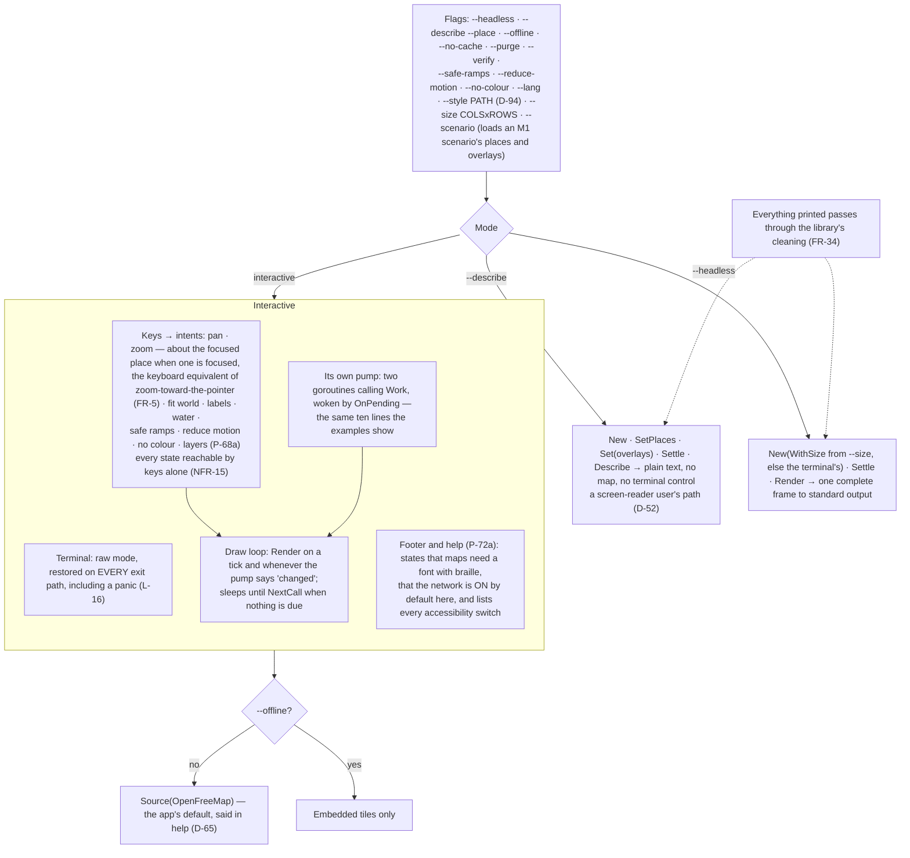

# Level 2 — The standalone app

Up: [architecture](architecture.md) · Carries: FR-5, FR-34, NFR-15, D-17, D-52, D-65, D-73, D-75, D-94, P-68a, P-68b, P-72a, P-72b, L-16

A separate module (D-75). It is the library's first host: it writes its own pump, as any host must (D-73), and it is what HUM LEAD judges M1a in.

## What can change this diagram

| If this changes… | …this moves |
|---|---|
| Pointer operations are built (after v0.1.0) | A mouse branch beside KEYS, each with its key equivalent (D-17) |
| Tours are built | Keys `g` and `t` (P-68b), the footer's tour segment (P-72b) |
