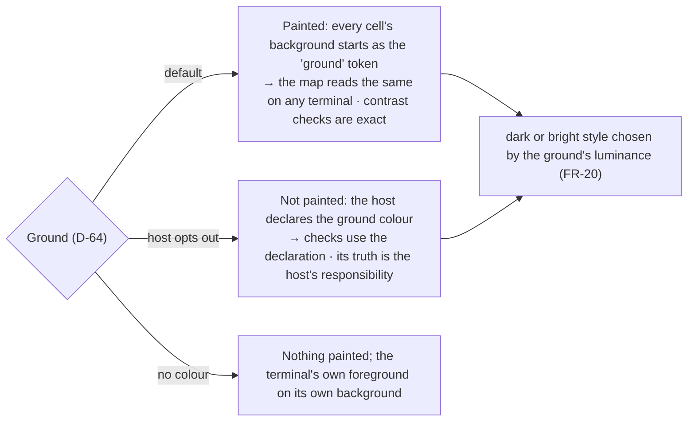

# Level 2 — Colour resolution

Up: [architecture](architecture.md) · Carries: FR-13, FR-16, FR-17, FR-18a, FR-20, NFR-15, D-35, D-53, D-59, D-62, D-63, D-64, D-69, D-77, D-79, D-88

## How a value becomes a cell colour

Read top to bottom. Each step can only narrow what the step above allowed.

```mermaid
flowchart TB
    V["A class index in a cell<br/>(from a grid, an image, or a feature's severity)"] --> TYPE

    subgraph TYPE["1 · Which type? (D-69)"]
      direction LR
      TP["Preset<br/>temperature: absolute scale, 17 classes of 5 °C, pale at freezing,<br/>breaks defined once in °C and converted exactly (D-62, specimen 21)"]
      TO["Preset, overridden by the host"]
      TH["The host's own type"]
    end

    TYPE --> TOK["2 · Semantic tokens (D-63)<br/>each class has a named role — 'radar.4', 'alert.severe.outline', 'temperature.9' —<br/>its place in its scale, never a colour (the list: constants, section 4). A host's own ramp is tokenised low · middle · high and interpolated"]
    TOK --> PAL{"3 · Does the host's palette set this token?"}
    PAL -- no --> DEF["The library's default for that token<br/>radar and temperature each have two sets of defaults: one for a dark ground, one for a light (D-91) —<br/>chosen by the ground IN EFFECT: painted, or the host's declared colour (D-64, D-88)"]
    PAL -- yes --> THEME["The host's colour"]
    THEME --> SAFE{"4 · Safe ramps on? (D-63)"}
    SAFE -- yes --> DEF
    SAFE -- no --> CHK["Checker: ordered · distinct at this depth · readable · colour-vision-safe<br/>violations → warnings; never refused (D-53)"]
    DEF --> DEPTH
    CHK --> DEPTH

    subgraph DEPTH["5 · Colour depth — a hint from the host (FR-17); NO_COLOR selects none (NFR-15)"]
      direction LR
      D24["Truecolor<br/>the colour as given"]
      D256["256 colours<br/>the library's own ramp for this depth — never an automatic downgrade (S10-1)<br/>indices 16–255 only, so contrast is exact"]
      D16["16 colours (D-59)<br/>line work, labels, markers, outlines: a palette CHOSEN from the 16 (S23-1)<br/>anything needing a ramp: its no-colour form<br/>(until the 16-colour ramps are built)"]
      D0["No colour (D-35)<br/>smooth fields: contours with value labels<br/>patchy data: block shades ░▒▓<br/>areas: hatch ╱ ╲ plus a plain-word label (FR-18a)"]
    end

    DEPTH --> BG["6 · The cell's background<br/>by the compositing order: ground → water → image or field → tint (L2-render)"]
    BG --> FG["7 · The cell's foreground (FR-16, D-77)<br/>the line's own colour where it meets 3:1 on this cell; otherwise whichever of black and white contrasts more<br/>line work ≥ 3:1 · labels and legend text ≥ 4.5:1"]
    FG --> CELL["The cell"]
    DEPTH --> LEGEND["The legend shows the colours actually drawn, at this depth, with text chosen the same way (FR-13, FR-16)"]
```

## The ground

## What the checker checks (D-53, FR-16)

| Rule | Meaning | Applies to |
|---|---|---|
| Ordered | Relative luminance moves one way along a ramp — or one way on each side of a labelled midpoint for a diverging ramp | every ramp |
| Distinct | Each step maps to a different palette entry **at the depth in use** | every ramp, every supported depth |
| Readable | Line work ≥ 3:1 and text ≥ 4.5:1 against every background it crosses, the painted ground included | every ramp |
| Colour-vision-safe (D-88) | **Every pair** of classes, and **every class against the ground**, at least 10 apart under simulated protanopia, deuteranopia, tritanopia and normal vision; simulation at full severity **in linear light**, 1976 Lab difference, D65 white | **required** of the library's defaults and presets; **reported** for a host's colours |
| An area tint is never the only edge | A polygon's outline is always drawn and meets 3:1 | alert areas |

A host can run the same checker in its own tests (`CheckRamp`).

## Owed before this diagram is final

| Item | Why | Due |
|---|---|---|
| The temperature preset's actual scale | D-62; PQ-5 | **A candidate exists (specimen 21):** 17 classes of 5 °C from −30 to +45, pale at freezing. **Every pair of classes**, not only neighbours, is at least 12.2 apart under every kind of colour vision in truecolor and 11.1 within the 256-colour palette (the scale was retuned after D-88; an earlier figure here, 13.7, was for neighbours only). Seen by HUM LEAD and found good (D-77). *Against a light ground its two freezing bands failed D-88 (red-team round 2); ruled D-91: a light-ground variant, three bands changed, specimen 21d* |
| A radar preset ramp that passes at 256 colours | S15-3 | **A candidate exists (specimen 22):** six classes, two ramps chosen by the ground; every pair and the ground at least 12.6 apart. Seen by HUM LEAD and found fine (D-78, D-89) |
| A specimen of step D16 — a coloured basemap with a colourless overlay | D-59 | **Done (specimen 23).** Finding: the basemap needs its own palette chosen from the sixteen; converted colours collapse to white and grey. Seen by HUM LEAD and found good (D-79) |
| Specimens of a painted light and a painted dark ground | D-64 | **Done (specimen 20), measured:** unpainted, 85% of drawn cells fall under 3:1 on a white terminal; painted, none do once the higher-contrast rule is applied to every line. Seen by HUM LEAD and found good (D-77). The bright style keeps a line's colour where it passes 3:1 on the cell and falls back to black or white where it does not |
| The list of tokens | D-63; a named PLAN artefact | **Done:** [constants](constants.md), section 4 |
| The colour-vision threshold | FR-16 | **Ruled: D-88** |
