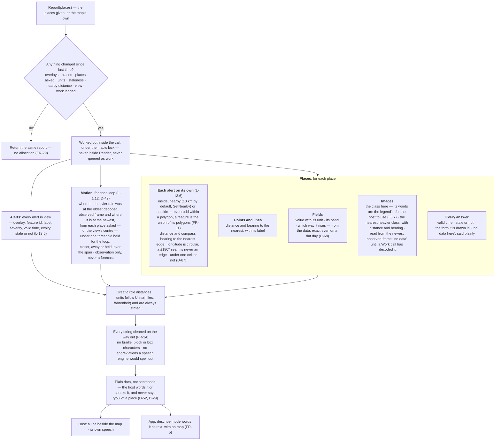
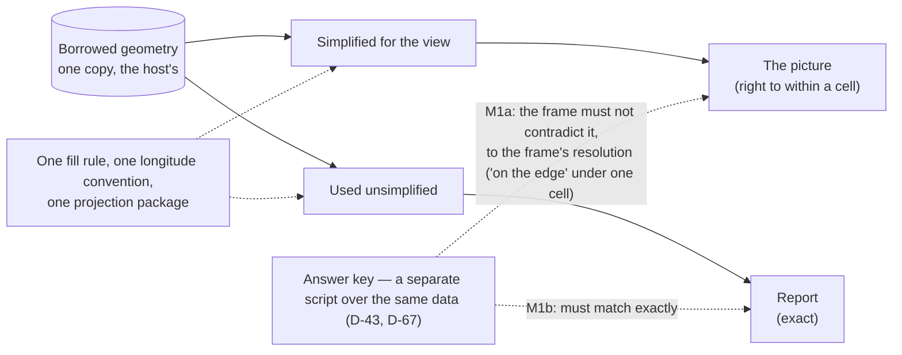

# Level 2 — The view described as data

Up: [architecture](architecture.md) · Carries: FR-5, FR-11, FR-29, FR-34, D-43, D-52, D-67, D-68, D-73

## Why it exists

A screen reader reads braille map characters as noise, and no picture can show a distance smaller than one cell (in specimen 13a at 69×12 a column is 1.6 km and a row 3.2 km). The description is the exact answer to the project's question — *where is it, relative to my place* — computed from the real shapes and values, never from the drawn cells. It is **M1b**: it must match the answer key exactly (D-67).

## How it is computed

*AS BUILT v0.2.0 (rc.5): `Describe` and `Description` are removed; `Report(places)` replaces them and carries every answer (D-57, L5.2–L5.8). It is worked out inside the call, from the host's own geometry, and needs no `Work` — except that an image's answer and observed motion read pictures a `Work` call has decoded.*

## Picture and description cannot disagree

## Cost rules (FR-29)

| Rule | Provisional target, unverified |
|---|---|
| Never computed inside Render | — |
| Recomputed only when overlays, places, staleness or depth change | An unchanged repeat allocates nothing |
| Cancellable; any index it builds counts against the shape cache's byte cap | The fixture with 60 places ≤ 50 ms; the worst case ≤ 500 ms |
