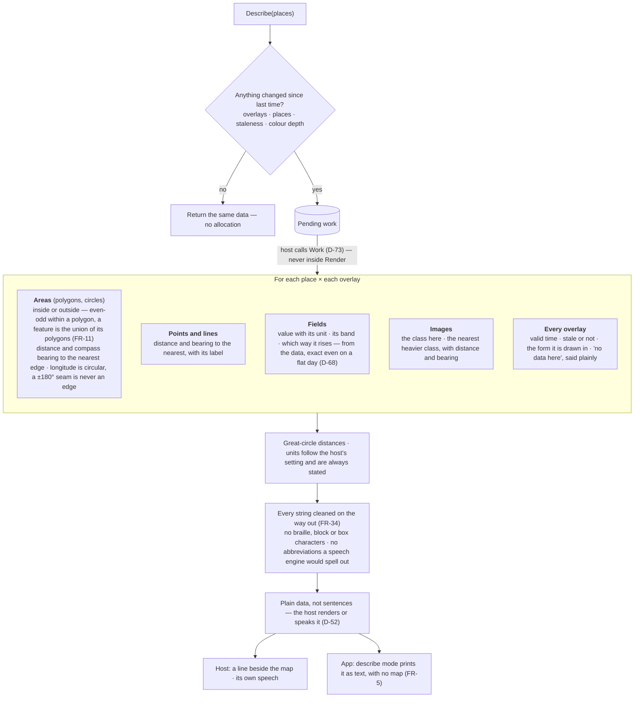
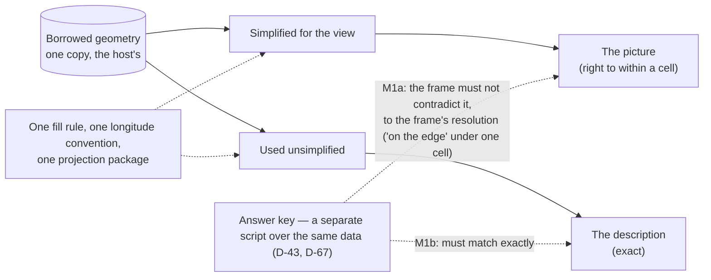

# Level 2 — The view described as data

Up: [architecture](architecture.md) · Carries: FR-29, FR-5, FR-32, FR-33, FR-34, D-52, D-67, D-68, D-73

## Why it exists

A screen reader reads braille map characters as noise, and no picture can show a distance smaller than one cell (at 69×12, a column is 1.6 km). The description is the exact answer to the project's question — *where is it, relative to my place* — computed from the real shapes and values, never from the drawn cells. It is **M1b**: it must match the answer key exactly (D-67).

## How it is computed

## Picture and description cannot disagree

## Cost rules (FR-29)

| Rule | Provisional target, unverified |
|---|---|
| Never computed inside Render | — |
| Recomputed only when overlays, places, staleness or depth change | An unchanged repeat allocates nothing |
| Cancellable; any index it builds counts against the shape cache's byte cap | The fixture with 60 places ≤ 50 ms; the worst case ≤ 500 ms |
