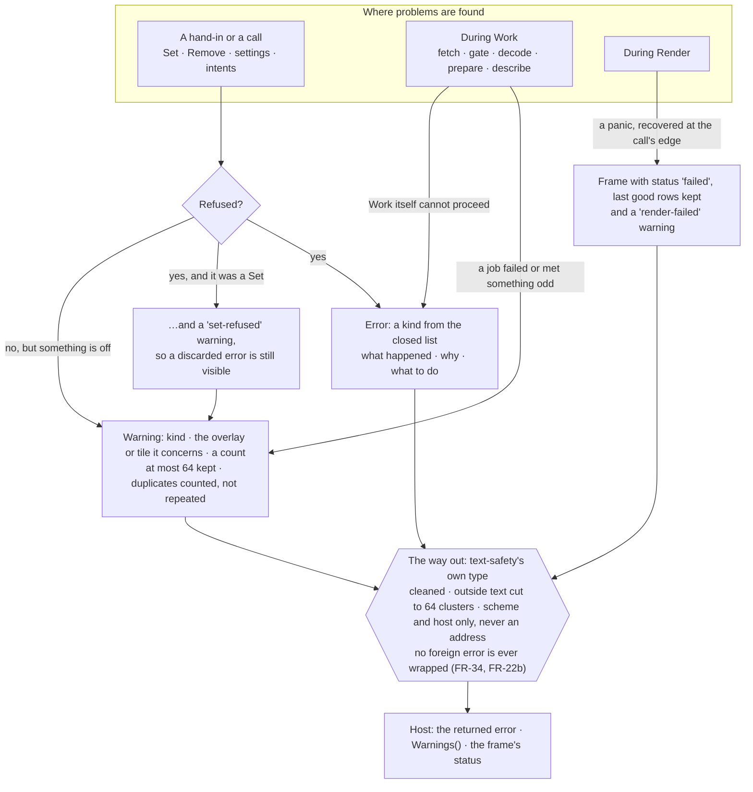

# Level 2 — Errors and warnings

Up: [architecture](architecture.md) · [contract, section 7](contract.md) · Carries: FR-22b, FR-34, NFR-22

One rule decides which a problem becomes: **refused → an error; accepted but off, or found later during `Work` → a warning.** Both pass through the one way out, so neither can carry an escape byte, a tile address or a foreign error.

| Error kinds (closed) | Warning kinds (closed) |
|---|---|
| invalid-coordinates · size-mismatch · unsorted-breaks · malformed-ramp · missing-table · malformed-table · unknown-preset · invalid-id · over-vertex-cap · over-image-cap · image-refused · ring-too-short · bad-currency · unsupported-schema · unsupported-tile · over-limit · fetch-refused · fetch-failed · cache-refused · no-size · reentrant-call · cancelled · closed · internal | ramp-rule-broken · unmatched-image-colours · stale-overlay · future-valid-time · implausible-unit · near-duplicate-id · set-refused · borrow-changed · no-work-called · tile-failed · cache-write-failed · render-failed · cache-under-need |

## What can change this diagram

| If this changes… | …this moves |
|---|---|
| A kind is added — a minor version (NFR-22) | The two lists, here and in the contract |
| The warning cap | The WARN box and the constants table |
