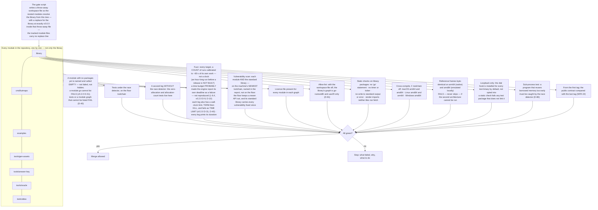

# Level 2 — Tests and gates

Up: [architecture](architecture.md) · Carries: NFR-22, D-19, D-81, D-86

**There is no remote until SHIP (D-19), so there is no hosted continuous integration until then.** Until SHIP the gate is a script run locally before every merge; at SHIP the same script becomes the hosted workflow. What cannot be run locally is said to be untested, not assumed.

| Untested until SHIP, and said so | Why |
|---|---|
| Running on Linux and Windows (only compiled) | No such machine before a remote exists |
| amd64 on real hardware | Emulated locally; the two-architecture claim is provisional until a hosted amd64 runner confirms it |
| The one-hour soak as a nightly job | Run by hand before each phase exit until then |

## What can change this diagram

| If this changes… | …this moves |
|---|---|
| SHIP creates the remote | The script becomes the hosted workflow; the "untested" table empties |
| A module is added | The MODS row |
