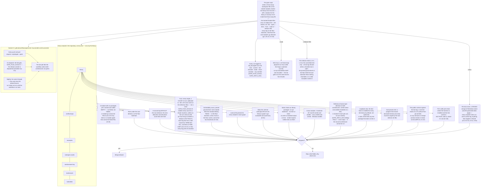

# Level 2 — Tests and gates

Up: [architecture](architecture.md) · Carries: NFR-22, D-19, D-81, D-86

**The gate is one script, run locally before every merge and by the hosted workflow** (`.github/workflows/gate.yml`, L-6.1, D-105) on linux/amd64 and linux/arm64. What cannot be run is said to be untested, not assumed.

*AS BUILT v0.2.0.*

```mermaid
flowchart TB
    subgraph MODS["Every module in the repository, one by one — not only the library"]
      direction LR
      M0["library"] --- M1["cmd/tuimaps"] --- M2["examples"] --- M3["tools/gen-assets"] --- M4["tools/answer-key"] --- M5["tools/oracle"] --- M6["tools/atlas"]
    end
    GATE["The gate script<br/>writes a throw-away workspace file so the nested modules resolve the library from this tree —<br/>with a replace for the library at exactly v0.0.0 inside that throw-away file —<br/>the tracked module files carry no replace line · one mode a run: full, --quick, --docs, --fuzz, --soak or --release TAG<br/>every leg on the floor toolchain, read from the root module's go directive (go 1.25.13, D-133)"] --> MODS
    GATE --> LOG["Every run logged to 06_docs/gate-runs.md: time · commit · tree checked · mode · result · duration · any override (GATE_FUZZ_SCALE, GATE_ARCH_LEG)"]
    GATE -- "--docs" --> DOCS["The docs lane: a STAGED change of Markdown alone (and the generated atlas page) —<br/>every module's tests run, and no other leg; anything else staged is refused (v0.2.0 D-15, D-41, D-53)"]
    GATE -- "--soak" --> SOAK["M4's hour: a 12-frame loop played for an hour while the heap is watched (L10.8);<br/>run by hand before SHIP and recorded — the full gate runs the same test for five minutes"]
    GATE -- "--release TAG" --> REL["The release check (L-5.3, L-5.5): the committed tree only · a final tag refused while a checklist row is open ·<br/>the pinned govulncheck at the floor AND the local toolchain finds nothing reachable, or a ruled exception names it"]
    MODS --> T0["A module with no packages yet is named and called EMPTY — not failed, not hidden;<br/>a module go cannot list FAILS (v0.2.0 D-31);<br/>tests or a module graph that cannot be listed FAIL (D-40)"]
    MODS --> T1["Tests under the race detector, on the floor toolchain"]
    MODS --> T2["A second leg WITHOUT the race detector: the zero-allocation and allocation-count tests live here"]
    MODS --> T3["Fuzz: every target, a COUNT of runs calibrated to ~60 s of its own work on the reference Mac — not a clock<br/>GATE_FUZZ_SCALE=N divides every count for a slower machine, written on the run's line (D-129)<br/>(an hour-long run before a release is NOT BUILT)<br/>each leg also has a wall-clock limit, TERM then KILL, and fails as TIME LIMIT (v0.2.0 D-31, D-40) · every leg prints its duration"]
    MODS --> T4["Vulnerability scans, pinned govulncheck: each module AND the standard library,<br/>TWICE — at the floor toolchain, what a host at the floor carries, and at the local toolchain (D-133)"]
    MODS --> T5["Licence file present for every module in each graph"]
    M0 --> A1["Allow-list: with the workspace file off, the library's graph is go-runewidth and uax29 only (D-81)"]
    M0 --> A2["Static checks on library packages: no 'go' statement · no timer or ticker ·<br/>no write to standard output or error · render imports neither tiles nor fetch"]
    M0 --> A3["Cross-compile, C toolchain off: macOS arm64 and amd64 · Linux amd64 and arm64 · Windows amd64"]
    M0 --> A4["Reference frames byte-identical on both architectures: arm64 native and amd64 emulated on a Mac;<br/>in hosted CI each job runs its own natively (GATE_ARCH_LEG=sibling)<br/>FAILS — never skips — if the second architecture cannot be run"]
    M0 --> A5["Loopback only: the dial hook is installed for every test binary by default, not opted into<br/>a static check fails any test package that does not link it"]
    M0 --> A6["Sub-process test: a program that reuses borrowed memory too early must be caught by the race detector (D-86)"]
    M0 --> A7["The public contract against the last tag: a root test reads v0.1.0's surface from git and fails<br/>on any removal or change contract section 12 does not list (NFR-22, D-137)"]
    M0 --> A8["P10: a2dh p10 check where the harness is installed and the tree carries it;<br/>NOT RUN, said so, where it is not (D-136)"]
    T1 & T2 & T3 & T4 & T5 & A1 & A2 & A3 & A4 & A5 & A6 & A7 & A8 --> OK{"All green?"}
    DOCS --> OK
    OK -- yes --> MERGE["Merge allowed"]
    OK -- no --> STOP["Stop: what failed, why, what to do"]
    subgraph CI["Hosted CI (.github/workflows/gate.yml): linux/amd64 and linux/arm64"]
      direction LR
      PUSH["Every push and pull request: scripts/gate --quick"]
      FULL["On dispatch: the full gate, GATE_FUZZ_SCALE 8 —<br/>the release commit is dispatched (checklist row 0.5)"]
      NIGHT["Nightly: the same full gate — fires only from the default branch,<br/>so it does not run until the workflow is on main"]
      BOTH["The last job fails the workflow unless both architectures ran green"]
      PUSH --> BOTH
      FULL --> BOTH
      NIGHT -.-> BOTH
    end
    GATE --> CI
```

| Untested, and said so | Why |
|---|---|
| Running on Windows (only compiled) | No Windows runner; macOS and Linux run the tests |
| The one-hour soak as a nightly job | Run by hand before SHIP (`scripts/gate --soak`) and recorded |
| The nightly full gate | It fires only from the default branch, which carries the workflow only from SHIP; until then the full gate runs by dispatch |

## What can change this diagram

| If this changes… | …this moves |
|---|---|
| The workflow reaches the default branch at SHIP | The nightly full gate fires; its row leaves the "untested" table |
| A module is added | The MODS row |
