# Level 2 — The memory budget map

Up: [architecture](architecture.md) · Carries: NFR-3, NFR-4, NFR-10, FR-11, FR-21a, FR-27, FR-37, D-29, D-48, D-73, D-75 · Risk RS-7 (Medium since the PLAN measurement)

## The target, as ruled

**8 MB** added to the host (D-29). Against a pinned typical-day fixture: **live heap ≤ 4 MB, peak ≤ 8 MB** (D-48). The first host's whole margin is 10.7 MB. *The ≈ figures in the diagram are a reviewer's arithmetic. **PLAN has since measured** a throwaway build of these structures against the pinned fixture — [memory-measurement.md](memory-measurement.md): **1.0 to 1.5 MB live, 2.8 to 4.8 MB peak** (the peak an upper bound), against lines of 4 and 8. The arithmetic was cautious by a factor of two to three. The ruled lines change only by ruling.*

## Where the bytes live

```mermaid
flowchart TB
    subgraph HOSTMEM["The host's memory — not counted against the library"]
      HG["Borrowed geometry (FR-11)<br/>synthetic upper bound: 58 zones · 812,058 vertices · 12.4 MiB<br/>measured: ten Gulf-coast counties · 56,827 vertices · 0.9 MB<br/>the library reads it, never copies it"]
      HP["The PNG the host fetched — may be released once the image is prepared"]
    end

    subgraph LIVE["Library, live after a collection — the 4 MB line"]
      direction TB
      FIX["<b>Fixed buffers</b> — measured 0.44 MB<br/>cell grid × 2 frames · dot mask · output lines (149×38)"]
      TC["<b>Tile cache</b> — byte-capped · one view measured 0.33 to 0.80 MB<br/>with data dropped while decoding and coordinates as 16-bit integers (D-75)"]
      SC["<b>Shape cache</b> — byte-capped · measured 0.01 MB for 56,827 borrowed vertices<br/>simplified forms and bounding boxes · a form over ¼ of the cap is not cached"]
      IC["<b>Image cache</b> — byte-capped · measured 0.25 MB for a 600×400 image<br/>one byte per pixel (D-36) · a loop's frames must fit inside this cap (FR-37)"]
      GC2["<b>Grids, contours, ramps, legend</b> ≈ 0.05 MB"]
      ST["<b>Styles, tokens, pools</b> ≈ 0.6 MB (an estimate; NOT measured)"]
      CAPS["Rule: default caps + fixed buffers ≤ 3 MB, leaving 1 MB for everything else (NFR-3)"]
    end

    subgraph TRANS["Transient — what pushes the peak toward 8 MB"]
      direction TB
      DEC["One tile in decode: compressed body + decompressed bytes + what is kept<br/>fixture tile ≈ 1.2 + 2.6 MB → multiplied by the pump's width, which is the host's (D-84);<br/>the peak line is measured two wide"]
      PNGD["One image in decode: up to 4 MiB for the largest allowed PNG (FR-9)"]
      GARB["Garbage between collections: at the default collector setting,<br/>heap objects run to about twice live"]
    end

    subgraph NOTHEAP["Not heap at all"]
      EMB["Embedded tiles: 1.7 MB of program data —<br/>invisible to heap metrics, present in the host's resident memory"]
    end

    LIVE --> SUM["Fixture, MEASURED: 1.0 to 1.5 MB live · 2.8 to 4.8 MB peak (upper bound)<br/>the earlier arithmetic said 3.6 MB"]
    TRANS --> PEAK["Peak ≈ live + one decode + garbage"]
    SUM --> T1["<b>Tension (NFR-3):</b> at live = 4 MB the 8 MB peak is reached by garbage alone.<br/>In practice live must sit nearer 3 MB — and measured, it sits near 1 to 1.5."]
    PEAK --> T1
```

## How it is measured (NFR-3, NFR-4)

| What | How |
|---|---|
| Live | The change in the runtime's live-heap metric after a forced collection, **after a scripted tour that fills every cache to its cap** — not after a first view |
| Peak | The maximum change in the runtime's heap-objects metric, sampled every 10 ms in a standalone harness, default collector setting |
| Instances | One, and again three sharing caches — the first host plans three placements (FR-27) |
| Unchanged frame | Zero allocations |
| Changed frame — the steady state, since a blinking marker changes most frames | Provisional, unverified: a marker-phase change ≤ 16 KB and ≤ 64 allocations; a one-cell pan no more than the first host's own window cost; identical at 100 and 1,000 features |
| One hour | Live heap grows ≤ 1 KB a minute; the count of goroutines does not change — and under D-73 the library starts none |
| Worst case, separately | The 58-zone alert at the fixture view and at zoom 12: accepted, drawn without copying, library-owned bytes within the shape cap, the draw-from-borrowed path inside its own time bound |
| Extreme input | Not held to 8 MB: bounded by the stated formula — per tile in decode, body cap + decompressed cap + retained cap, times the number of `Work` calls the host runs at once (D-84) |
| The host's resident-memory protocol | Confirmatory only; its run-to-run spread (8.5 MB) exceeds what is being measured |

## What can change this diagram

| If this changes… | …this part moves |
|---|---|
| The library's own benchmark in BUILD against the pinned fixture | Every figure; possibly the ruled lines, by ruling only |
| The pinned fixture changes (pinned 2026-09-19, see the measurement) | The tile and shape figures |
| Image loops are built (FR-37) | The image cache's cap and what fits in it |
