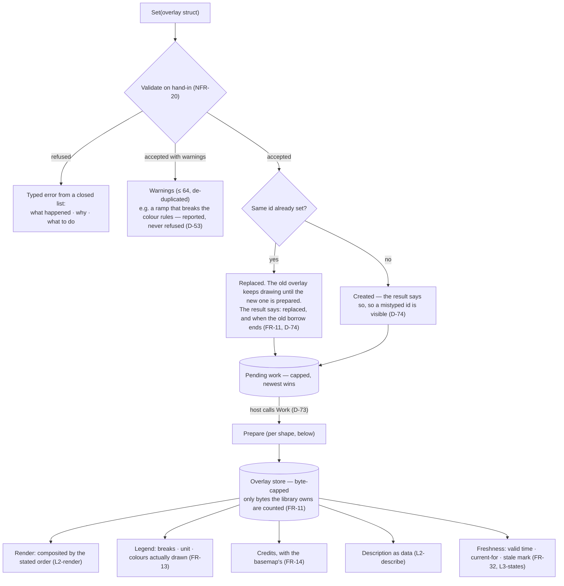
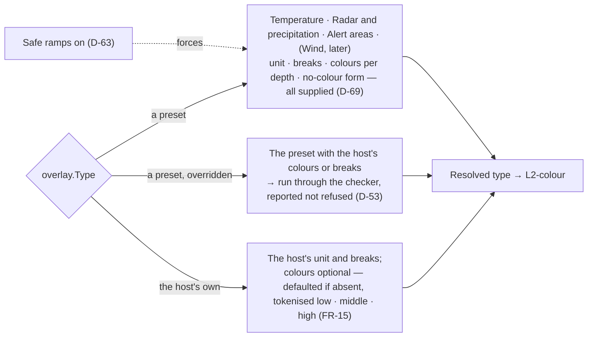

# Level 2 — The overlay pipeline, shape by shape

Up: [architecture](architecture.md) · Carries: FR-6 to FR-14, FR-18, FR-18a, FR-32, FR-37, NFR-20, D-14, D-15, D-16, D-35, D-36, D-44, D-45, D-47, D-69, D-73, D-74

## One path for every overlay

The host hands in a plain struct (D-74). What happens next is the same for every shape; only the "prepare" step differs.

## What "prepare" means for each shape

```mermaid
flowchart LR
    subgraph V010["In v0.1.0 (D-44)"]
      direction TB
      subgraph F["Features — points · lines · polygons · circles"]
        direction LR
        F1["Borrowed geometry<br/>not copied (FR-11)"] --> F2["Simplify to the dot tolerance<br/>per zoom bucket · iterative"]
        F2 --> F3{"Simplified form > ¼ of the cap?"}
        F3 -- no --> F4["Cache the unclipped result;<br/>split at ±180° here"]
        F3 -- yes --> F5["Do not cache: draw from the borrowed shape,<br/>culled by segment runs · own time bound"]
        F4 --> F6["Bounding boxes per run<br/>for drawing and for the description"]
        F5 --> F6
      end
      subgraph S["Scalar grid — lon/lat grid of values with a unit"]
        direction LR
        S1["Type: a preset (breaks and colours supplied)<br/>or the host's own breaks (D-69)"] --> S2["Classify each value → class index<br/>non-finite = no data"]
        S2 --> S3["Resample to cell centres for the view"]
        S3 --> S4["Contour lines at the breaks<br/>for the no-colour form (D-35)"]
      end
      subgraph I["Image — one PNG for one bounding box"]
        direction LR
        I1["Header read first: PNG only ·<br/>≤ 1,048,576 pixels · 8-bit (FR-9)"] --> I2["Decode directly (never via a format registry)"]
        I2 --> I3["Colour → class by the required table (D-45)<br/>nearest within tolerance; unmatched = no data, counted"]
        I3 --> I4["Keep ONE byte per pixel: the class index (D-36)<br/>the provider's colours are never shown"]
        I4 --> I5["Resample to cell centres for the view,<br/>from the projection the host stated"]
      end
    end
    subgraph LATER["After the integration (D-44, D-60)"]
      direction TB
      VG["Vector grid (wind)<br/>two scalar grids → arrow and speed class per cell · basemap thins (S5-1)"]
      TI["Tile-image provider<br/>a host function per tile → each tile takes the Image path"]
      LOOP["Image frames (FR-37)<br/>a sequence of Images on the host's clock, inside the image cache's byte cap"]
    end
```

## Presets and host-defined types

## What can change this diagram

| If this changes… | …this part moves |
|---|---|
| The integration review (D-60) finds the contract lacking | The struct fields behind `Set`, and the "later" box |
| The radar resampling rule is settled (owed in PLAN) | Step I5 |
| A proper contouring pass is proven by specimen (A-5) | Step S4 |
| The zoom buckets are defined (owed in PLAN) | Step F2 |
