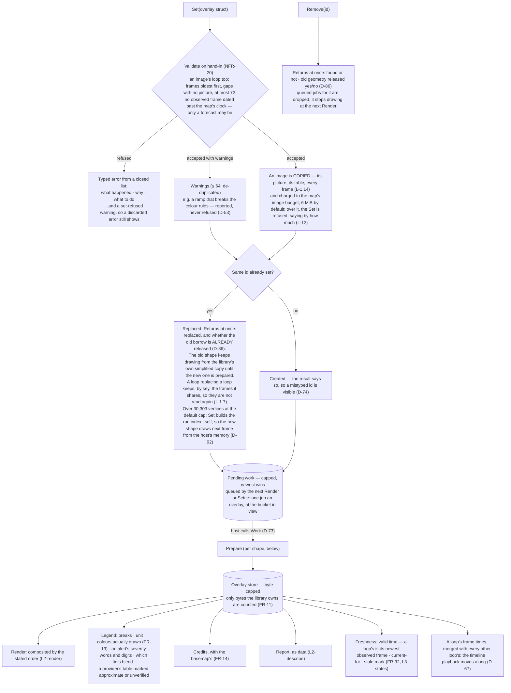
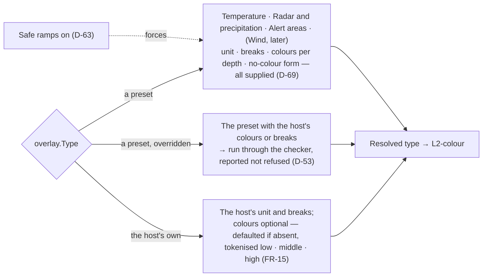

# Level 2 — The overlay pipeline, shape by shape

Up: [architecture](architecture.md) · Carries: FR-9, FR-11, FR-13, FR-14, FR-15, FR-32, FR-37, NFR-20, D-35, D-36, D-44, D-45, D-53, D-60, D-63, D-69, D-73, D-74, D-78, D-86, D-90, D-92

## One path for every overlay

*AS BUILT v0.2.0 (rc.5): an image overlay may carry loop frames (D-54), and every image is copied and held to the map's image budget at `Set`. Prepare work is queued by the next `Render` or `Settle`, not by `Set`.*

The host hands in a plain struct (D-74). What happens next is the same for every shape; only the "prepare" step differs.

## What "prepare" means for each shape

*AS BUILT v0.2.0 (rc.5): a loop is `Image.Frames`, each frame read in `Work` and kept by a key of its bytes, table, bounds, type and valid time; it plays on the library's animation clock, inside the map's image budget (D-54, D-68). An image may name a provider instead of handing in a table (L-2.5).*

```mermaid
flowchart LR
    subgraph V010["Built — v0.1.0 (D-44), with loops and provider tables in v0.2.0"]
      direction TB
      subgraph F["Features — points · lines · polygons · circles"]
        direction LR
        F1["Borrowed geometry<br/>not copied (FR-11)"] --> F2["Simplify to the dot tolerance<br/>per zoom bucket · iterative"]
        F2 --> F3{"Simplified form larger than the WHOLE shape cap? (D-90)"}
        F3 -- no --> F4["Cache the unclipped result;<br/>split at ±180° here"]
        F3 -- yes --> F5["Do not cache: draw from the borrowed shape,<br/>culled by segment runs · a stated bound on work, not on time (constants, section 3)"]
        F4 --> F6["Bounding boxes per run<br/>for drawing and for the description"]
        F5 --> F6
      end
      subgraph S["Scalar grid — lon/lat grid of values with a unit"]
        direction LR
        S1["Type: a preset (breaks and colours supplied)<br/>or the host's own breaks (D-69)"] --> S2["Classify each value → class index<br/>non-finite = no data"]
        S2 --> S3["Kept as classes on the host's own grid.<br/>PREPARE ENDS HERE"]
        S3 -. "at draw time, in render" .-> S4["Each cell samples the grid at its centre ·<br/>contour lines at the breaks for the no-colour form (D-35)<br/>work bounded by the cell count, not the data"]
      end
      subgraph I["Image — one PNG, or a loop of frames, for one bounding box"]
        direction LR
        I0["A loop: each frame that is not a gap, in turn;<br/>a frame whose key the replaced loop already read is kept (L-1.7)"] --> I1
        I1["Header read first: PNG only ·<br/>≤ 1,048,576 pixels · 8-bit · within the map's image cap (FR-9)"] --> I2["Decode directly (never via a format registry);<br/>a picture another map sharing caches already read is taken from the shared set"]
        I2 --> I3["Colour → class by the image's table, or its provider's (D-45, L-2.5):<br/>IEM, published · MRMS, observed and approximate<br/>nearest within tolerance; unmatched = no data, counted ·<br/>MRMS's heavy end, off its table, valued along its legend — counted, a table-fallback warning"]
        I3 --> I4["Keep ONE byte per pixel: the class index (D-36)<br/>the provider's colours are never shown"]
        I4 -. "PREPARE ENDS HERE · at draw time, in render" .-> I5["The frame of the moment shown (L-1.6) ·<br/>from the projection the host stated: eight samples a cell,<br/>the HEAVIEST class wins, never the mean (D-78)<br/>so a pan needs no Work (PL-PF-4)"]
      end
    end
    subgraph LATER["After the integration (D-44, D-60)"]
      direction TB
      VG["Vector grid (wind)<br/>two scalar grids → arrow and speed class per cell · basemap thins (S5-1)"]
      TI["Tile-image provider<br/>a host function per tile → each tile takes the Image path"]
    end
```

## Presets and host-defined types

## What can change this diagram

| If this changes… | …this part moves |
|---|---|
| The integration review (D-60) finds the contract lacking | The struct fields behind `Set`, and the "later" box |
| The radar resampling rule changes (now: the heaviest class in the cell, D-78) | Step I5, and render's task 09.23 |
| The contouring pass changes (per-dot isolines, specimen 25) | Step S4 |
| The zoom buckets change ([constants](constants.md), section 3) | Step F2 |
