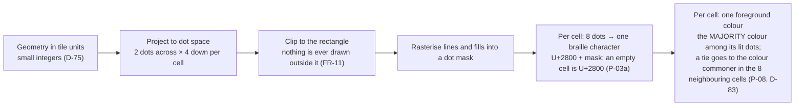

# Level 2 — Render and compositing

Up: [architecture](architecture.md) · Carries: FR-11, FR-12, FR-14, FR-16, FR-18a, FR-19, FR-23, FR-24a, FR-32, FR-33, FR-34, FR-36, NFR-4, NFR-6, NFR-8, D-32, D-35, D-42, D-64, D-73, D-75, D-77, D-83, D-87, P-03a, P-08

## The rule this diagram protects

**Render reads only what is already on hand, and never waits** (FR-23). It is a pure function of its inputs (NFR-6): the same view, size, depth, palette, time, overlays and tiles give the same bytes on any machine. An unchanged frame costs nothing (NFR-4).

## From a call to a frame

```mermaid
flowchart TB
    CALL["Render(rectangle, now)"] --> SAME{"Anything that could change a cell changed?<br/>the full list is the contract's, section 5 —<br/>view · size · look · places · overlays · tiles · phase · freshness · status"}
    SAME -- yes --> REUSE["Return the previous frame<br/>zero allocations (NFR-4)"]
    SAME -- no --> SNAP["Take a snapshot of what is on hand<br/>tiles in a fixed order (NFR-6) · prepared overlays · markers"]
    SNAP --> NEED["Note what is missing → pending work<br/>(never fetched here; the host's Work does it — D-73)"]
    SNAP --> PROFILE["Choose the basemap profile (FR-19)<br/>by map size · by what is on top · by layers switched off (FR-36)"]
    PROFILE --> PAINT

    subgraph PAINT["Paint the cell grid — each cell is glyph + foreground + background"]
      direction TB
      L0["1 Ground<br/>painted from the ground token, or left to the terminal if the host declared it (D-64)"]
      L1["2 Water<br/>masks a scalar FIELD: temperature stops at the shore (D-32)<br/>never masks an IMAGE: rain shows over water, the coast drawn as an outline (D-87)<br/>a host can flip either, per overlay"]
      L2["3 Images and fields<br/>cell background by class → colour (L2-colour)<br/>fields skip water cells; images do not (D-87)"]
      L3["4 Area tints<br/>alert polygons' interior; hatch when there is no colour (FR-18a)"]
      L4["5 Basemap lines<br/>braille dots, 2×4 per cell: coast, borders, roads, rivers, parks"]
      L5["6 Overlay lines and outlines<br/>polygon outlines always drawn (FR-16), contours (D-35), tracks"]
      L6["7 Labels<br/>place names, value labels, edge labels — collision-checked, cleaned, by grapheme cluster (FR-34)<br/>the text is a contest: furniture, then a marker, then an overlay's label, then a place name,<br/>and a marker's own label last, where P-60 puts it<br/><b>a frame with a scalar field claims in a different order (D-124):</b> marker labels, then the field's<br/>contour values, then the place names — a contour with no value says where a band changes but not to what"]
      L7["8 Glyphs<br/>markers over everything beneath — never under a hatch or a name (FR-18a); focus indicator (FR-24a)"]
      L8["9 Furniture<br/>scale mark (FR-33) · stale mark (FR-32) · credit line (FR-14) · footer, off by default (P-57) · the no-tiles notice (FR-23)"]
      L0 --> L1 --> L2 --> L3 --> L4 --> L5 --> L6 --> L7 --> L8
    end

    PAINT --> FG["Choose each cell's foreground (FR-16, D-77)<br/>the line's own colour where it meets 3:1 on this cell; otherwise whichever of black and white contrasts more"]
    FG --> DEPTH["Map colours to the depth in use<br/>truecolor · 256 (indices 16–255 only) · 16 · none (L2-colour)"]
    DEPTH --> EMIT["Emit lines<br/>each exactly the requested width (NFR-8)<br/>colour sequences and cleaned text, nothing else (FR-34)"]
    EMIT --> STATUS["Frame + status<br/>complete · still sharpening · no tiles · failed<br/>(failed: a panic was recovered — the last good rows are kept)"]
```

## The braille canvas

**The three parts of a cell.** A cell has one background, one set of dots and one piece of text, and the order above is read within each: the later layer is what that part of the cell shows, and across the three all of them are seen at once. **The text is a contest, not a painting**: the first layer to claim a cell keeps it, so for text the order above is the order in which cells are claimed - the frame's own furniture first, then a marker, then an overlay's label, then a place name, and a marker's own label last of all, which is where P-60 puts it. **A frame with a scalar field on it claims in a different order** (D-124): the host's own marker labels, then the values the field's contours carry, and only then the place names. A field drawn without colour is contour lines, and a contour with no value on it says where a band changes but not to what - so on such a frame the values are the data the host asked for and a place name is the decoration, while the host's own marker still outranks both. Upstream has no scalar fields, so it has no contour values to order against names: this order is taken only on a frame that has a field on it, and P-60's own order stands on every frame upstream could draw. A hatch (FR-18a) is laid last over the cells nothing else has taken, so a marker or a name inside an alert area always shows.

**Why one colour per cell matters.** A terminal cell has one foreground and one background. Two lines of different colours crossing one cell cannot both keep their colour; within the basemap upstream's majority vote decides (P-08, D-83), and across layers the compositing order does. This is the reason the basemap thins under overlays (FR-19) rather than competing with them.

## What can change this diagram

| If this changes… | …this part moves |
|---|---|
| The compositing order (FR-12) | The numbered list in "Paint the cell grid" |
| The cell-colour rule (P-08, D-83) | The last box of "The braille canvas" |
| The block renderer is built (after v0.1.0, D-42) | A second canvas beside the braille one; steps 5 to 7 use it; its own sparser profile |
| The ground ruling (D-64) | Step 1 |
| A new kind of furniture | Step 9, and NFR-8's closed list of characters |
| The precedence of text in a cell | The paragraph under the diagram, and the order the renderer claims cells in |
