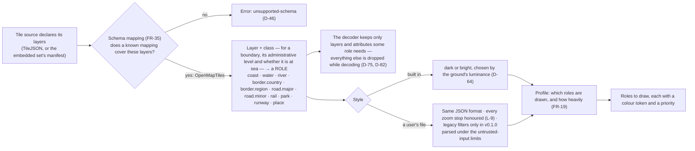
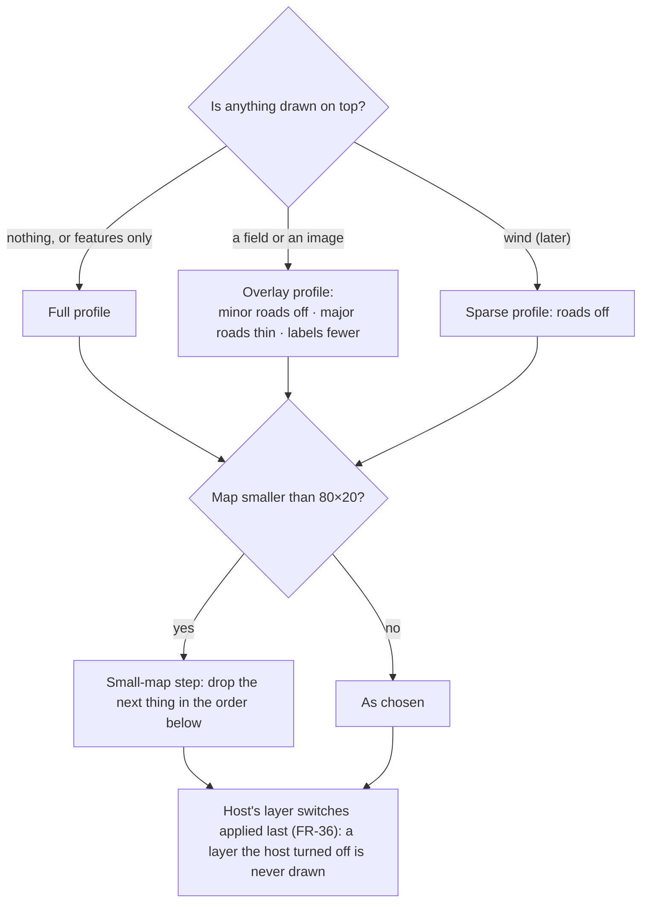
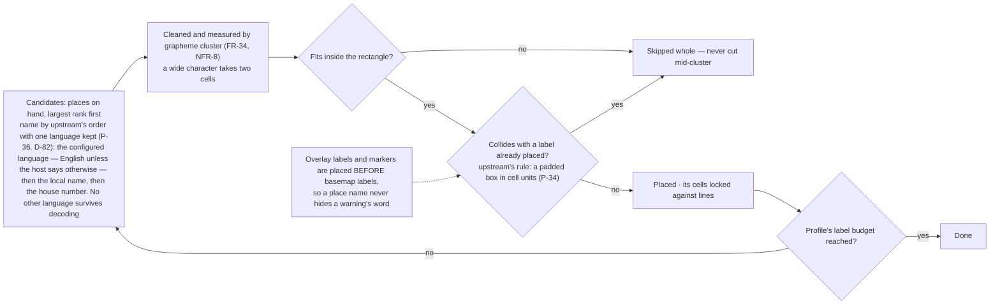

# Level 2 — Style, profiles, the schema seam, and labels

Up: [architecture](architecture.md) · Carries: FR-19, FR-34, FR-35, FR-36, NFR-8, D-46, D-64, D-75, D-82, D-83, P-34, P-36, L-9

## From a tile's layers to what is drawn

## Choosing the profile — what the basemap gives up, and in what order

**This is not a navigation tool (D-83): roads go first; coast, water, borders and terrain go last.**

| Given up first → last | Minor roads · major roads · rail · parks · region borders · place labels beyond the largest · rivers · country borders · water · coast |
|---|---|

## Placing labels

## What can change this diagram

| If this changes… | …this moves |
|---|---|
| The provider changes its schema | Only the mapping box and the role table |
| Style expressions arrive (after v0.1.0) | The user's-file branch. Until then a style that uses them is refused as `malformed-style`, saying so (D-102) |
| What a filter can ask about | `$type`, `class`, `name`, `rank`, `admin_level`, `maritime` — what the decoder keeps. `==` on any other key is false, as upstream has it for a key a feature lacks (P-42) |
| The block renderer is built | A second, sparser set of profiles |
