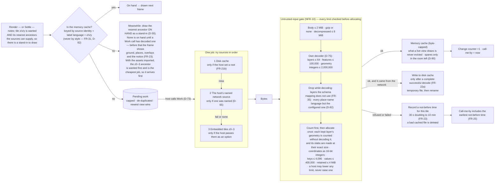
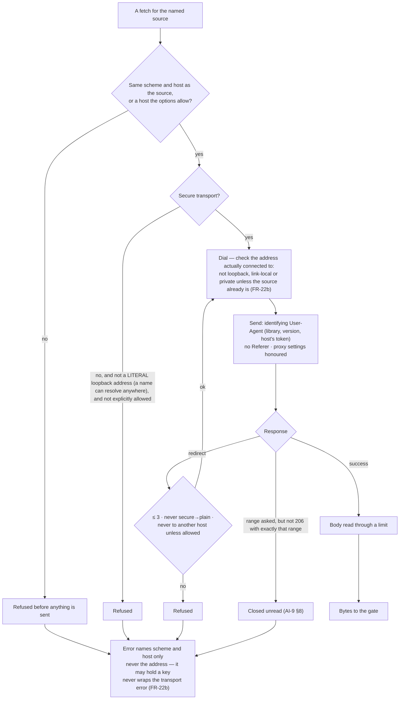
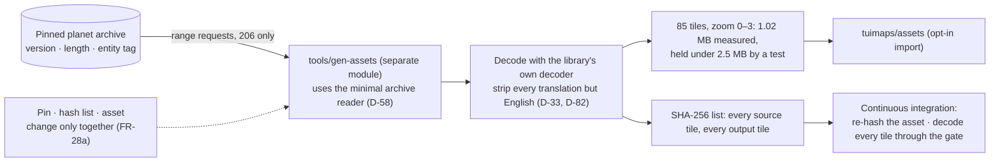

# Level 2 — The tile pipeline

Up: [architecture](architecture.md) · Carries: FR-21a, FR-21b, FR-22a, FR-22b, FR-23, FR-25, FR-28a, FR-31, FR-35, NFR-10, D-18, D-30, D-33, D-58, D-65, D-73, D-75, D-82, D-90, L-13

## Where a tile can come from

Each wanted tile is one job, and each job asks the sources in one fixed order: disk cache, the named network source, the embedded set. Embedded tiles never override a source the host chose (L-13): for zoom 0 to 3 with a network source named, the network's tile wins when it arrives, and the embedded one is what is drawn until then.

## The network edge

Everything that touches the network goes through one package, so the rules are enforced in one place.

## The disk cache

| Rule | From |
|---|---|
| Off unless the host sets a root — its file names are a record of where the user looked | FR-21b |
| Paths built only from a hash of the source identity and integers the library formats; all access confined to the root | FR-21b |
| Private to the user; a root writable by others is refused where the platform can tell | FR-21b |
| No expiry. Byte cap (default 256 MB); evict least-recently-read; recency = modification time set on read, at most hourly; total kept in memory, seeded by one walk at open; prune to 90% during `Work`, never while drawing | D-18, FR-21a |
| `Purge` and `Verify` exposed, and offered by the app | FR-22a |

## The embedded tiles and their generator

## What can change this diagram

| If this changes… | …this part moves |
|---|---|
| The public PMTiles source is built (after v0.1.0) | A fourth source in "try sources in order"; it wraps the same archive reader |
| Per-tile maxima, measured across zoom 0 to 14 ([constants](constants.md), section 1), change | The numbers in the gate |
| The provider changes its schema | Only the schema mapping (FR-35), and "drop while decoding" follows it |
