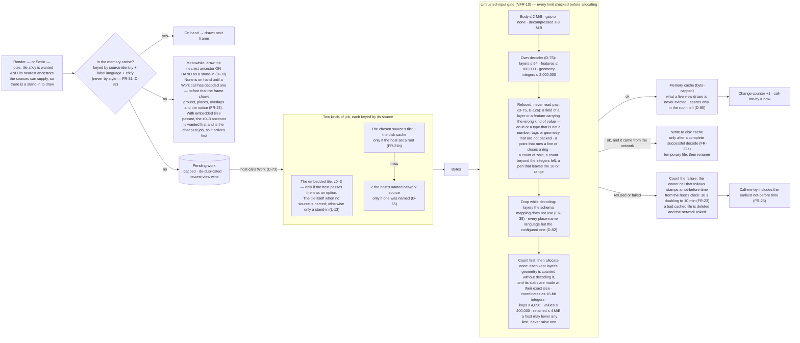
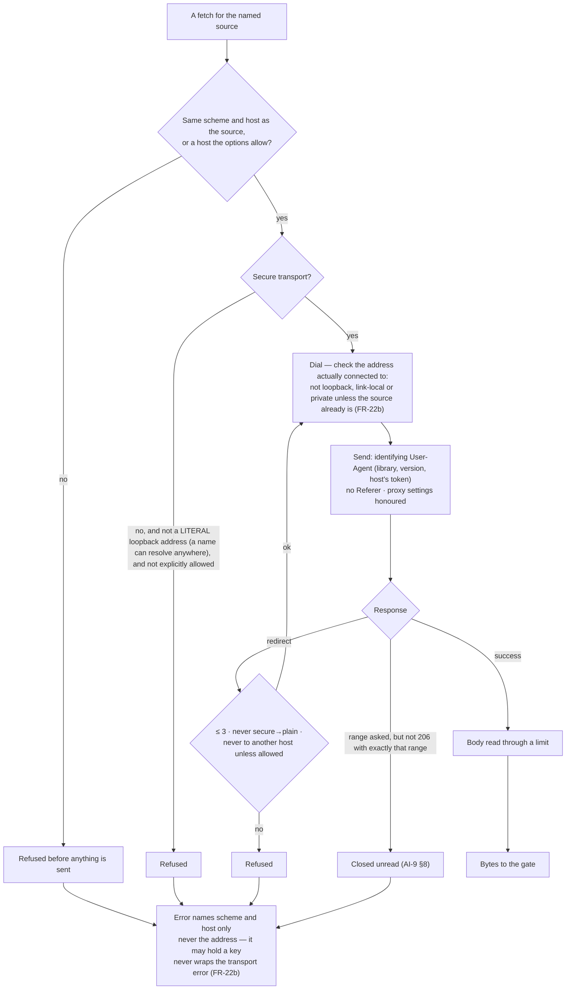
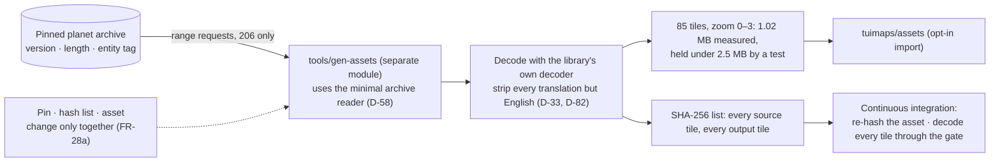

# Level 2 — The tile pipeline

Up: [architecture](architecture.md) · Carries: FR-21a, FR-21b, FR-22a, FR-22b, FR-23, FR-25, FR-28a, FR-31, FR-35, NFR-10, D-18, D-30, D-33, D-58, D-65, D-73, D-75, D-82, D-90, L-13

## Where a tile can come from

A wanted tile is asked of the source the host chose: the disk cache first, then the named network source, inside one job. The embedded set is asked in a job of its own, which is the cheapest there is and so sorts first. Embedded tiles never override a source the host chose (L-13): with a network source named, an embedded tile is only ever a stand-in — the network's tile wins when it arrives, and the embedded one is what is drawn until then. With no source named, the embedded set is the source for the zooms it holds.

**What is drawn for a tile is the first tile on hand of a chain**: the chosen source's tile, then the embedded one at the same zoom, then the same pair for each ancestor in turn. The memory cache is told the chains of every live view, and the first tile on hand of each chain is that view's need (D-90). *(BUILD, WP-06: the first design had one job try all three sources in order. That could not draw the embedded tile while a slow network fetch was still running, which is the behaviour this page has always promised.)*

## The network edge

Everything that touches the network goes through one package, so the rules are enforced in one place.

## The disk cache

| Rule | From |
|---|---|
| Off unless the host sets a root — its file names are a record of where the user looked | FR-21b |
| Paths built only from a hash of the source identity and integers the library formats; all access confined to the root | FR-21b |
| Private to the user; a root writable by others is refused where the platform can tell | FR-21b |
| No expiry. Byte cap (default 256 MB); evict least-recently-read; recency = modification time set on read, at most hourly; total kept in memory, seeded by one walk at open; prune to 90% during `Work`, never while drawing | D-18, FR-21a |
| `Purge` and `Verify` exposed, and offered by the app | FR-22a |
| **Layout, stable and documented:** `<root>/v1/<hash>/<z>/<x>-<y>.pbf`, where `<hash>` is the first 32 hex digits of the SHA-256 of the source's identity. Raw bytes as the source sent them, so a file serves every label language | L-12, P-48; set in BUILD |
| The root is opened once as a confined handle, and the permission check is made on that handle. Every entry on the way to a file is looked at without following links before the file is opened, and what was opened is compared with what was looked at | PL-IS-4 |
| A tile still being drawn from memory is still being read: the plan notes it in memory, and the next job writes its recency down. A plan does no input or output | FR-21a, FR-23 |

## The named source's two modes (P-49)

| Rule | From |
|---|---|
| A source ending in `/` is a prefix: `{source}{z}/{x}/{y}.pbf`. Any other is a TileJSON document, whose first tile address is used | P-49 |
| The TileJSON is read once, inside the first tile job that needs it — never when the source is named. Until then the source is taken to hold zoom 0 to 14; afterwards, the zooms it declares. A refusal is kept and not asked for again; a failure to fetch is not kept | D-65, NFR-5 |
| At most 1 MiB, nested at most 64 deep, checked before it is parsed | NFR-10 |
| Its tile address: a secure scheme, no user name, the TileJSON's own host unless the application allowed another, only `{z}`, `{x}` and `{y}` filled and all three present, no token in the host, **no fragment** — a fragment is never sent, so every tile would be the same request *(found by the fuzz target in BUILD)* | FR-22b |
| A source that declares layers of which the map knows none is refused as an unsupported schema | FR-35 |

## The embedded tiles and their generator

## What can change this diagram

| If this changes… | …this part moves |
|---|---|
| The public PMTiles source is built (after v0.1.0) | A fourth source in "try sources in order"; it wraps the same archive reader |
| Per-tile maxima, measured across zoom 0 to 14 ([constants](constants.md), section 1), change | The numbers in the gate |
| The provider changes its schema | Only the schema mapping (FR-35), and "drop while decoding" follows it |
