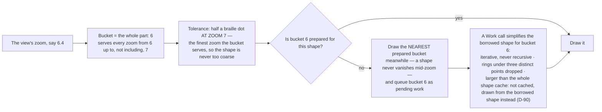
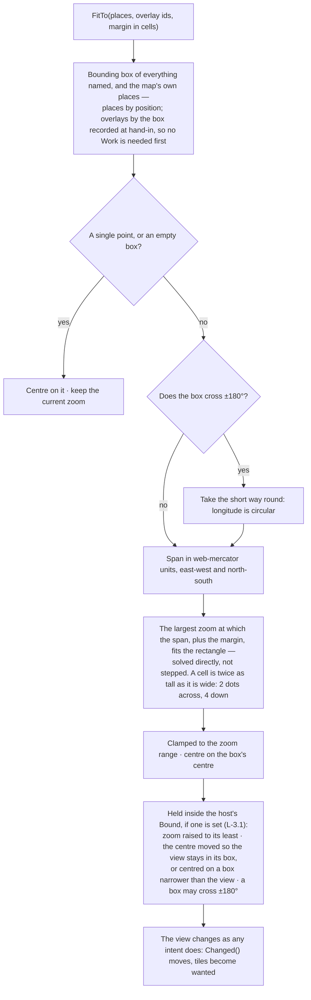

# Level 2 — The view: zoom buckets and fit-to

Up: [architecture](architecture.md) · [constants, section 3](constants.md) · Carries: D-76, D-90

## Zoom buckets — one simplified copy of a shape per whole zoom level

## Fit-to — put these things in the frame (D-76)

*AS BUILT v0.2.0 (rc.6): the fitted view, like every move, is then held inside the host's bound if one is set (`SetBound`, L-3.1).*

**M1's guard** — the place and the condition share one frame — is met by calling this, and tested by it (task 14.5).

## What can change this diagram

| If this changes… | …this moves |
|---|---|
| The bucket width or its tolerance | The first diagram and the constants table |
| Fit-to gains a "keep this place centred" form | The second diagram |
