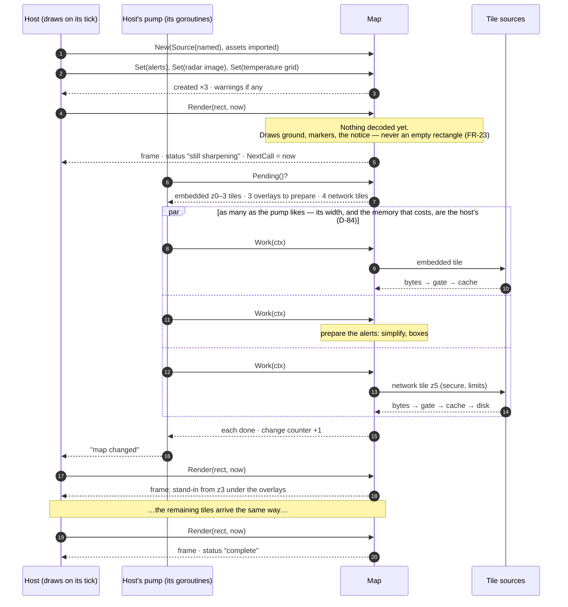
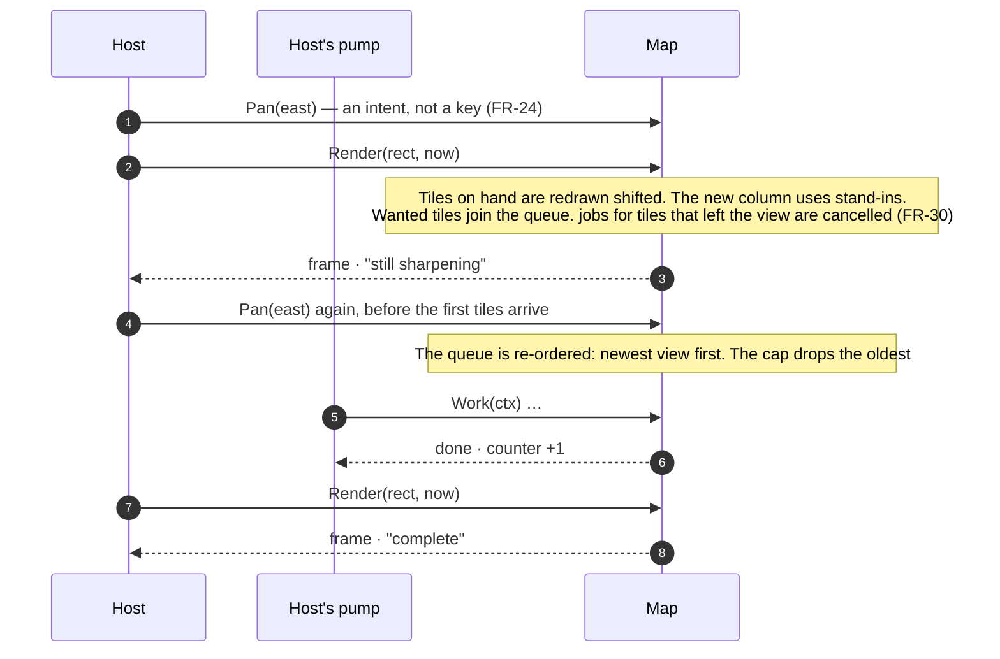
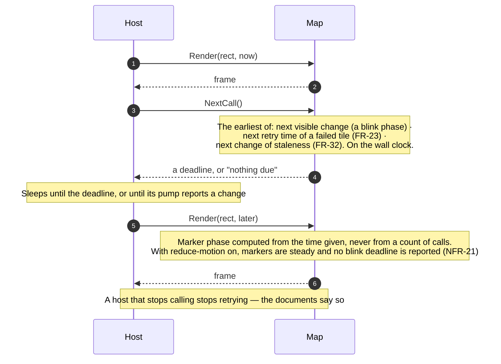
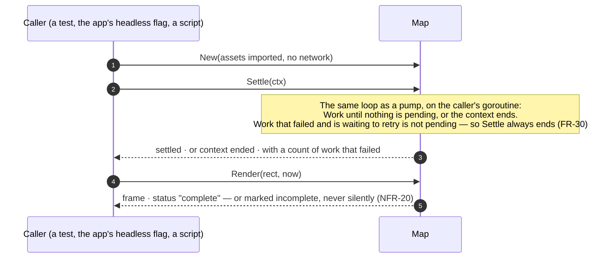

# Level 3 — Sequences

Up: [architecture](architecture.md) · Carries: D-73, D-30, D-65, FR-4, FR-23, FR-25, FR-30, NFR-5, NFR-19

The library starts no goroutine (D-73). In every sequence below, anything slow happens inside a `Work` call made by the host.

## 1 · A cold first frame — never blank (D-30, NFR-5: ≤ 3 s to full detail)

## 2 · A pan — the newest view wins

## 3 · An idle host — how it still learns that something is due (FR-25)

## 4 · A one-shot render — three calls (NFR-19, FR-4)

## What can change these diagrams

| If this changes… | …these move |
|---|---|
| The background-work model (D-73) | All four |
| The integration review finds the pump awkward in the first host (D-60) | Sequences 1 and 3; the examples |
| The never-blank floor (FR-23) | The first Render in sequence 1 |
