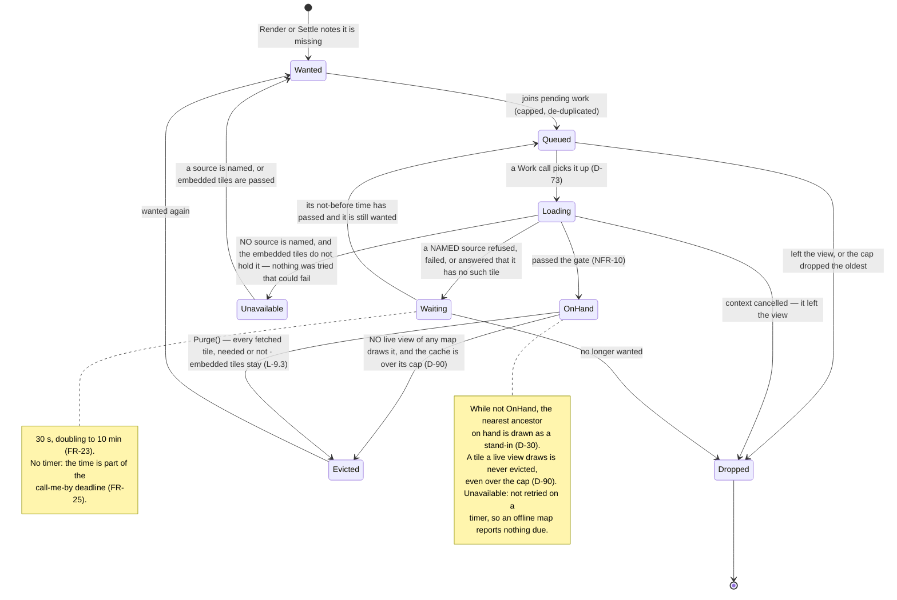
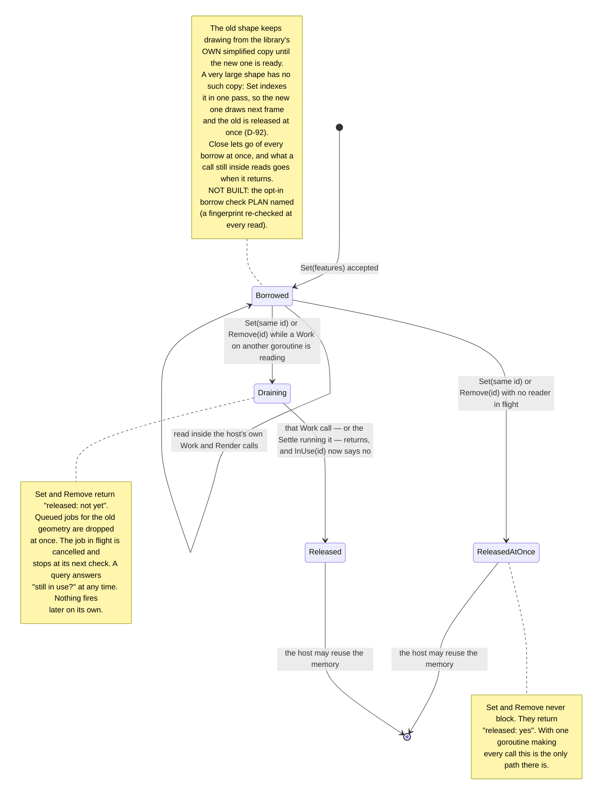
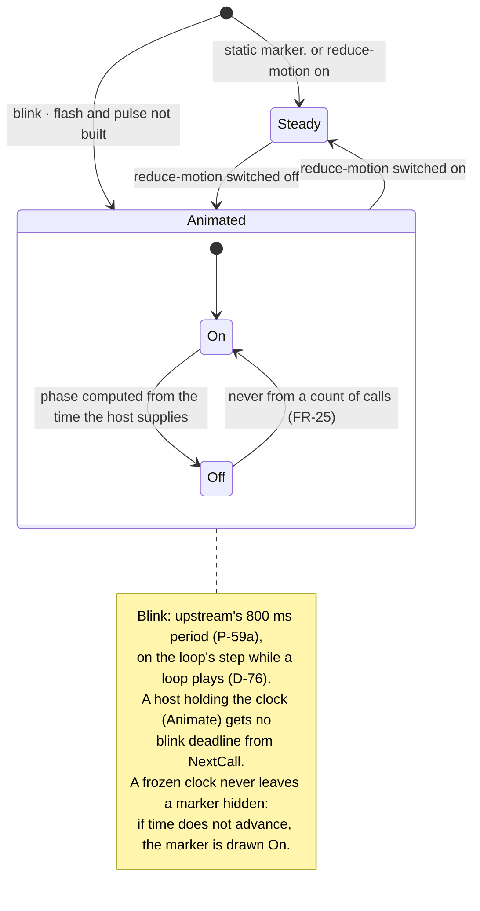
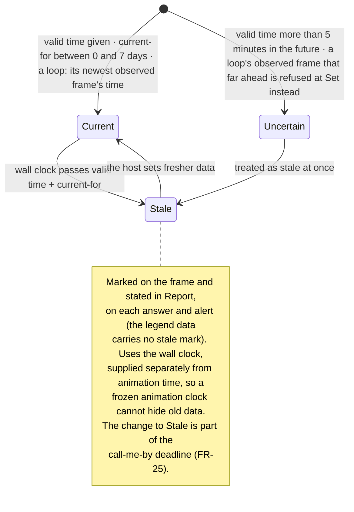

# Level 3 — State machines

Up: [architecture](architecture.md) · Carries: FR-11, FR-23, FR-25, FR-26, FR-32, FR-37, NFR-10, NFR-21, D-30, D-56, D-73, D-74, D-86, D-90, D-92, P-59a

## 1 · A tile

*AS BUILT v0.2.0 (rc.8): `Purge` also takes a fetched tile out of memory, and a disk file past its maximum age is fetched again rather than served (D-56).*

## 2 · Borrowed geometry (FR-11, D-74, D-86)

The one dangerous part of the contract: the host's memory, read by the library. **Every reader runs inside a call the host itself made** — `Work` (simplifying, describing) or `Render` (drawing a very large shape directly) — so the end of a borrow is **reported to the host, never waited for** (D-86). *AS BUILT (v0.1.0, unchanged in v0.2.0), corrected against the code: `Work` and `Settle` return no released ids; after "not yet", `InUse(id)` is how the host learns the borrow is over; and the opt-in borrow check was never built.* `Render`, `Set` and `Remove` are owner calls, one at a time (contract, section 6), so a `Render` is never still reading when a `Set` arrives: only a `Work` can be the last reader.

## 3 · A marker's animation (FR-26, D-56, NFR-21)

*AS BUILT v0.2.0 (rc.3): while a loop plays, the blink's half-period is put on the loop's step, the smallest multiple of it at least half the blink's own period, so every blink change falls on a frame advance (D-76). Flash and pulse are not built.*

## 4 · An overlay's freshness (FR-32)

*AS BUILT v0.2.0 (rc.3): a loop's freshness is its newest observed frame's — never the frame shown, a gap or a forecast (L-1.3, D-67); an observed frame dated more than five minutes past the map's clock is refused at `Set`, since only a forecast may be in the future.*

## What can change these diagrams

| If this changes… | …this moves |
|---|---|
| The retry times (FR-23) | Machine 1's note |
| How the end of a borrow is reported (D-86) | Machine 2 |
| Flash and pulse are built; camera tours arrive | Machine 3 gains the camera's own machine beside it |
| Image loops are built (FR-37) | Machine 4 gains a per-frame valid time |
