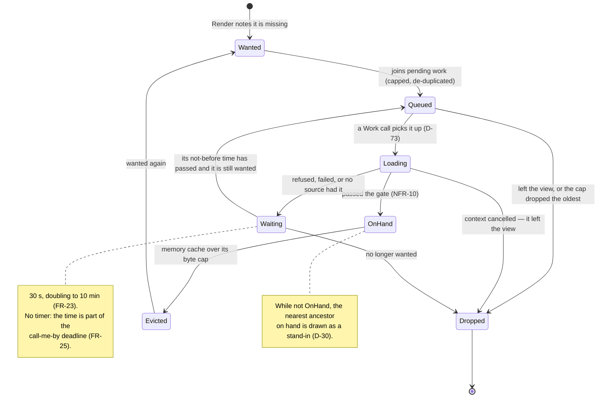
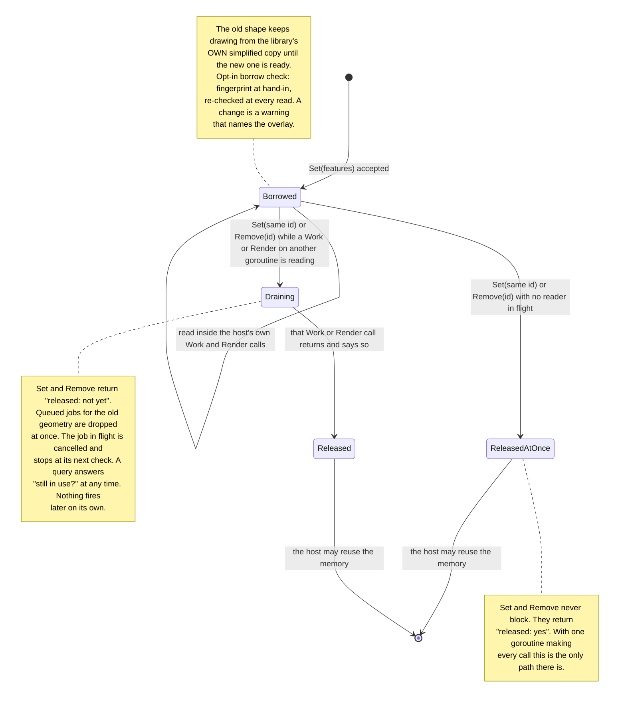
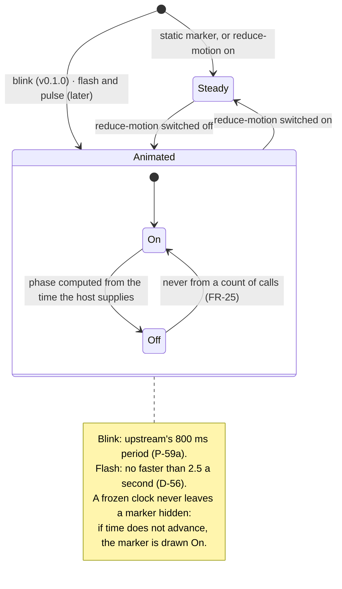
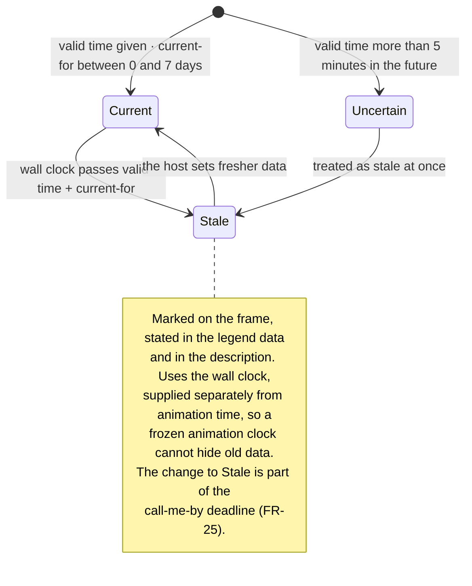

# Level 3 — State machines

Up: [architecture](architecture.md) · Carries: FR-11, FR-22a, FR-23, FR-25, FR-26, FR-32, NFR-21, D-30, D-56, D-73, D-74, D-86

## 1 · A tile

## 2 · Borrowed geometry (FR-11, D-74, D-86)

The one dangerous part of the contract: the host's memory, read by the library. **Every reader runs inside a call the host itself made** — `Work` (simplifying, describing) or `Render` (drawing a very large shape directly) — so the end of a borrow is **reported to the host, never waited for** (D-86).

## 3 · A marker's animation (FR-26, D-56, NFR-21)

## 4 · An overlay's freshness (FR-32)

## What can change these diagrams

| If this changes… | …this moves |
|---|---|
| The retry times (FR-23) | Machine 1's note |
| How the end of a borrow is reported (D-86) | Machine 2 |
| Flash and pulse are built; camera tours arrive | Machine 3 gains the camera's own machine beside it |
| Image loops are built (FR-37) | Machine 4 gains a per-frame valid time |
