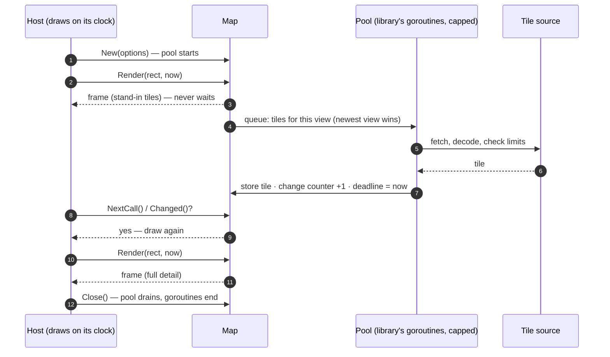
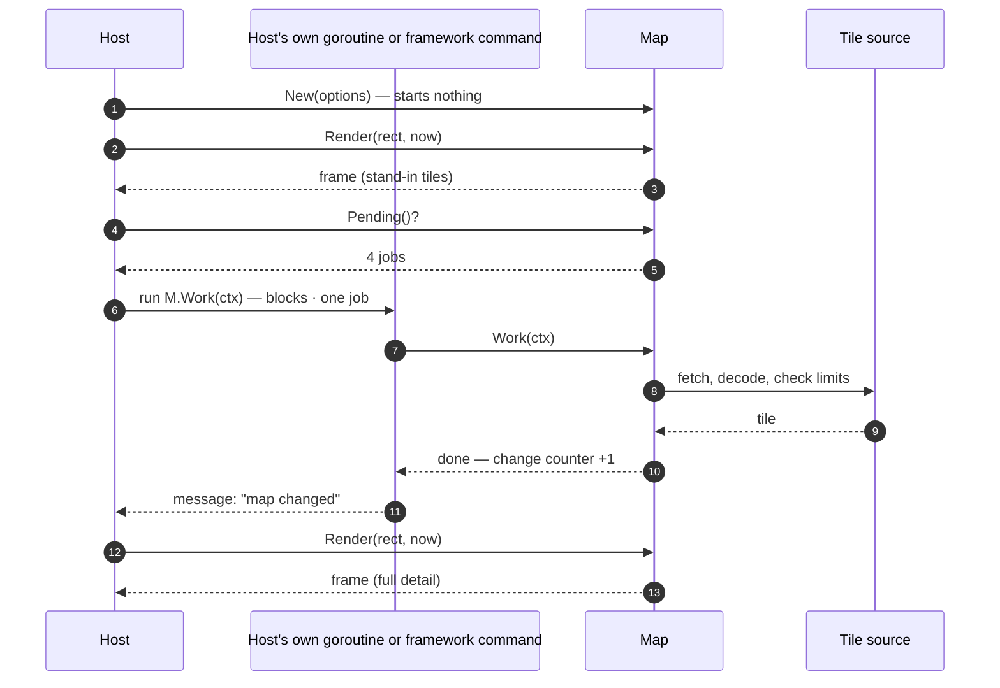
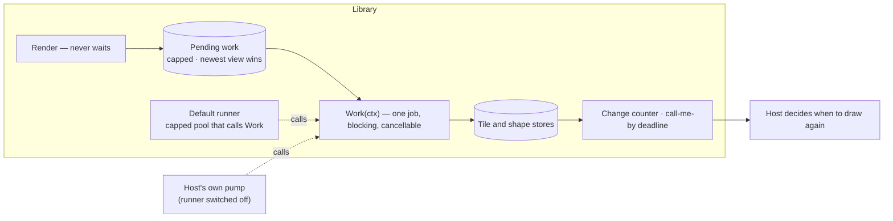

# PLAN — Approach 1: who runs background work

| Field | Value |
|---|---|
| Phase | PLAN |
| Date | 2026-09-19 |
| Decides | The design note FR-30 requires: at least two models for running slow work, compared against FR-30's constraints. Risk RS-4 (High). |
| Status | **Ruled 2026-09-19 (D-73): Model B — the host runs the work.** Chosen against the recommendation (C). Models A and C are kept below as the record of what was considered. |

## The problem in one paragraph

Drawing a frame must never wait (FR-23: Render does no input or output). But tiles have to be fetched and decoded, large shapes simplified, descriptions computed — all slow. So something other than Render does that work, and the question is **whose goroutines those are**: the library's, or the host's. The first host redraws every 300 ms from a single clock, builds on a framework whose idiom for slow work is "hand the framework a function; it runs it and sends you a message", and keeps timers out of its interface layer.

## What every model must satisfy (FR-30, FR-23, FR-25, NFR-3, NFR-4)

Every goroutine has an owner and none outlives the map · work in flight is capped, newest view wins · every job is cancellable · one Render may run beside one fetch, under the race detector · finishing work moves the change counter and the "call me by" deadline · a settle call for one-shot renders · no panic escapes · decode concurrency is limited so the memory peak holds · a newcomer gets a map in three calls (NFR-19, and D-69's "easy for a developer").

## Model A — the library owns a small pool



- **For:** the least a host can write. Three calls give a working map; nothing to pump. Decode concurrency and caps are enforced in one place.
- **Against:** hidden concurrency inside a library; a host that forgets `Close` leaks goroutines; tests must control a pool to be deterministic; a host with strict rules about who starts goroutines cannot opt out.

## Model B — the host runs the work



- **For:** no goroutine the host did not start. Fits the first host's framework exactly. Tests are deterministic with no tricks: call `Work` until `Pending` is zero — which is also all that `Settle` is.
- **Against:** every host must write the pump, and a host that does not gets a map that never sharpens — the opposite of "it just works". Parallelism and the memory peak become the host's to get right.

## Model C — B is the engine, A is a thin default on top

The core is Model B: the map never starts a goroutine, and `Work(ctx)` does one unit of pending work. A small runner — a capped pool that simply calls `Work` — is supplied by the library and **on by default**. A host that wants control switches it off and pumps `Work` itself.



Illustrative shape of the calls, not a design:

```go
m := tuimaps.New(opts...)            // default runner on
m := tuimaps.New(tuimaps.NoRunner()) // host pumps: for m.Pending() > 0 { m.Work(ctx) }
m.Settle(ctx)                        // same loop, inside the library
m.Close()
```

- **For:** the newcomer's three calls *and* the strict host's control. One engine, so one set of rules for caps, cancellation and memory. Tests drive `Work` directly and stay deterministic; the runner is small enough to test on its own.
- **Against:** two ways to run is more to specify, document and keep under the race detector; if the first host takes the default, the hand-pumped path is exercised only by tests.

## Against the constraints

| Constraint | A — library pool | B — host runs | C — engine plus default runner |
|---|---|---|---|
| Owner of every goroutine | The map; ends at `Close` | The host | The runner (ends at `Close`), or the host |
| A map in three calls (NFR-19, D-69) | Yes | No — needs a pump | Yes |
| Fits a host that forbids library goroutines | No | Yes | Yes, with the runner off |
| Deterministic tests without special hooks | Needs a controllable pool | Yes | Yes |
| Memory peak controlled in one place (NFR-3) | Yes | The host's job | Yes by default; the host's job with the runner off |
| Leak if the host forgets `Close` | Yes | Nothing to leak | Yes by default |
| Size | Smallest for hosts | Smallest for the library | The engine plus a small runner |
