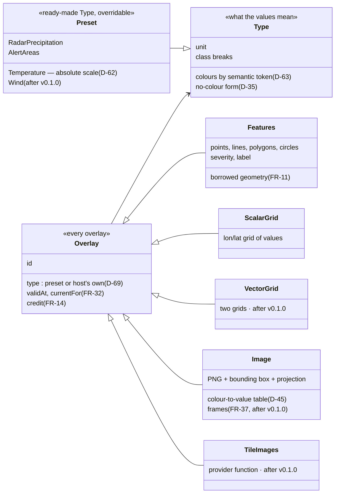
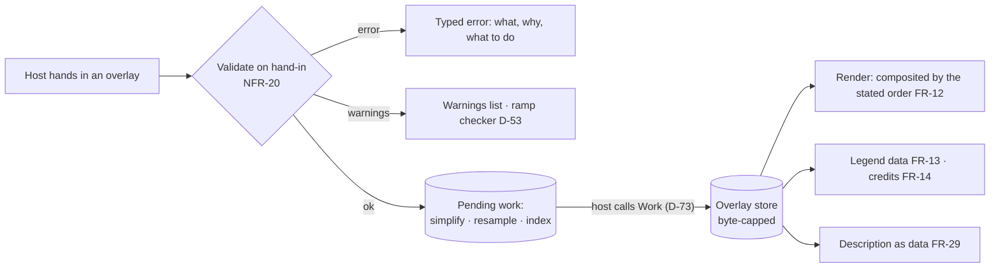

# PLAN — Approach 2: the shape of the overlay contract

| Field | Value |
|---|---|
| Phase | PLAN |
| Date | 2026-09-19 |
| Decides | How a host hands an overlay to the map — the part of the library the first host imports and D-60 promises to keep stable. Risk RS-2 (High). Judged on developer ergonomics first (D-69). |
| Status | **Ruled 2026-09-19 (D-74): Style A — plain structs set by id.** Styles B and C are kept below as the record of what was considered. Two points from the argument against A are carried into the design: the end of a borrow must be hard to ignore, and a set call says whether it replaced or created. |

## What any contract must carry

The same whichever style is chosen. Every box traces to a ruling.





## Style A — plain data: one struct per shape, set by id

The host fills in a struct and sets it; setting the same id again replaces it; presets are ready-made values for the `Type` field, with helper constructors so the common case is one call.

```go
m.Set(tuimaps.TemperatureGrid("temp", grid, tuimaps.Celsius, validAt))   // preset, one call
m.Set(tuimaps.Image{ID: "radar", Type: tuimaps.Radar(), PNG: png, Box: box, Table: iemTable, ValidAt: t})
m.Set(tuimaps.Features{ID: "alerts", Type: tuimaps.Alerts(), Items: shapes})
m.Set(tuimaps.ScalarGrid{ID: "aqi", Type: myAirQualityType, Grid: g})     // host's own type
m.Remove("radar")
```

- **For:** nothing to learn but the structs; easy to build in a test; new fields can be added later without breaking callers (NFR-22), which positional arguments cannot do; "set it again to replace it" is already FR-11's rule.
- **Against:** a mistyped id silently makes a second overlay; refreshing radar every few minutes restates the whole struct; when the borrow of old geometry ends has to come back from `Set` as a value the host may ignore.

## Style B — layer handles

The host adds a layer once and keeps a handle; data and style are updated through it.

```go
radar := m.AddImageLayer("radar", tuimaps.Radar())
radar.SetTable(iemTable)
done := radar.SetData(png, box, validAt)   // done reports when the old data is no longer read
radar.Remove()
```

- **For:** the life of borrowed data is explicit and hard to ignore; a refresh hands in only what changed; a mistyped id is a compile error, not a second overlay.
- **Against:** more to learn — a handle type per shape, each with its own methods; handles are state the host must keep and can lose; harder to build an overlay in a test and compare it.

## Style C — functional options

One `Add` call with a data constructor and any number of options.

```go
m.Add("temp", tuimaps.Grid(grid), tuimaps.Temperature(tuimaps.Celsius), tuimaps.ValidAt(t))
m.Add("radar", tuimaps.PNG(png, box), tuimaps.Radar(), tuimaps.Table(iemTable))
```

- **For:** short at the call site; options can be added for ever without breaking anyone.
- **Against:** nothing tells a developer which options go with which shape — a table on a grid compiles and fails at run time; the editor's completion lists every option for every shape; hardest of the three to read back.

## Compared

| | A — plain structs | B — layer handles | C — options |
|---|---|---|---|
| A preset overlay in one call | Yes, by helper constructor | Two: add, then set data | Yes |
| Wrong combination caught by the compiler | Mostly — each shape has only its own fields | Yes | No |
| Add a field or option later without breaking callers (NFR-22) | Yes | Yes | Yes |
| End of the borrow (FR-11) | A value returned by `Set` and `Remove` | Natural: returned by `SetData` | A value returned by `Add` |
| Refreshing data | Restate the struct | Hand in only the data | Restate the call |
| Building and comparing in tests | Easiest | Hardest | Middle |
| What a newcomer must learn | Five structs and four presets | Five handle types and their methods | One call and a long list of options |
