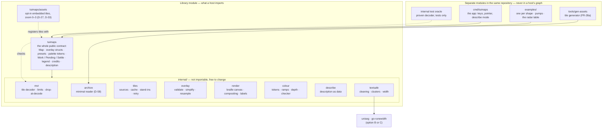

# PLAN — Approach 3: what the library depends on, and how it is laid out

| Field | Value |
|---|---|
| Phase | PLAN |
| Date | 2026-09-19 |
| Decides | The dependency allow-list NFR-9 requires, and with it who writes the code that parses untrusted bytes (risk RS-12; the contradiction X-5 carried from the research). The layout below follows from the answer and is reviewed with the architecture. |
| Status | **Ruled 2026-09-19 (D-75): Option B — a short allow-list for text tables only; own tile decoder with a test-only oracle.** Options A and C are kept as the record of what was considered. The layout is reviewed with the architecture. |

## The facts (research AI-3, AI-4, AI-9; red-team rounds 2 and 3)

- **The first host's rules for anything it imports:** pure Go, a licence file for every module in the graph, a clean vulnerability scan, and nothing that drags its interface framework into other consumers.
- **Vector tiles are the main untrusted input.** The proven Go decoder (`paulmach/orb`, MIT, active) brings a small scanner module, a protobuf module whose own README is headed "Deprecated", and a database driver listed in its module file (whether pruning keeps that out of a consumer's graph was not verified).
- **The memory budget needs things that decoder does not offer.** The 8 MB arithmetic only closes if unused layers and the place-name translations (93% of a low-zoom tile) are **dropped while decoding**, and coordinates are kept as small integers rather than pairs of 64-bit floats (round 2, performance). NFR-10 also needs limits on layers, features and geometry **enforced before allocating**. A general-purpose decoder decodes everything, then hands it over.
- **Text is the other sharp edge.** NFR-8 and FR-34 need grapheme clusters and a width table — "the same one the first host measures with". Those are Unicode data tables, thousands of lines, revised yearly. The standard Go modules for them (`rivo/uniseg`; `mattn/go-runewidth`, which the first host already uses and which itself imports `uniseg`) are MIT with no further dependencies.
- **Everything else is in the standard library:** HTTP, gzip, PNG, JSON, embedding files.
- **The archive reader** has no credible importable module (AI-9): the reference implementation pulls in three cloud SDKs. D-58 already ruled a minimal in-house reader.

## The options

| Option | Who parses tiles | Text width and clusters | In a consumer's module graph |
|---|---|---|---|
| A. Nothing but the standard library | Own decoder | Own tables, generated from the Unicode data files | Nothing |
| **B. A short allow-list: text tables only** | **Own decoder**, fuzzed, with the proven decoder kept as a test oracle outside the shipped module | `uniseg` and `go-runewidth` | Two small MIT modules the first host already carries |
| C. Proven decoder too | `paulmach/orb` | `uniseg` and `go-runewidth` | Those two, plus orb, its scanner, a deprecated protobuf module and possibly a database driver |

- **A — for:** the cleanest possible graph. **Against:** re-creating Unicode tables is thousands of generated lines that must be regenerated every Unicode release, to arrive at — at best — what the first host already measures with; any difference between the two tables is a layout bug in the host (NFR-8).
- **B — for:** own code exactly where the budget and the limits demand control, borrowed code exactly where the data is large, dull and standard; the width table is the host's by construction. **Against:** about 300 to 400 hand-written lines (an estimate, unverified) parsing hostile bytes — RS-12 stays open and is paid for with fuzzing and an oracle.
- **C — for:** the least parsing code to write and the most field-tested. **Against:** cannot drop data at decode or enforce limits before allocating without forking it; the memory arithmetic fails at its 6–8× expansion; a deprecated module in every consumer's licence file and vulnerability scan.

## The layout that follows (the same for A and B; C adds one import)

Why separate modules: an example that shows the pump in the first host's framework has to import that framework, and the app needs terminal input handling; kept in the library's module file, both would appear in every host's dependency graph and licence list (research AI-4 §10).
