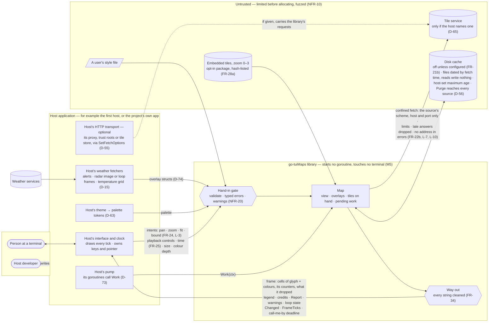
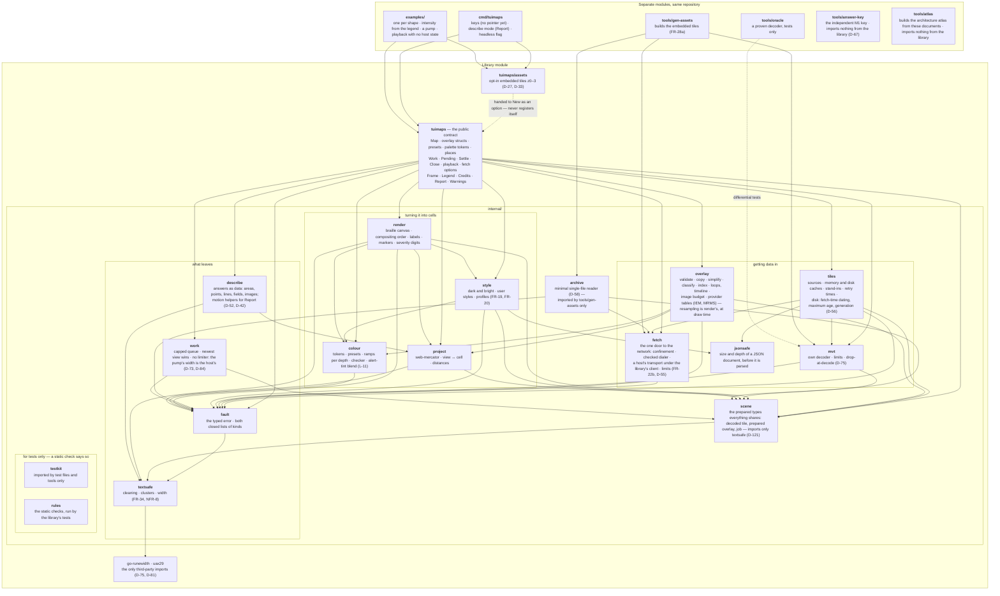

# go-tuiMaps — Architecture

| Field | Value |
|---|---|
| Phase | PLAN |
| Date | 2026-09-19 |
| Status | **Approved with the Plan of Record (D-95).** Revised after each of the PLAN red-team's three rounds. Built on rulings D-11 to D-94. HUM LEAD's first read, 2026-09-19: "These look good so far" — a basic understanding, not yet a deep one; the set was approved with the Plan of Record (D-95). |
| How to use this | These diagrams are **living references** (D-71). Point at one when asking a question; when a decision changes, the diagram changes in the same commit. Every diagram file names the rulings and requirements it carries on its first lines, so a change to one of those says which file to open; for the three diagrams in this file, the ids are in the text beside each. |

## Start here

Thirty-four diagrams is a lot to hold. **[A guided tour](architecture-tour.md)** follows one story — a flood warning and a radar picture, from the first host to the cells on the screen and the sentence it can speak — through almost every diagram once, in 29 steps, each naming the diagram to look at and the ruling behind it. It ends with the three diagrams to read if you read no others.

## The documents of PLAN, and the diagram set

Read down for more detail, up for context. Each file's first lines say which rulings and requirements it carries.

| Level | What | File |
|---|---|---|
| — | **A guided tour**: one story through almost every diagram, in 29 steps | [`architecture-tour.md`](architecture-tour.md) |
| 0 | **Context and trust boundary** — the library among its neighbours, and which side of the line each byte comes from | this file |
| 1 | **The parts** — packages, what each owns, what may import what | this file |
| 1 | **The public contract at a glance** | this file |
| 1 | **The contract** — what a host can rely on: the pump, the three-call path, the end of a borrow, the frame, which calls are safe together, shared caches, where each deferred shape lands (2 diagrams) | [`contract.md`](contract.md) |
| 1 | **Constants** — every number a test needs, and the semantic token list | [`constants.md`](constants.md) |
| 2 | Render and compositing (2 diagrams) | [`L2-render.md`](L2-render.md) |
| 2 | Tile pipeline, the network edge, the embedded tiles and their generator (3) | [`L2-tiles.md`](L2-tiles.md) |
| 2 | Overlay pipeline, shape by shape; presets (3) | [`L2-overlays.md`](L2-overlays.md) |
| 2 | Colour resolution; the ground (2) | [`L2-colour.md`](L2-colour.md) |
| 2 | Style, profiles, the schema seam, label placement (3) | [`L2-style.md`](L2-style.md) |
| 2 | The view: zoom buckets and fit-to (2) | [`L2-view.md`](L2-view.md) |
| 2 | The view described as data (2) | [`L2-describe.md`](L2-describe.md) |
| 2 | Errors and warnings (1) | [`L2-errors.md`](L2-errors.md) |
| 2 | Memory budget map (1), and the measurement behind it (no diagram) | [`L2-memory.md`](L2-memory.md) · [`memory-measurement.md`](memory-measurement.md) |
| 2 | The standalone app (1) | [`L2-app.md`](L2-app.md) |
| 2 | Tests and gates (1) | [`L2-gates.md`](L2-gates.md) |
| 3 | Sequences: a cold first frame · a pan · an idle host · a one-shot render (4) | [`L3-sequences.md`](L3-sequences.md) |
| 3 | State machines: a tile · borrowed geometry · a marker · an overlay's freshness (4) | [`L3-states.md`](L3-states.md) |
| — | The three approach notes, kept as the record of what was considered; their diagrams show the options, not the design (6) | [`approach-1`](approach-1-background-work.md) · [`approach-2`](approach-2-overlay-contract.md) · [`approach-3`](approach-3-dependencies-and-layout.md) |
| — | PLAN entry checks: the radar image source; the terminal matrix | [`plan-entry-checks.md`](plan-entry-checks.md) |
| — | The implementation plan, with the work packages' dependency diagram (1) | [`../04-development/implementation-plan.md`](../04-development/implementation-plan.md) |
| — | How the first host starts before a remote exists, and the integration-review template (D-60) | [`../04-development/first-host-start.md`](../04-development/first-host-start.md) · [`../07-readiness/integration-review-template.md`](../07-readiness/integration-review-template.md) |
| — | The parity mapping: each of this release's 62 parity rows, the work package that builds it, the test that proves it | [`../04-development/parity-mapping.md`](../04-development/parity-mapping.md) |

**Counted:** 3 in this file, 2 in the contract, 21 at level 2, 8 at level 3 — **34**; with the approach notes' 6 and the plan's 1, **41**.

---

## Level 0 — Context and trust boundary

*AS BUILT v0.2.0 (rc.8).*

Who the library talks to, and who it trusts. **The library trusts nothing that arrives as bytes**, including what its own host hands in: the host's data is validated (NFR-20), everyone else's is limited, decoded defensively and fuzzed (NFR-10). Nothing crosses back out to a terminal or a host uncleaned (FR-34).

**What this diagram settles**

| Question | Answer | From |
|---|---|---|
| Who fetches weather? | The host. The library never calls a weather service. | D-15 |
| Does the library reach the network by itself? | Never, unless the host names a tile source. | D-65 |
| Whose goroutines? | The host's. The library starts none. | D-73 |
| Who reads keys and the mouse? | The host; the library takes intents. | D-17, FR-24 |
| Who owns time? | The host supplies it; the library answers "call me by…". | FR-25 |
| What is trusted? | Nothing that arrives as bytes. Host input is validated; the rest is limited, decoded defensively and fuzzed. | NFR-10, NFR-20 |
| What leaves? | Cells, and plain data; every string cleaned on the way out. | FR-34, D-52 |

---

## Level 1 — The parts

*AS BUILT v0.2.0 (rc.8): the edges are the real import graph; most edges into `textsafe` are left out.*

One public package holds the whole contract (D-74). Everything under `internal/` can change freely without breaking a host (D-60). The app, examples, generator and test oracle are **separate modules**, so nothing they import appears in a host's dependency graph (D-75).

**Rules of the layout**

| Rule | Why |
|---|---|
| A host imports `tuimaps`, and `tuimaps/assets` if it wants offline tiles. Nothing else is importable. | D-74; internal parts stay free to change under D-60's promise |
| `render` never imports `tiles`, `fetch` or `overlay`'s slow paths. It reads what is already on hand. | FR-23: Render does no input or output, ever |
| Only `work` runs slow jobs, and only when the host calls `Work`. It knows jobs only through `scene`'s job type — `tiles` and `overlay` supply jobs; `work` imports neither. `describe` supplies none: `Report` is worked out inside its own call. | D-73; this is what keeps the import graph free of cycles (PL-CQ-7) |
| Only `fetch` opens a connection; only `textsafe` lets a string out. Every package that reports a problem does it through `fault`, whose only import is `textsafe`. | One place to enforce FR-22b; one place to enforce FR-34 |
| The public package imports `tiles` to configure sources and caches and to hand its jobs to `work`. | Without this edge nothing reaches `tiles`, and through it `fetch`, `mvt` and `archive` (P2-DOC-2) |
| Only `textsafe` imports third-party code. | D-75 |
| The framework the first host uses appears only under `examples/`. | D-13, D-75 |

---

## Level 1 — The public contract at a glance

*AS BUILT v0.2.0 (rc.8): `Report` replaces `Describe`; playback, fetch options, cache age, bound.*

Everything a host can call or hand in, grouped by what it is for. The names are the code's, as of v0.2.0-rc.8; PLAN's were illustrative (D-71). **The full statement — what each call promises, which calls are safe together, the pump, the end of a borrow — is [the contract](contract.md).**

```mermaid
flowchart LR
    subgraph IN["Host → Map"]
      direction TB
      A1["<b>Life</b><br/>New(options: WithSize · Embed · SharedCaches) · Close() — closes at once and reports calls still inside"]
      A2["<b>Size and view</b><br/>WithSize(cols, rows) — state, set BEFORE Settle or Render; Render's size updates it<br/>intents: PanCells · Zoom · ZoomBy · Recentre · FitWorld · FitTo(places, overlays, margin) (FR-24, D-76)<br/>SetBound(Bound): a least zoom and a box, held on every move (L-3.1) · Centre() · DeepestZoom()"]
      A2b["<b>Places and markers</b><br/>SetPlaces(places) · AddPlace(place) · RemovePlace(id) · Places() — ids as upstream (P-61)<br/>what Report answers for, what FitTo can fit, what markers draw (FR-26)"]
      A3["<b>Overlays</b> (D-74, D-86)<br/>Set(overlay) → SetResult: created or replaced · old geometry released yes/no<br/>Remove(id) → RemoveResult: found · released yes/no · InUse(id) · Overlays()<br/>structs: Features · Grid · Image — one PNG, or Frames: a loop of up to MaxFrames 72, gaps and forecasts stated (D-54)<br/>an image's table, or a Provider's: IEM · MRMS · SetImageBudget(bytes), 6 MiB by default (L-12)<br/>presets: Temperature · Radar · Alerts (· Wind, VectorGrid, TileImages later) (D-69)"]
      A4["<b>Look</b><br/>SetPalette(tokens) (D-63) · SafeRamps(on) · Ground(colour) · PaintGround() (D-64)<br/>ColourDepth(depth) · ReduceMotion(on) (NFR-21) · Layers(layer, on) (FR-36; major and minor roads apart, v0.2.0 D-82) · LabelLanguage(code) (D-82)<br/>SetDetail(level) (v0.2.0 L-14) · SetStyle(body) · ShowFooter(on)"]
      A5["<b>Tiles</b><br/>Source(address) (D-65) · CacheRoot(dir, capBytes) · SetCacheMaxAge(age) (D-56)<br/>SetFetchOptions(FetchOptions: Transport · UserAgent · Timeout · AllowHTTP) · CheckedDialer() (D-55)<br/>NewShared · SharedCaches (FR-27, D-85) · CacheUse() (D-90) · Purge() → PurgeReport · Verify() (FR-22a) · SourceCredit()"]
      A6["<b>Running the work</b> (D-73, D-84)<br/>Pending() · Work(ctx) → did · Settle(ctx) → SettleResult: ran · failed · in flight · why · OnPending(hook) · InFlight()<br/>Set and Remove say at once whether a borrow is over; InUse(id) answers after (D-86)"]
      A7["<b>Playback</b> — one for the map (D-54, D-67, D-76)<br/>SetPlayback(on or off) · SetPlaybackStep(200–1000 ms, 500 by default)<br/>Play · Stop · Reset · Step(by) · Animate(at) · FollowClock()"]
    end
    subgraph OUTB["Map → Host"]
      direction TB
      B1["<b>The picture</b><br/>Render(size, now) → Frame: exactly-sized rows (NFR-8), valid until the next Render,<br/>the counters it was drawn at, and what it dropped (a label, a place's name)<br/>status: complete · still sharpening · no tiles; a recovered panic returns an empty frame and an internal error"]
      B2["<b>When to call again</b><br/>Changed(): inputs, and work landed · FrameTicks(): loop frame advances (D-66)<br/>NextCall(wallClock): the earliest of a marker phase, a retry time, an overlay going stale, the next loop advance (FR-25, FR-32)"]
      B3["<b>The same facts as data</b><br/>Legend() · Credits() · Scale() (FR-13, FR-14, FR-33)<br/>Footer(): centre and zoom in upstream's wording (P-57)<br/>Report(places) → alerts shown · each place's alerts and answers · observed motion (D-57) · Units · SetNearby<br/>Loop() → LoopState: the moment shown, the span, playing, advancing, why off"]
      B4["<b>What went wrong</b><br/>errors of a closed list of 25 kinds · KindOf · Warnings() ≤ 64, of 15 kinds (NFR-20)<br/>CheckRamp(ramp, how) for a host's own tests (D-53, D-88)"]
    end
    IN --> M((Map)) --> OUTB
```

