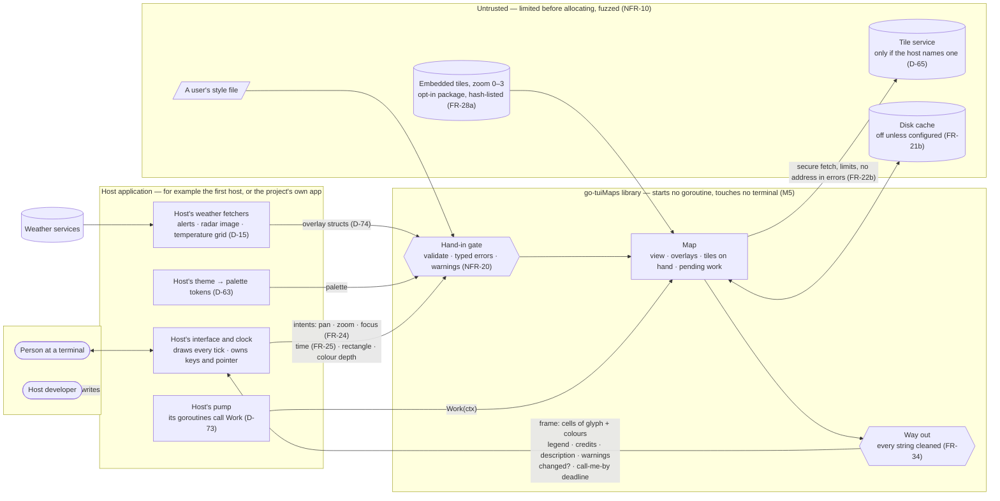
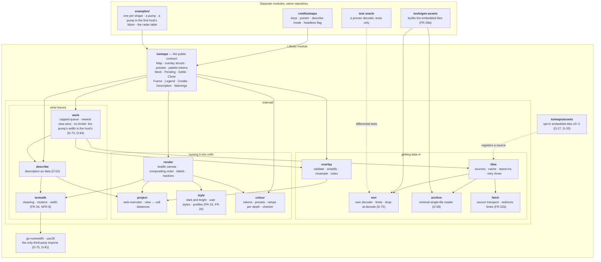

# go-tuiMaps — Architecture

| Field | Value |
|---|---|
| Phase | PLAN |
| Date | 2026-09-19 |
| Status | Draft for HUM LEAD's review. Built on rulings D-11 to D-76. HUM LEAD's first read, 2026-09-19: "These look good so far" — a basic understanding, not yet a deep one; formal approval comes with the Plan of Record. |
| How to use this | These diagrams are **living references** (D-71). Point at one when asking a question; when a decision changes, the diagram changes in the same commit. Every diagram names the rulings and requirements it carries, so a change to one of those says which diagram to open. |

## Start here

Twenty-four diagrams is a lot to hold. **[A guided tour](architecture-tour.md)** follows one story — a flood warning and a radar picture, from the first host to the cells on the screen and the sentence it can speak — through almost every diagram once, in 29 steps, each naming the diagram to look at and the ruling behind it. It ends with the three diagrams to read if you read no others.

## The diagram set

Four levels of detail. Read down for more detail, up for context.

| Level | Diagram | File | Carries |
|---|---|---|---|
| 0 | **Context and trust boundary** — the library among its neighbours, and which side of the line each byte comes from | this file | D-13, D-15, D-65, D-73, NFR-10, FR-34 |
| 1 | **The parts** — packages, what each owns, what may import what | this file | D-74, D-75, D-27, D-58 |
| 1 | **The public contract at a glance** — everything a host can call or hand in | this file | D-73, D-74, D-63, D-52, FR-24, FR-25 |
| 2 | Render and compositing | [`L2-render.md`](L2-render.md) | FR-12, FR-19, D-64, D-42, FR-16, NFR-8 |
| 2 | Tile pipeline | [`L2-tiles.md`](L2-tiles.md) | FR-21 to FR-23, D-30, D-58, D-65, NFR-10 |
| 2 | Overlay pipeline, shape by shape | [`L2-overlays.md`](L2-overlays.md) | FR-6 to FR-11, D-45, D-69, D-74, FR-32 |
| 2 | Colour resolution | [`L2-colour.md`](L2-colour.md) | D-53, D-59, D-62, D-63, D-64, D-69, FR-17, FR-18 |
| 2 | The view described as data | [`L2-describe.md`](L2-describe.md) | D-52, D-67, D-68, FR-29 |
| 2 | Memory budget map | [`L2-memory.md`](L2-memory.md) | D-29, D-48, NFR-3, NFR-4 |
| 2 | The memory measurement against the pinned fixture | [`memory-measurement.md`](memory-measurement.md) | D-29, D-48, NFR-3, RS-7 |
| 3 | Sequences: a cold first frame · a pan · an idle host · a one-shot render | [`L3-sequences.md`](L3-sequences.md) | D-73, D-30, FR-25, FR-30 |
| 3 | State machines: a tile · borrowed geometry · a marker · an overlay's freshness | [`L3-states.md`](L3-states.md) | FR-23, FR-11, D-56, FR-32 |

---

## Level 0 — Context and trust boundary

Who the library talks to, and who it trusts. **The library trusts nothing that arrives as bytes**, including what its own host hands in: the host's data is validated (NFR-20), everyone else's is limited, decoded defensively and fuzzed (NFR-10). Nothing crosses back out to a terminal or a host uncleaned (FR-34).

**What this diagram settles**

| Question | Answer | From |
|---|---|---|
| Who fetches weather? | The host. The library never calls a weather service. | D-15 |
| Does the library reach the network by itself? | Never, unless the host names a tile source. | D-65 |
| Whose goroutines? | The host's. The library starts none. | D-73 |
| Who reads keys and the mouse? | The host; the library takes intents. | D-17, FR-24 |
| Who owns time? | The host supplies it; the library answers "call me by…". | FR-25 |
| What is trusted? | Nothing that arrives as bytes. Host input is validated; the rest is limited, decoded defensively and fuzzed. | NFR-10, NFR-20 |
| What leaves? | Cells, and plain data; every string cleaned on the way out. | FR-34, D-52 |

---

## Level 1 — The parts

One public package holds the whole contract (D-74). Everything under `internal/` can change freely without breaking a host (D-60). The app, examples, generator and test oracle are **separate modules**, so nothing they import appears in a host's dependency graph (D-75).

**Rules of the layout**

| Rule | Why |
|---|---|
| A host imports `tuimaps`, and `tuimaps/assets` if it wants offline tiles. Nothing else is importable. | D-74; internal parts stay free to change under D-60's promise |
| `render` never imports `tiles`, `fetch` or `overlay`'s slow paths. It reads what is already on hand. | FR-23: Render does no input or output, ever |
| Only `work` runs slow jobs, and only when the host calls `Work`. | D-73 |
| Only `fetch` opens a connection; only `textsafe` lets a string out. | One place to enforce FR-22b; one place to enforce FR-34 |
| Only `textsafe` imports third-party code. | D-75 |
| The framework the first host uses appears only under `examples/`. | D-13, D-75 |

---

## Level 1 — The public contract at a glance

Everything a host can call or hand in, grouped by what it is for. Signatures are illustrative (D-71); the exact names are settled in the implementation plan.

```mermaid
flowchart LR
    subgraph IN["Host → Map"]
      direction TB
      A1["<b>Create and close</b><br/>New(options) · Close()"]
      A2["<b>Where and how big</b><br/>intents: Pan · PanCells · Zoom · ZoomAround · Recentre · FitWorld · FitTo(places, overlays, margin) (FR-24, D-76)<br/>focus: Next · Previous (FR-24a)"]
      A3["<b>What is on it</b><br/>Set(overlay) → created or replaced · old geometry released yes/no (D-86)<br/>Remove(id) → found or not · released yes/no · InUse(id) · BorrowCheck(on)<br/>overlay structs: Features · ScalarGrid · Image (· VectorGrid · TileImages later)<br/>presets: Temperature · Radar · Alerts (· Wind later) (D-69)"]
      A4["<b>How it looks</b><br/>SetPalette(tokens) (D-63) · SafeRamps(on) · Ground(paint or declared) (D-64)<br/>ColourDepth(hint) · ReduceMotion(on) (NFR-21) · Layers(on/off) (FR-36)"]
      A5["<b>Tiles</b><br/>Source(named network source) (D-65) · CacheRoot(path) · a replacement fetcher"]
      A6["<b>Running the work</b> (D-73)<br/>Pending() · Work(ctx) · Settle(ctx)"]
    end
    subgraph OUTB["Map → Host"]
      direction TB
      B1["<b>The picture</b><br/>Render(rectangle, now) → Frame: exactly-sized lines of cells (NFR-8)<br/>frame status: complete or still sharpening"]
      B2["<b>When to call again</b><br/>Changed() counter · NextCall() deadline on the wall clock (FR-25)"]
      B3["<b>The same facts as data</b><br/>Legend() · Credits() · Scale() (FR-13, FR-14, FR-33)<br/>Describe(places) (D-52) · the focused target's label and id"]
      B4["<b>What went wrong</b><br/>typed errors from a closed list · Warnings() ≤ 64 (NFR-20)<br/>CheckRamp(ramp) for a host's own tests (D-53)"]
    end
    IN --> M((Map)) --> OUTB
```

