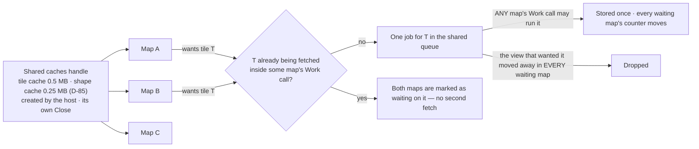

# The contract — what a host can rely on

Up: [architecture](architecture.md) · Carries: FR-11, FR-22a, FR-24, FR-25, FR-26, FR-27, FR-29, FR-32, FR-37, NFR-22, D-17, D-44, D-47, D-52, D-58, D-65, D-71, D-73, D-74, D-82, D-84, D-85, D-86, D-90, D-92, P-57, P-61

| Field | Value |
|---|---|
| Phase | PLAN |
| Date | 2026-09-19 |
| Why this exists | DISCOVER named "the contract document" as a PLAN artefact. The PLAN red-team found it missing, and with it: no statement of which calls are safe together, no end to a borrow, a three-call path that contradicted itself, a pump nobody had drawn, and deferred shapes that did not yet fit (PL-CQ-2, PL-CQ-3, PL-PM-1 to PL-PM-3, PL-PM-6, PL-PM-7, PL-NC-1 to PL-NC-4). |
| What it is not | Code. Names and signatures here are illustrative (D-71); BUILD fixes them test-first. What is binding is the **behaviour**: once v0.1.0 is tagged it changes only at a minor version, with a migration note (NFR-22). |

## 1 · The shape of the contract

One public package. Everything a host hands in is a plain struct (D-74); everything it gets back is cells or plain data (D-52). The library starts no goroutine, opens no connection it was not told to, reads no keys, and owns no clock (D-73, D-65, D-17, FR-25).

| Group | Calls | Notes |
|---|---|---|
| Life | `New(options)` · `Close()` | `New` starts nothing: no goroutine, connection or file. `Close` closes the map at once and reports how many host calls are still inside it. Every reference no call is reading is dropped then, borrowed geometry included; what a call still inside is reading is dropped when that call returns, and `InUse` says yes until it does (section 6) |
| Size and view | `WithSize(cols, rows)` at `New` · intents: `PanCells`, `Zoom`, `ZoomBy`, `Recentre`, `FitWorld`, `FitTo(places, overlay ids, margin)` | **The size is state, set with `WithSize` before the first `Settle` or `Render`** — this is what makes the three-call path work (section 3). `Render` takes the size too and updates it |
| Places and markers | `SetPlaces(places)` · `AddPlace(place)` · `RemovePlace(id)` — each place a name, a position, a marker style and an id | Places are what `Describe` answers for and what `FitTo` can fit; markers are how they are drawn (FR-26). Separate from overlays: they are the host's "my places", not data. **As upstream (P-61):** an id left empty defaults to the position written to six decimal places, and `RemovePlace` removes every place with that id |
| Overlays | `Set(overlay)` · `Remove(id)` · `InUse(id)` | Section 4 |
| Look | `SetPalette(tokens)` · `SafeRamps(on)` · `Ground(painted or declared)` · `ColourDepth(hint)` · `ReduceMotion(on)` · `Layers(on, off)` · `LabelLanguage(code)` | All take effect at the next `Render`; none re-parses a tile, except the language, which is part of the tile cache key (D-82) |
| Tiles | `Source(named source)` · `CacheRoot(dir, capBytes)` · `Fetcher(replacement)` · `SharedCaches(handle)` · `CacheUse()` · `Purge()` · `Verify()` | Nothing is reached until `Source` is called (D-65). Section 8 for shared caches. `CacheUse` reports, for each memory cache, the bytes live views need, the bytes held, and the cap (D-90). `Purge` and `Verify` are the disk cache's two maintenance calls (FR-22a) |
| Running the work | `Pending()` · `Work(ctx)` · `Settle(ctx)` · `OnPending(func)` | Section 2 |
| The picture | `Render(size, now)` → `Frame` | Section 5. **`now` is the wall clock (D-114).** Markers move on it too, unless the host takes the animation clock over with `Animate(at)` and gives it back with `FollowClock()`. Staleness is always the wall clock's, so a frozen animation clock cannot hide old data (FR-32). *A host that passes a fixed instant for reproducibility sees data that is never stale: that is the cost of A, put to HUM LEAD and taken.* |
| When to call again | `Changed()` · `NextCall(wallClock)` | The counter moves on every call that changes an input — `Set`, `Remove`, the look, places, the view — and inside `Render` when the frame differs. **A tile or picture that `Work` lands reaches it only at the next `Render`** (v0.2.0 closes this: D-66). `NextCall` is the earliest of: the next marker phase, a failed tile's retry time, an overlay going stale — on the wall clock, which is passed in separately from animation time (FR-25, FR-32) |
| The same facts as data | `Legend()` · `Credits()` · `Scale()` · `Footer()` · `Describe(places)` | `Footer` is the centre and zoom in upstream's own wording, cut with floor as upstream cuts it (P-57); it is drawn inside the map only if the host turns that furniture layer on, and it is off by default. `Describe` returns what it has at once, with each part marked **ready** or **pending**; the pending parts are computed by `Work` (FR-29) |
| What went wrong | errors of a closed list of kinds · `Warnings()` · `CheckRamp(ramp, ground)` | Section 7 |

## 2 · Running the work — the pump, drawn

The library never runs anything by itself (D-73) and never makes one `Work` wait on another (D-84). So a host that wants its map to sharpen **writes a pump**. This is the whole of it.

**The rules a pump follows**

| Rule | Why |
|---|---|
| Work arrives only from the host's own calls — `Render`, `Set`, `Remove`, an intent, `Describe` — and `OnPending` fires inside that call when pending goes from none to some | So the pump needs no polling and no timer. A host that prefers to poll checks `Pending()` after those calls |
| **How `wake` is written.** It does nothing but non-blocking sends on a channel the host made **buffered, with one slot for each pump goroutine**, filling every free slot. It never blocks and never calls the map | An unbuffered send made while the pump is busy inside `Work` would be dropped and the wake lost. One slot a goroutine is what makes the pump as wide as the host meant: each pump goroutine takes one token, then calls `Work` until it says it did nothing |
| **One exception to "only inside the host's own calls", for shared caches.** When a `Work` call gives up a shared job that another map still wants — because its context was cancelled, **or because its own map was closed under it** — the job returns to the queue and **that other map's hook fires from inside the `Work` call that gave it up** | Otherwise the other map's pump, already told there was nothing to do, would sleep for ever on a job that is waiting. It is why `wake` must be safe from any goroutine — which a non-blocking send is. A hook fired this way does **not** arm the re-entrancy guard of section 6, rule 3: the other map's owner may legally be in the middle of a call |
| `Pending()` counts jobs **waiting to be picked up**. It does not count a job already inside a `Work` call, nor failed work waiting for its retry time | A retry does not wake the pump by itself — nothing in the library can. It becomes pending at the first owner call after its time, and the host learns that time from `NextCall` (section 1); a host that renders on a tick meets it within a tick |
| `Work(ctx)` does at most one job and says whether it did one. Call it until it says no | A blocking call, cancellable; never call it from the interface goroutine — a fetch can take seconds |
| Two pump goroutines is the width the memory line is measured at. Each further one can add about 1 MB while a tile decodes, more at the input limits | D-84: the width and its memory are the host's |
| If renders keep finding work pending and no `Work` has been called for a while, a warning says so, once | The silent failure a newcomer would otherwise meet (PL-NC-2) |
| `Settle(ctx)` is the same loop run on the caller's goroutine. It returns when nothing is pending or the context ends, with how much work failed, and with **why nothing could be fetched** if no source is named and no embedded tiles were passed | One-shot renders and tests. Work that failed and is waiting to retry is not pending, so `Settle` always ends. `Settle` never waits on a `Work` running elsewhere: if jobs are in flight on other goroutines when the queue empties, it returns and says how many. Its result also carries every id released while it ran (D-86). Called on a map that has no size yet, it is refused with the `no-size` kind |

## 3 · The three-call path, corrected

As first drawn, tiles became wanted only when `Render` noticed them missing, yet `Settle` ran before `Render` — so there was nothing to settle (PL-PM-3). The size is now state the map has **before** either call, and `Settle` itself notes what a render of that size would want.

| # | Call | What it does |
|---|---|---|
| 1 | `New(WithSize(cols, rows), …)` with the assets package's tiles passed as an option, `Embed(assets.Tile, assets.MaxZoom)` (D-106; importing the package changes nothing by itself) | Creates the map. Starts nothing |
| 2 | `Settle(ctx)` | Notes what the current view and size need, then works until nothing is pending. With no source and no embedded tiles it says so in its result |
| 3 | `Render(size, now)` | A complete frame; its status says complete, still sharpening, or no tiles |

## 4 · Overlays: set, replace, remove, and the end of a borrow (D-74, D-86)

| Call | Returns at once | Never |
|---|---|---|
| `Set(overlay)` | created or replaced · **old geometry released: yes or no** · an error of a closed kind if refused — and a refused `Set` also leaves a warning, so a discarded error is still visible | blocks |
| `Remove(id)` | found or not · released: yes or no | blocks |
| `InUse(id)` | whether any host call is still reading that id's old geometry | blocks |

- With **one goroutine** making every call, "released" is always yes.
- `Set` and `Remove` report the release at once. `Work` and `Settle` carry no released ids: with one goroutine making every owner call, nothing is still reading when `Set` or `Remove` returns.
- The old shape keeps drawing from the library's **own simplified copy** until the new one is prepared.
- **A shape large enough that it might have to be drawn straight from the host's memory** (FR-11's fallback) cannot rely on such a copy. So for any feature overlay of more than **30,303 vertices at the default shape cap** — the most whose unsimplified form *and* run index fit the cap together (constants, section 3) — **`Set` itself makes one linear pass and builds the run index that drawing from memory needs** (D-92). For these shapes this bullet, not the one above, governs a replacement: the new shape is drawn from the host's memory on the next frame, the old shape's copy and index are dropped, and the old geometry is released at once. Nothing vanishes. When a `Work` call has simplified the new shape for the view's bucket and that form fits the cache, drawing moves to it.
- **The run index** is one bounding box — 16 bytes — for each run of 64 vertices: 0.25 byte a vertex, 203 KB for the synthetic 812,058-vertex worst case, 500 KB at the 2,000,000-vertex cap. It lives with the overlay for as long as the overlay is set, so the shape is drawable from memory at **any** later zoom without another `Set`. It counts as need (D-90): it is never evicted, and where it alone is over the shape cap the cache says so, as for tiles.
- `Set` still never waits on anything; for these shapes it does bounded work. **Measured in BUILD (task 10.26), at the vertex cap of 2,000,000: 23 ms** - about 11 nanoseconds a vertex, so 1 ms at 100,000 vertices. *PLAN's estimate, "a few milliseconds at the vertex cap by arithmetic", was low by about eight times.* A host that sets shapes of that size should know that `Set` is an owner call on its interface goroutine. *An earlier version had such a shape go undrawn until its replacement was prepared; that was the coordinator's, unruled, and D-92 replaces it.*
- **Caps are fixed when a map, or a shared-caches handle, is created.** They cannot change afterwards, so the vertex count above is fixed for an overlay's whole life.
- A mistyped id on a refresh makes a second overlay; the result says **created**, and a warning notes a create whose id differs from an existing id only slightly.
- Values declared in one unit that are implausible for it — for example temperatures all above 60 declared as °C — are accepted with a warning.

## 5 · The frame (PL-PF-5, PL-CQ-3)

| Question | Answer |
|---|---|
| What is it | The rendered rows, each exactly the requested width, held as bytes the map owns; `Frame.Lines`, one string a row; plus its `Status` |
| How long is it valid | **Until the next `Render` on the same map.** The buffers are reused; a host that keeps a frame copies its `Lines` |
| When is it reused unchanged, at no cost | When nothing that could change a cell has changed: view, size, depth, palette, safe ramps, ground, layers, language, focus, **the places**, reduce-motion, the overlays' versions, the tiles on hand, the marker phase, **each overlay's freshness**, and the frame's status. This list is the key; L2 Render's diagram points here rather than repeating it |
| What does a changed frame cost | Only the rows that changed are rebuilt; a marker blink rebuilds the marker's row |

## 6 · Which calls are safe together

One map is used from two kinds of goroutine: the **owner** — the host's interface goroutine — and the **pump**.

| Class | Calls | Rule |
|---|---|---|
| **Owner** | `Render`, `Set`, `Remove`, the intents, `SetPlaces`, `AddPlace`, `RemovePlace`, every look and tile setting, `OnPending`, `Purge`, `Verify`, `Describe`, `Legend`, `Credits`, `Scale`, `Footer`, `Warnings`, `NextCall` | **One at a time.** They are not safe against each other from two goroutines. Safe beside any pump call |
| **Pump** | `Work`, `Settle` | Any number at once, beside each other and beside owner calls |
| **Any goroutine** | `Pending`, `InUse`, `Changed`, `CacheUse` | Safe beside everything; each is one short read under the lock. This is what lets a pump poll `Pending` |
| **No map involved** | `CheckRamp` | A pure function |
| **`Close`** | | Meant to come after the last owner call and after every pump call has returned. If a call is still inside, `Close` does not wait: **the map is closed at once**, every later call returns the `closed` kind, a `Work` still inside abandons or finishes its job, publishes nothing to this map, returns `closed` **together with the ids whose geometry it was the last to read**, and hands any shared job another map still wants back to the queue, waking that map (section 2); and `Close` reports how many calls were inside. `InUse` still answers afterwards, and says yes for a borrowed id until those calls have returned |

**How it is kept** — rules for the implementation, each with a test:

1. One lock guards the map's state. **It is never held across a fetch, a decode, a simplification or a description.** A job copies what it needs under the lock, works with the lock released, and publishes its result under the lock. **A shared-caches handle has a lock of its own.** Each map publishes what its view needs to the handle at the owner call that changes its view or size, and at `Close`; an eviction, in whichever map's `Work` it happens, reads only the handle. The order is always map, then handle — never the reverse — and `CacheUse` takes the handle's lock alone.
2. `Render` takes the lock only to snapshot what is on hand and to note what is missing.
3. `OnPending` is called with the lock released. It must not call the map. An **owner** call made from inside a hook **that an owner call fired** is detected — owner calls are one at a time, so a second one arriving while that hook runs can only be re-entry or misuse — and refused with the `reentrant-call` kind. A hook fired from inside a `Work` (section 2's one exception) arms nothing, because the owner may legally be mid-call. A pump call made from inside any hook cannot be told from a legal concurrent one and is not detected; the rule is documentation there.
4. A panic inside any public call is recovered at that call's edge and returned as an error of the "internal" kind (for `Render` too: an empty frame with the error — there is no "failed" status and no last good rows); the map stays usable. Out-of-memory is not recoverable and is not claimed to be.

## 7 · Errors and warnings

| | Errors | Warnings |
|---|---|---|
| When | A hand-in or a call is refused | Accepted, but something is off; or something happened during `Work` |
| Form | A typed error with a **kind from a closed list**, saying what happened, why, and what to do; never a tile address; quoted outside text cleaned and cut to 64 clusters | A list, at most 64, de-duplicated; each with a kind, the overlay or tile it concerns, and a count |
| Kinds (the list is closed; adding one is a minor version) | invalid-coordinates · size-mismatch · unsorted-breaks · malformed-ramp · missing-table · malformed-table · unknown-preset · malformed-style · invalid-id · over-vertex-cap · over-image-cap · image-refused · ring-too-short · bad-currency · unsupported-schema · unsupported-tile · over-limit · fetch-refused · fetch-failed · cache-refused · no-size · reentrant-call · cancelled · closed · internal | ramp-rule-broken · unmatched-image-colours · stale-overlay · future-valid-time · implausible-unit · near-duplicate-id · unknown-token · set-refused · no-work-called · tile-failed · cache-write-failed · render-failed · cache-under-need |

Every string in either passes through the one cleaning type that only the text-safety package can construct (PL-IS-5); no foreign error is ever wrapped. **One stated exemption:** the `cancelled` kind answers `errors.Is` for the context package's two errors, so a host's usual check works; it carries none of their text. The typed error and both lists of kinds live in one leaf package, `internal/fault`, which imports only text-safety; the public package re-exports them.

## 8 · Shared caches (FR-27, D-85)

**What a shared cache may drop (D-90).** A tile or shape that any live view of any map is drawing is never evicted; the cap governs only what is kept beyond that. When the maps' need alone is over the cap, the cache holds exactly the need, raises `cache-under-need` once, and `CacheUse` gives the figures — so two maps on different views can never evict each other into fetching without end.

| Term | Meaning |
|---|---|
| **Live view** | The **current view and size of every map that has not been closed** — the map's state, whether or not it has rendered yet (so `Settle` before the first `Render` has a live view), and however long ago it last rendered. A host that keeps fifty maps open has fifty live views; `Close` ends one |
| **Need** | For each live view: the tiles it wants that are on hand; **plus**, for each tile it wants that is not on hand, the nearest ancestor on hand that stands in for it; plus the simplified shapes and run indexes of its overlays. A tile wanted and not yet arrived has no size and counts for nothing until it arrives |
| **The bound on need** | A 149×38 view wants at most 9 tiles, and so at most 9 stand-ins: 18 tiles a map. Measured, a view needs 0.26 to 0.80 MB. At the input limits — every tile at the 4 MiB retained cap, which takes a hostile source — it is 18 × 4 MiB a map; a host that does not trust its source lowers the retained cap, which is host-settable downward |

There is no goroutine for a shared fetch to "live on" (PL-CQ-11, PL-PM-2): a shared job belongs to the shared queue, and whichever host `Work` call picks it up runs it to the end or to that call's cancellation; if cancelled while other maps still want the tile, the job returns to the queue.

## 9 · The deferred shapes, and where each lands (D-44, D-47, PL-PM-6)

The contract is designed for all of v1 and built for v0.1.0. Each deferred part is **additive**: a new struct, a new field with a zero value that means "as before", or a new call.

| Deferred | How it arrives | What v0.1.0 must already leave room for |
|---|---|---|
| Wind (vector grid) | A new overlay struct holding two grids | Nothing; the preset's name is reserved |
| Image loops (FR-37) | `Image` gains `Frames []Frame`, each with its own valid time; zero frames means today's single image | **`NextCall` gains a frame-advance source in v0.2.0** (L4.3); in v0.1.0 its sources are the marker blink, an overlay going stale and a failed tile's retry time. **Bytes:** frames share the map's image cap (0.25 MB by default, D-85), so a loop needs the host to raise it — ten 300×200 frames are 0.6 MB — and the over-cap error says what would fit |
| Tile-image provider | A new overlay struct whose one non-data field is a function the host supplies. **It is called only from inside `Work`, on the host's goroutine, with `Work`'s context**; its failures take the same retry times as tiles; each tile it returns takes the image path | D-74's "plain data" holds for everything in v0.1.0; this is the one stated exception, and it is why the queue's job kinds are an open set internally |
| Block renderer | A renderer option; the frame type does not change | The closed glyph list and the terminal matrix already cover its characters |
| PMTiles source | A named source, wrapping the archive reader already inside v0.1.0 (D-58) | — |
| Pointer operations | Two pure calls: **cell → coordinate** and **cell → the overlay or place under it**; the host turns mouse events into those and into intents | The projection package already has both directions (FR-24, D-17) |
| Flash, pulse, tours | Marker styles and camera intents | The marker state machine already takes time from the host |

## 10 · Every name, and what it is for (v0.2.0 L1.2, L-4.1)

The whole public surface, grouped. A test holds this section to the code both ways: a name here the
package lacks fails, and a name the package exports that is not here fails. The detail of each is in
its doc comment and in the sections above.

| For | Names |
|---|---|
| The map | `Map`, `New`, `Option`, `WithSize`, `Embed`, `SharedCaches`, `NewShared`, `Shared`, `Shared.Use`, `Size`, `Frame`, `Status` (`Complete`, `Sharpening`, `NoTiles`; `Status.String`), `SettleResult`, `MinZoom`, `MaxZoom` |
| Running the work | `Map.Work`, `Map.Pending`, `Map.Settle`, `Map.OnPending`, `Map.InFlight`, `Map.Close` |
| The picture | `Map.Render`, `Map.Changed`, `Map.NextCall`, `Map.Animate`, `Map.FollowClock` |
| The view | `Map.Centre`, `Map.Zoom`, `Map.ZoomBy`, `Map.PanCells`, `Map.Recentre`, `Map.FitWorld`, `Map.FitTo`, `Map.DeepestZoom` |
| Places and markers | `Place`, `Positioned`, `LonLat`, `MarkerStyle` (`MarkerDot`, `MarkerCross`, `MarkerDiamond`, `MarkerRing`, `MarkerDisc`, `MarkerGlyph`), `Map.SetPlaces`, `Map.AddPlace`, `Map.RemovePlace`, `Map.Places` |
| Overlays | `Overlay`, `Feature`, `FeatureKind` (`Point`, `Line`, `Polygon`, `Circle`), `Grid`, `Image`, `Projection` (`PlateCarree`, `WebMercator`), `TableEntry`, `Type`, `Ring`, `Rings`, `RadarImage`, `TemperatureGrid`, `SetResult`, `RemoveResult`, `Map.Set`, `Map.Remove`, `Map.InUse`, `Map.Overlays` |
| Roles and colours | `Token`, `TokenNames`, the alert roles (`AlertExtreme`, `AlertSevere`, `AlertModerate`, `AlertMinor`, `AlertUnknown`), `Track`, the field roles (`Low`, `Middle`, `High`), `RGB`, `Unit` (`Celsius`, `Fahrenheit`), `Depth` (`Truecolor`, `Colours256`, `Colours16`, `NoColour`) |
| The look | `Map.SetPalette`, `Map.SafeRamps`, `Map.Ground`, `Map.PaintGround`, `Map.ColourDepth`, `Map.ReduceMotion`, `Map.Units`, `Map.LabelLanguage`, `Map.SetStyle`, `Map.ShowFooter`, `Layer` (`RoadLayer`, `RailLayer`, `ParkLayer`, `BorderLayer`, `RiverLayer`, `WaterLayer`, `LabelLayer`), `Map.Layers` |
| Tiles and caches | `Map.Source`, `Map.SourceCredit`, `Map.CacheRoot`, `Map.Fetcher`, `Fetcher`, `Map.Purge`, `Map.Verify`, `Map.CacheUse`, `Caches`, `CacheUse` |
| The same facts as data | `Map.Legend`, `LegendEntry`, `Class`, `Map.Credits`, `Map.Scale`, `Scaled`, `Map.Footer`, `Map.Describe`, `Description`, `Answer` |
| Checking a ramp | `CheckRamp`, `RampCheck`, `Rule` (`Ordered`, `Distinct`, `Readable`, `VisionSafe`), `Finding` |
| Errors | `Kind`, `Kinds`, `KindOf`, and the kinds: `InvalidCoordinates`, `SizeMismatch`, `UnsortedBreaks`, `MalformedRamp`, `MissingTable`, `MalformedTable`, `UnknownPreset`, `MalformedStyle`, `InvalidID`, `OverVertexCap`, `OverImageCap`, `ImageRefused`, `RingTooShort`, `BadCurrency`, `UnsupportedSchema`, `UnsupportedTile`, `OverLimit`, `FetchRefused`, `FetchFailed`, `CacheRefused`, `NoSize`, `ReentrantCall`, `Cancelled`, `Closed`, `Internal` |
| Warnings | `Warning`, `WarningKind`, `WarningKinds`, `Map.Warnings`, and the kinds: `RampRuleBroken`, `UnmatchedImageColours`, `StaleOverlay`, `FutureValidTime`, `ImplausibleUnit`, `NearDuplicateID`, `UnknownToken`, `SetRefused`, `NoWorkCalled`, `TileFailed`, `CacheWriteFailed`, `RenderFailed`, `CacheUnderNeed` |
