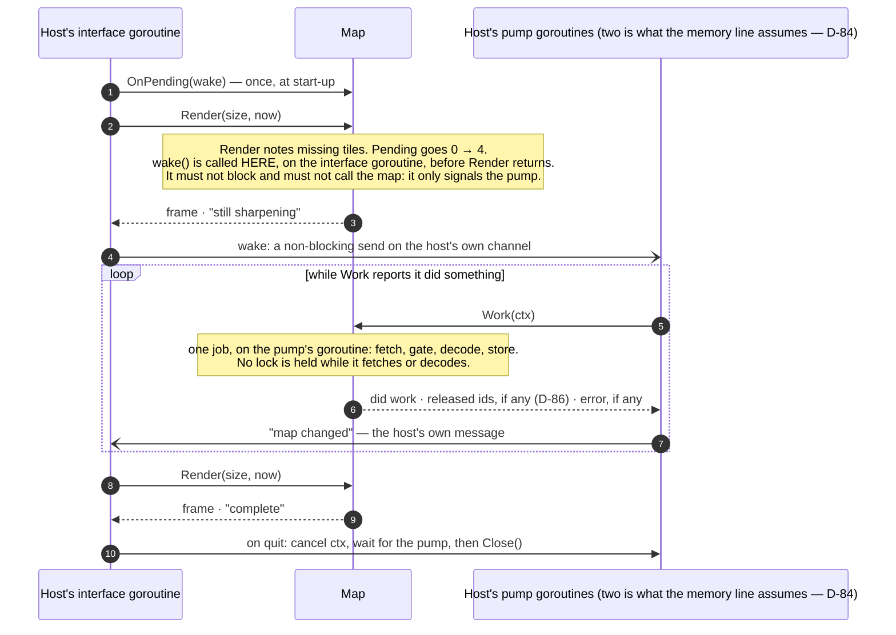
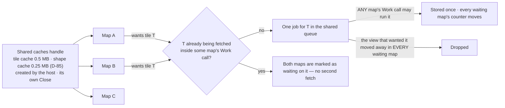

# The contract — what a host can rely on

Up: [architecture](architecture.md) · Carries: FR-11, FR-24, FR-25, FR-26, FR-27, FR-29, FR-32, FR-37, NFR-22, D-17, D-44, D-47, D-52, D-58, D-65, D-71, D-73, D-74, D-82, D-84, D-85, D-86

| Field | Value |
|---|---|
| Phase | PLAN |
| Date | 2026-09-19 |
| Why this exists | DISCOVER named "the contract document" as a PLAN artefact. The PLAN red-team found it missing, and with it: no statement of which calls are safe together, no end to a borrow, a three-call path that contradicted itself, a pump nobody had drawn, and deferred shapes that did not yet fit (PL-CQ-2, PL-CQ-3, PL-PM-1 to PL-PM-3, PL-PM-6, PL-PM-7, PL-NC-1 to PL-NC-4). |
| What it is not | Code. Names and signatures here are illustrative (D-71); BUILD fixes them test-first. What is binding is the **behaviour**: once v0.1.0 is tagged it changes only at a minor version, with a migration note (NFR-22). |

## 1 · The shape of the contract

One public package. Everything a host hands in is a plain struct (D-74); everything it gets back is cells or plain data (D-52). The library starts no goroutine, opens no connection it was not told to, reads no keys, and owns no clock (D-73, D-65, D-17, FR-25).

| Group | Calls | Notes |
|---|---|---|
| Life | `New(options)` · `Close()` | `New` starts nothing: no goroutine, connection or file. `Close` drops every reference, including borrowed geometry, and reports whether any host call is still inside the map |
| Size and view | `SetSize(cols, rows)` · intents: `Pan`, `PanCells`, `Zoom`, `ZoomAround`, `Recentre`, `FitWorld`, `FitTo(places, overlay ids, margin)` | **The size is state, set before the first `Settle` or `Render`** — this is what makes the three-call path work (section 3). `Render` takes the size too and updates it |
| Places and markers | `SetPlaces(places)` — each a name, a position, a marker style | Places are what `Describe` answers for and what `FitTo` can fit; markers are how they are drawn (FR-26). Separate from overlays: they are the host's "my places", not data |
| Overlays | `Set(overlay)` · `Remove(id)` · `InUse(id)` | Section 4 |
| Look | `SetPalette(tokens)` · `SafeRamps(on)` · `Ground(painted or declared)` · `ColourDepth(hint)` · `ReduceMotion(on)` · `Layers(on, off)` · `LabelLanguage(code)` | All take effect at the next `Render`; none re-parses a tile, except the language, which is part of the tile cache key (D-82) |
| Tiles | `Source(named source)` · `CacheRoot(path)` · `Fetcher(replacement)` · `SharedCaches(handle)` | Nothing is reached until `Source` is called (D-65). Section 6 for shared caches |
| Running the work | `Pending()` · `Work(ctx)` · `Settle(ctx)` · `OnPending(func)` | Section 2 |
| The picture | `Render(size, now)` → `Frame` | Section 5 |
| When to call again | `Changed()` · `NextCall(wallClock)` | The counter moves whenever a redraw would differ. `NextCall` is the earliest of: the next marker phase, a failed tile's retry time, an overlay going stale — on the wall clock, which is passed in separately from animation time (FR-25, FR-32) |
| The same facts as data | `Legend()` · `Credits()` · `Scale()` · `Describe(places)` · `Focused()` | `Describe` returns what it has at once, with each part marked **ready** or **pending**; the pending parts are computed by `Work` (FR-29) |
| What went wrong | errors of a closed list of kinds · `Warnings()` · `CheckRamp(ramp, ground)` | Section 7 |

## 2 · Running the work — the pump, drawn

The library never runs anything by itself (D-73) and never makes one `Work` wait on another (D-84). So a host that wants its map to sharpen **writes a pump**. This is the whole of it.

**The rules a pump follows**

| Rule | Why |
|---|---|
| Work arrives only from the host's own calls — `Render`, `Set`, `Remove`, an intent, `SetSize`, `Describe` — and `OnPending` fires inside that call when pending goes from none to some | So the pump needs no polling and no timer. A host that prefers to poll checks `Pending()` after those calls |
| `Work(ctx)` does at most one job and says whether it did one. Call it until it says no | A blocking call, cancellable; never call it from the interface goroutine — a fetch can take seconds |
| Two pump goroutines is the width the memory line is measured at. Each further one can add about 1 MB while a tile decodes, more at the input limits | D-84: the width and its memory are the host's |
| If renders keep finding work pending and no `Work` has been called for a while, a warning says so, once | The silent failure a newcomer would otherwise meet (PL-NC-2) |
| `Settle(ctx)` is the same loop run on the caller's goroutine. It returns when nothing is pending or the context ends, with how much work failed, and with **why nothing could be fetched** if no source is named and no assets are imported | One-shot renders and tests. Work that failed and is waiting to retry is not pending, so `Settle` always ends |

## 3 · The three-call path, corrected

As first drawn, tiles became wanted only when `Render` noticed them missing, yet `Settle` ran before `Render` — so there was nothing to settle (PL-PM-3). The size is now state the map has **before** either call, and `Settle` itself notes what a render of that size would want.

| # | Call | What it does |
|---|---|---|
| 1 | `New(WithSize(cols, rows), …)` with the assets package imported | Creates the map. Starts nothing |
| 2 | `Settle(ctx)` | Notes what the current view and size need, then works until nothing is pending. With no source and no assets it says so in its result |
| 3 | `Render(size, now)` | A complete frame; its status says complete, still sharpening, or no tiles |

## 4 · Overlays: set, replace, remove, and the end of a borrow (D-74, D-86)

| Call | Returns at once | Never |
|---|---|---|
| `Set(overlay)` | created or replaced · **old geometry released: yes or no** · an error of a closed kind if refused — and a refused `Set` also leaves a warning, so a discarded error is still visible | blocks |
| `Remove(id)` | found or not · released: yes or no | blocks |
| `InUse(id)` | whether any host call is still reading that id's old geometry | blocks |
| `Work`, `Render` | among their results: the ids whose old geometry this call was the last to read | — |

- With **one goroutine** making every call, "released" is always yes.
- The old shape keeps drawing from the library's **own simplified copy** until the new one is prepared. **One exception:** a shape so large that it was being drawn straight from borrowed memory (FR-11's fallback) has no such copy; it is not drawn from the moment it is replaced or removed until its replacement is prepared, and the frame's status says "still sharpening".
- A mistyped id on a refresh makes a second overlay; the result says **created**, and a warning notes a create whose id differs from an existing id only slightly.
- Values declared in one unit that are implausible for it — for example temperatures all above 60 declared as °C — are accepted with a warning.
- `BorrowCheck(on)`: geometry is fingerprinted at hand-in and re-checked at every read; a change while in use is a warning naming the overlay. On in every example and test.

## 5 · The frame (PL-PF-5, PL-CQ-3)

| Question | Answer |
|---|---|
| What is it | The rendered rows, each exactly the requested width, held as bytes the map owns; `Frame.Line(i)`, `Frame.WriteTo(w)`, `Frame.String()`; plus its status and the ids released by this call |
| How long is it valid | **Until the next `Render` on the same map.** The buffers are reused; a host that keeps a frame copies it. `String()` copies |
| When is it reused unchanged, at no cost | When nothing that could change a cell has changed: view, size, depth, palette, safe ramps, ground, layers, language, focus, the overlays' versions, the tiles on hand, the marker phase, **each overlay's freshness**, and the frame's status |
| What does a changed frame cost | Only the rows that changed are rebuilt; a marker blink rebuilds the marker's row |

## 6 · Which calls are safe together

One map is used from two kinds of goroutine: the **owner** — the host's interface goroutine — and the **pump**.

| | Owner calls: `Render`, `Set`, `Remove`, intents, `SetSize`, `SetPlaces`, look and tile settings, `Describe`, `Legend`, `Credits`, `Scale`, `Warnings`, `Changed`, `NextCall`, `Pending` | Pump calls: `Work`, `Settle` | `Close` |
|---|---|---|---|
| **Owner calls** | One at a time. They are not safe against each other from two goroutines | Safe together | After the last owner call |
| **Pump calls** | Safe together | Safe together, any number | After every pump call has returned; `Close` reports it if one has not |

**How it is kept** — rules for the implementation, each with a test:

1. One lock guards the map's state. **It is never held across a fetch, a decode, a simplification or a description.** A job copies what it needs under the lock, works with the lock released, and publishes its result under the lock.
2. `Render` takes the lock only to snapshot what is on hand and to note what is missing.
3. `OnPending` is called with the lock released. It must not call the map.
4. A panic inside any public call is recovered at that call's edge and returned as an error of the "internal" kind (or, for `Render`, a frame whose status is "failed" with the last good rows kept); the map stays usable. Out-of-memory is not recoverable and is not claimed to be.

## 7 · Errors and warnings

| | Errors | Warnings |
|---|---|---|
| When | A hand-in or a call is refused | Accepted, but something is off; or something happened during `Work` |
| Form | A typed error with a **kind from a closed list**, saying what happened, why, and what to do; never a tile address; quoted outside text cleaned and cut to 64 clusters | A list, at most 64, de-duplicated; each with a kind, the overlay or tile it concerns, and a count |
| Kinds (the list is closed; adding one is a minor version) | invalid-coordinates · size-mismatch · unsorted-breaks · malformed-ramp · missing-table · malformed-table · unknown-preset · invalid-id · over-vertex-cap · over-image-cap · image-refused · ring-too-short · bad-currency · unsupported-schema · unsupported-tile · over-limit · fetch-refused · fetch-failed · cache-refused · closed · internal | ramp-rule-broken · unmatched-image-colours · stale-overlay · future-valid-time · implausible-unit · near-duplicate-id · set-refused · borrow-changed · no-work-called · tile-failed · cache-write-failed |

Every string in either passes through the one cleaning type that only the text-safety package can construct (PL-IS-5); no foreign error is ever wrapped.

## 8 · Shared caches (FR-27, D-85)

There is no goroutine for a shared fetch to "live on" (PL-CQ-11, PL-PM-2): a shared job belongs to the shared queue, and whichever host `Work` call picks it up runs it to the end or to that call's cancellation; if cancelled while other maps still want the tile, the job returns to the queue.

## 9 · The deferred shapes, and where each lands (D-44, D-47, PL-PM-6)

The contract is designed for all of v1 and built for v0.1.0. Each deferred part is **additive**: a new struct, a new field with a zero value that means "as before", or a new call.

| Deferred | How it arrives | What v0.1.0 must already leave room for |
|---|---|---|
| Wind (vector grid) | A new overlay struct holding two grids | Nothing; the preset's name is reserved |
| Image loops (FR-37) | `Image` gains `Frames []Frame`, each with its own valid time; zero frames means today's single image | **`NextCall` already has a frame-advance source** — it is simply absent when there are no frames. **Bytes:** frames share the map's image cap (0.25 MB by default, D-85), so a loop needs the host to raise it — ten 300×200 frames are 0.6 MB — and the over-cap error says what would fit |
| Tile-image provider | A new overlay struct whose one non-data field is a function the host supplies. **It is called only from inside `Work`, on the host's goroutine, with `Work`'s context**; its failures take the same retry times as tiles; each tile it returns takes the image path | D-74's "plain data" holds for everything in v0.1.0; this is the one stated exception, and it is why the queue's job kinds are an open set internally |
| Block renderer | A renderer option; the frame type does not change | The closed glyph list and the terminal matrix already cover its characters |
| PMTiles source | A named source, wrapping the archive reader already inside v0.1.0 (D-58) | — |
| Pointer operations | Two pure calls: **cell → coordinate** and **cell → the overlay or place under it**; the host turns mouse events into those and into intents | The projection package already has both directions (FR-24, D-17) |
| Flash, pulse, tours | Marker styles and camera intents | The marker state machine already takes time from the host |
