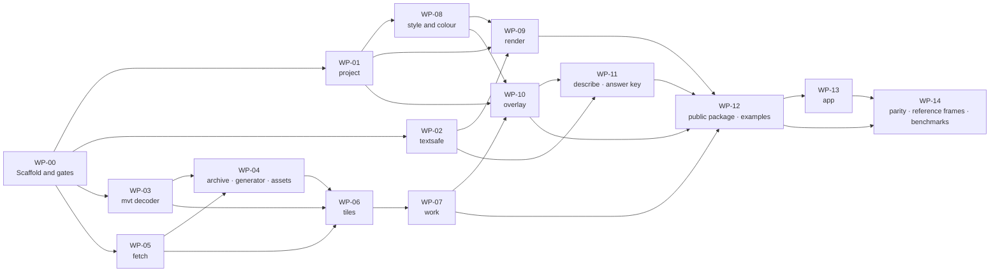

# go-tuiMaps v0.1.0 — Implementation plan

| Field | Value |
|---|---|
| Phase | PLAN |
| Date | 2026-09-19 |
| Status | Draft for HUM LEAD's review, then red-team. |
| Goal | Build the first release, v0.1.0, as ruled in D-44 and refined through D-79: a braille basemap with features, images and scalar grids on it, the view described as data, and a small app — ready to integrate into the first host. |
| Architecture | [`../03-architecture-design/architecture.md`](../03-architecture-design/architecture.md) and its diagram set. This plan names the diagram each work package builds. |
| Tech stack | Go 1.25 (the floor toolchain), standard library, plus `mattn/go-runewidth` and `clipperhouse/uax29/v2` (D-75, D-81). No C toolchain (D-22). |
| Branch | `feature/go-tuimaps`, merged to `release/v0.1.0` at each phase exit (D-28). |

## How this plan is written (D-71)

**No code bodies.** Code is written in BUILD, test first. Each task gives: the file, the **test to write first** — its name and what it asserts — then what to implement, a signature only where it fixes a contract, and the command that verifies it. The framework's planning guide asks for complete code and two-to-five-minute tasks; HUM LEAD's directive overrides that, so a task here is **one red-green-refactor cycle**: one behaviour, one failing test, the least code that passes.

**Every task is test-first (FULL TDD).** A task is done when its test was seen to fail for the right reason, passes, and the whole suite is green under the race detector.

**Diagrams are kept current.** A task that changes a design decision updates the diagram named in its work package in the same commit.

## Conventions for every work package

| Rule | Check |
|---|---|
| Tests first, race detector on, floor toolchain, read-only modules | `go test -race ./...` in continuous integration (NFR-16) |
| The library starts no goroutine | A helper asserts the goroutine count is unchanged around every public-call test (D-73, FR-30) |
| Anything that parses outside bytes has a fuzz target, 60 s on every change | `go test -fuzz` per target (NFR-10) |
| Builds for five targets with the C toolchain off | cross-compile job (NFR-1) |
| Reference frames run on amd64 **and** arm64 | two runners (NFR-6) |
| Public contract compared with the last tag | contract-check job, from the first tag (NFR-22) |
| Tests connect to loopback only | a dial hook fails the test otherwise (NFR-11) |
| Every exported name has a doc comment | lint (NFR-20) |
| Sole-author commits; no tool-generated trailers or watermarks | NFR-14 |

## File map

```
go.mod                         module github.com/branden-thompson/go-tuimaps · go 1.25.0
go.work                        local only, untracked: ties the separate modules together during development
tuimaps/ (module root)         the public package: map.go · options.go · intents.go · overlay.go · presets.go
                               palette.go · frame.go · legend.go · describe.go · errors.go · doc.go
assets/                        opt-in embedded tiles: assets.go · tiles/ (generated) · HASHES · NOTICE
internal/project/              projection, view-to-cell, distances, fit-to
internal/textsafe/             cleaning, grapheme clusters, width, id validation
internal/mvt/                  own vector-tile decoder, limits, compact geometry
internal/archive/              minimal single-file archive reader
internal/fetch/                transport rules
internal/tiles/                sources, caches, stand-ins, retry times, schema mapping
internal/work/                 pending queue, Work, Settle, deadlines
internal/style/                dark and bright styles, profiles, user styles (legacy filters)
internal/colour/               tokens, presets' ramps per depth, checker, ground, foreground choice
internal/render/               braille canvas, rasteriser, compositing, labels, markers, furniture, frame
internal/overlay/              validation, features, grids, images, freshness
internal/describe/             description as data
internal/testkit/              goroutine-count helper, dial hook, blocking transport, fixture loaders
testdata/                      pinned fixture (memory-measurement.md) · reference frames · M1 scenario data · answer keys
cmd/tuimaps/   (own module)    the app
examples/      (own module)    one per shape · pump · pump in the first host's idiom · radar with its table
tools/gen-assets/ (own module) the tile generator
tools/answer-key/ (own module) the independent M1 answer-key script (D-43, D-67) — shares no code with internal/
tools/oracle/  (own module)    differential tests of internal/mvt against a proven decoder
```

## Work packages and their order



| Milestone | Reached when | Shows |
|---|---|---|
| M-A **A map from embedded tiles** | WP-00 to WP-04, WP-06, WP-07, WP-09 (basemap only), a thin WP-12 | The three-call world map (NFR-19); never blank; no goroutines; deterministic frames |
| M-B **Overlays** | WP-08, WP-10 | Alerts, radar by the image path, temperature; presets; safe ramps; no-colour forms |
| M-C **The same facts as words** | WP-11 | M1b for every scenario in the slice, against the independent key |
| M-D **Release candidate** | WP-12 to WP-14 | The app; examples; 62 parity rows; M1 to M5; the benchmark against the pinned fixture |

**Quality checkpoint (HUM LEAD): after M-A.** The first working map is shown to HUM LEAD before M-B starts: does it hold up. *First written as a re-estimate checkpoint; HUM LEAD ruled that estimates are not what matters (D-80).*

## First effort estimate — a record, not a constraint

**HUM LEAD, D-80: "estimates mean nothing - I want it done right, so I'm willing to wait / use the time that's needed."** Nothing in BUILD is to be cut, hurried or re-ordered to meet the figures below. They are kept because the Discovery Report said no estimate existed and red-team round 2 asked for one; they say how big the work looked from PLAN, unverified.

- **Unit:** a *cycle* is one task below — one failing test, the code to pass it, a refactor. A *session* is one focused working sitting that lands about 8 to 12 cycles with their reviews and commits.
- **Basis:** the task counts below, plus an allowance of 30% for what tasks always hide — refactoring across packages, fixing what a later test exposes, specimen-to-code surprises. SEV-0 phase exits, red-team rounds and HUM LEAD's reviews are **not** in the figure.

| Work package | Tasks | Size | Sessions |
|---|---|---|---|
| WP-00 Scaffold and gates | 9 | S | 1 |
| WP-01 project | 11 | S | 1 |
| WP-02 textsafe | 10 | S | 1 |
| WP-03 mvt decoder | 16 | L | 2 to 3 |
| WP-04 archive · generator · assets | 12 | M | 2 |
| WP-05 fetch | 11 | M | 1 to 2 |
| WP-06 tiles | 15 | L | 2 to 3 |
| WP-07 work | 12 | M | 2 |
| WP-08 style and colour | 17 | L | 3 |
| WP-09 render | 22 | L | 4 to 5 |
| WP-10 overlay | 21 | L | 4 |
| WP-11 describe · answer key | 13 | M | 2 to 3 |
| WP-12 public package · examples | 16 | M | 3 |
| WP-13 app | 11 | M | 2 |
| WP-14 parity · reference frames · benchmarks | 14 | L | 3 to 4 |
| **Total** | **210** | | **33 to 39, or 43 to 51 with the 30% allowance** |

Cross-check against the size estimate in the Discovery Report (about 6,700 to 7,300 lines for v0.1.0): 210 cycles at 30 to 35 lines of production code a cycle is 6,300 to 7,350 lines. The two agree, which says only that they share assumptions.

## The work packages

Each table lists tasks in order. "Test first" names the test and what it must assert. Signatures appear only where they fix the public contract or a boundary between packages.

### WP-00 — Scaffold and gates · builds: L1 "The parts"

| # | Test first | Then | Verify |
|---|---|---|---|
| 00.1 | — (BUILD-entry checklist, D-20) | Restore the language declaration in the project configuration; run the first code-quality check; confirm the floor toolchain | the framework's structure check and code-quality check pass |
| 00.2 | `TestModuleHasNoReplace` reads `go.mod` and fails on a `replace` line | Module layout per the file map; separate `go.mod` for `cmd/`, `examples/`, `tools/*`; untracked `go.work` | `go build ./...` in each module |
| 00.3 | `TestAllowList` fails if `go list -m all`, run with the workspace file switched off, names anything beyond the two allowed modules | Dependency allow-list check (NFR-9, D-75, D-81) | the test |
| 00.4 | `testkit.NoNewGoroutines(t)` self-test: passes when nothing is started, fails when a goroutine is leaked | The goroutine-count helper | `go test ./internal/testkit` |
| 00.5 | `testkit.LoopbackOnly` self-test: a dial to a public address fails the test | The dial hook (NFR-11) | the test |
| 00.6 | `testkit.BlockingTransport` self-test: a request never returns until cancelled | The transport used to prove Render never waits (FR-23) | the test |
| 00.7 | — | Continuous integration: race tests, five-target cross-compile with the C toolchain off, vulnerability scan of module and standard library, fuzz 60 s per target, amd64 and arm64 runners | a green run on an empty package |
| 00.8 | — | Lint: exported names documented; no writes to standard output or error from the library | lint job |
| 00.9 | `TestFixturePinned` hashes `testdata/fixture/` against a committed list | Commit the pinned fixture of `memory-measurement.md` | the test |

### WP-01 — project · builds: L2 Render "The braille canvas", L2 Describe

| # | Test first | Then | Verify |
|---|---|---|---|
| 01.1 | `TestMercatorRoundTrip`: lon/lat → world → lon/lat within 1e-9 for a table of points incl. ±85°, ±180° | Web-mercator forward and inverse | `go test ./internal/project` |
| 01.2 | `TestViewToDot`: centre of view maps to centre dot; one zoom level doubles the scale | `View{Centre, Zoom, Cols, Rows}`; dot space is 2×4 per cell | same |
| 01.3 | `TestFractionalZoom` | Fractional zoom scaling | same |
| 01.4 | `TestTilesForView`: the fixture view needs exactly its four zoom-6 tiles, in a fixed order | Tiles covering a view, deterministic order (NFR-6) | same |
| 01.5 | `TestGreatCircle` against published distances (three city pairs) within 0.5% | Haversine distance | same |
| 01.6 | `TestBearingAndCompass`: eight directions; 342° is "north" | Initial bearing; eight-point compass words | same |
| 01.7 | `TestCellSpan`: at the scenario-2 view a column is 0.8 km and a row 1.6 km (specimen 17) | Ground distance per column and per row (FR-33) | same |
| 01.8 | `TestLongitudeIsCircular`: distance across ±180° is the short way | Circular longitude (FR-29) | same |
| 01.9 | `TestFitToContainsAll`: for the scenario-6 points and a 69×12 rectangle, every named point lies inside with the margin | `FitTo(places, boxes, margin)` → centre and zoom (D-76) | same |
| 01.10 | `TestFitToLargestZoom`: one zoom step closer would push a point outside | Largest-zoom search | same |
| 01.11 | `TestNoNonFiniteReachesInt`: NaN or infinite input returns an error, never a conversion | Guard (NFR-6) | same |

### WP-02 — textsafe · builds: L0 "Way out"

| # | Test first | Then | Verify |
|---|---|---|---|
| 02.1 | `TestInvalidUTF8BecomesReplacement` | Cleaning pass, step 1 (FR-34) | `go test ./internal/textsafe` |
| 02.2 | `TestControlsDropped`: C0, DEL, C1, line and paragraph separators | Step 2 | same |
| 02.3 | `TestBidiDropped` | Step 3 | same |
| 02.4 | `TestZeroWidthOutsideClusterDropped` and `…InsideClusterKept` (a flag emoji, a letter with a combining accent) | Cluster-aware zero-width rule; the code-point list as a documented table | same |
| 02.5 | `TestWidthMatchesHostTable`: a table of strings measures the same as `go-runewidth` under the fixed narrow condition | Width by cluster (NFR-8) | same |
| 02.6 | `TestFitDropsWholeCluster`: a two-cell cluster that does not fit is dropped, never split | `Fit(s, cells)` | same |
| 02.7 | `TestQuoteCutTo64Clusters` | Quoting untrusted text in errors | same |
| 02.8 | `TestIDValidation`: an id that would need cleaning is refused; a clean id is returned byte-for-byte | Id rule (FR-34, NFR-20) | same |
| 02.9 | `FuzzClean`: output never contains an escape byte or a control | Fuzz target | `go test -fuzz FuzzClean -fuzztime 60s` |
| 02.10 | `TestClosedGlyphList`: every character the renderer may emit is in the list, and each measures one cell | The closed list of NFR-8 as data | same |

### WP-03 — mvt decoder · builds: L2 Tiles "Untrusted-input gate"

| # | Test first | Then | Verify |
|---|---|---|---|
| 03.1 | `TestVarint`: boundary values; an over-long varint is an error | Varint and tag scanning over a byte slice, no allocation | `go test ./internal/mvt` |
| 03.2 | `TestBodyLimit`: a body over 2 MiB is refused before reading | Limits struct with the NFR-10 defaults | same |
| 03.3 | `TestGzipLimit`: a gzip bomb stops at 8 MiB decompressed | Limited decompression | same |
| 03.4 | `TestLayerLimit` (65 layers refused) | Layer scan | same |
| 03.5 | `TestDropUnusedLayer`: a layer absent from the schema mapping allocates nothing | Drop while decoding (D-75) | same, with an allocation assertion |
| 03.6 | `TestKeysAndValues`: only `class`, `name`, `house_num`, the configured language's name keys and the keys the mapping asks for are kept; no other `name:xx` is ever materialised (D-82) | Attribute filter | same |
| 03.7 | `TestFeatureLimit`, `TestGeometryIntegerLimit` | Counts checked before allocating | same |
| 03.8 | `TestGeometryCommands`: MoveTo, LineTo, ClosePath; zig-zag deltas; a malformed command stream is an error | Geometry decoding into 16-bit pairs with ring markers | same |
| 03.9 | `TestExtentRange`: 0 and 65,537 refused | Extent | same |
| 03.10 | `TestRetainedLimit`: a tile whose kept form exceeds 4 MiB is refused | Retained-size accounting | same |
| 03.11 | `TestUnsupported`: a non-vector tile type and an unknown compression give a clear "unsupported" error | Error kinds | same |
| 03.12 | `TestCompactSize`: the four fixture tiles keep about 0.33 MB in total, within 10% of the measurement | Size regression against `memory-measurement.md` | same |
| 03.13 | `TestNeverPanics` over the corpus of real tiles, truncated at every byte | Robustness | same |
| 03.14 | `FuzzDecode`, seeded with real tiles | Fuzz target | 60 s |
| 03.15 | `tools/oracle`: every kept feature of the fixture tiles equals what the proven decoder gives, after the same filter | Differential test, separate module | `go test` in `tools/oracle` |
| 03.16 | `BenchmarkDecode`: records time and allocations for a fixture tile | Baseline for NFR-4 | `go test -bench` |

### WP-04 — archive · generator · assets · builds: L2 Tiles "The embedded tiles and their generator"

| # | Test first | Then | Verify |
|---|---|---|---|
| 04.1 | `TestHeader`: a good header parses; bad magic, bad version, offsets beyond the file are errors | Header (NFR-10) | `go test ./internal/archive` |
| 04.2 | `TestDirectoryLimits`: > 1 MiB decompressed, > 65,536 entries, or entries > bytes/4 refused before allocating | Directory decoding | same |
| 04.3 | `TestLeafDepthAndCycle`: depth 4 and a cycle are refused | Leaf traversal with a guard | same |
| 04.4 | `TestTileIDHilbert`: z/x/y ↔ tile id for a table of known values | Tile id | same |
| 04.5 | `TestFindTile` against a small archive built in the test | Lookup | same |
| 04.6 | `TestRangeReaderInsistsOn206`: a 200 reply is closed unread | Range reads through `internal/fetch` | same |
| 04.7 | `FuzzHeader`, `FuzzDirectory` | Fuzz targets | 60 s each |
| 04.8 | `TestGeneratorStripsTranslations`: output tiles carry `name` and English, and no other `name:xx` (D-82) | `tools/gen-assets`: read pinned archive, decode, strip, re-encode | `go test` in the tool's module |
| 04.9 | `TestGeneratorWritesHashList`: every source and output tile listed with SHA-256 | HASHES file | same |
| 04.10 | `TestPinChangesTogether`: pin, hash list and asset disagreeing fails | Pin check (FR-28a) | same |
| 04.11 | `TestAssetsDecodeThroughGate`: all 85 embedded tiles pass `internal/mvt` with default limits; total ≈ 1.7 MB | `assets` package with `embed` | `go test ./assets` |
| 04.12 | `TestAssetsNeverOverrideChosenSource` | Registration rule (L-13) | same |

### WP-05 — fetch · builds: L2 Tiles "The network edge"

| # | Test first | Then | Verify |
|---|---|---|---|
| 05.1 | `TestPlainHTTPRefused` except loopback or explicit option | Transport rules (FR-22b) | `go test ./internal/fetch` |
| 05.2 | `TestRedirectLimit` (4th refused), `TestNoSecureToPlain`, `TestCrossHostRefusedUnlessAllowed` | Redirect policy | same |
| 05.3 | `TestPrivateAddressRefusedAtDial`: a public name resolving to a private address is refused, checked on the connected address | Dial control | same |
| 05.4 | `TestNoReferer`, `TestUserAgent`: names library, version and the host's token, nothing about the machine | Headers | same |
| 05.5 | `TestBodyReadThroughLimit` | Limit reader | same |
| 05.6 | `TestRangeMustBe206Exact` | Range replies | same |
| 05.7 | `TestErrorNeverCarriesAddress`: message text, `Unwrap` and `errors.As` expose scheme and host only | Own error type (FR-22b) | same |
| 05.8 | `TestProxyFromEnvironment` | Proxy | same |
| 05.9 | `TestReplacementFetcherContract`: range and maximum length are passed, and what returns is checked | The host's replacement fetcher | same |
| 05.10 | `TestTimeout`, `TestContextCancel` | Cancellation | same |
| 05.11 | `TestStatusChecked`: 404 and 500 are errors with a kind | Status (L-2) | same |

### WP-06 — tiles · builds: L2 Tiles "Where a tile can come from", L3 States "A tile"

| # | Test first | Then | Verify |
|---|---|---|---|
| 06.1 | `TestNoSourceNoConnection`: a map with no named source never dials (D-65) | Source registry; nothing registered by default | `go test ./internal/tiles` |
| 06.2 | `TestSourceOrder`: disk, then named network, then embedded | Order | same |
| 06.3 | `TestMemoryCacheByteCap` at the default of 0.5 MB, shared between maps (D-85), and `TestOversizeTileDrawnNotCached` (> ¼ of the cap) | Byte-capped cache | same |
| 06.4 | `TestCacheKeyIncludesLanguageNotStyle` (FR-31, D-82): a tile decoded for English is never served for another language | Key = source identity + label language + z/x/y | same |
| 06.5 | `TestAncestorStandIn`: with only a zoom-3 tile on hand, a zoom-6 request yields a stand-in region | Stand-ins (D-30) | same |
| 06.6 | `TestTileStates`: the transitions of the state diagram, table-driven | State machine | same |
| 06.7 | `TestNotBeforeDoubles`: 30 s doubling to 10 min; no timer is created | Retry times (FR-23) | same, with the goroutine helper |
| 06.8 | `TestDiskCacheOffByDefault` | Disk cache only with a root (FR-21b) | same |
| 06.9 | `TestCachePathConfined`: hostile source identities cannot escape the root; path is hash plus integers | Paths | same |
| 06.10 | `TestWriteOnlyAfterFullDecode`; `TestBadCachedFileDeleted` (FR-22a) | Write rule | same |
| 06.11 | `TestRootWritableByOthersRefused` (skipped with a stated reason on Windows) | Permissions | same |
| 06.12 | `TestEvictLeastRecentlyRead`: recency is modification time set on read, at most hourly; prune to 90% | LRU (FR-21a) | same |
| 06.13 | `TestPurgeAndVerify` | Maintenance calls | same |
| 06.14 | `TestSchemaMappingSeam`: a source declaring unknown layers gives "unsupported schema" (D-46, FR-35) | Mapping | same |
| 06.15 | `TestDedupInFlight`: two wants for one tile make one job | De-duplication | same |

### WP-07 — work · builds: L3 Sequences, all four

| # | Test first | Then | Verify |
|---|---|---|---|
| 07.1 | `TestPendingCounts` | Queue with kinds: tile, overlay-prepare, describe | `go test ./internal/work` |
| 07.2 | `TestCapDropsOldest`, `TestNewestViewFirst` | Cap and ordering (FR-30) | same |
| 07.3 | `TestWorkDoesOneJob`: `Work(ctx)` runs exactly one job on the caller's goroutine | `Work(ctx) (did bool, err error)` | same, with the goroutine helper |
| 07.4 | `TestWorkCancel`: a cancelled context abandons the job and leaves state consistent | Cancellation | same |
| 07.5 | `TestWorkNeverWaitsOnWork`: eight concurrent `Work` calls each proceed without waiting on another; and a documentation test that the per-`Work` memory note exists | No limiter (D-84): the pump's width and its memory are the host's | same, race detector |
| 07.6 | `TestLeftViewCancelsJob` | Jobs tied to the view | same |
| 07.7 | `TestChangeCounterMovesOnCompletion` | Counter (FR-25) | same |
| 07.8 | `TestNextCallIsEarliest`: of blink phase, retry time, staleness; on the wall clock | Deadline | same |
| 07.9 | `TestSettleEnds`: with a blocking transport and a failed tile in back-off, `Settle` returns and reports the failure count | `Settle(ctx) (SettleResult, error)` | same |
| 07.10 | `TestRenderWhileWorking`: one Render beside one Work under the race detector | Concurrency contract | same |
| 07.11 | `TestNoPanicEscapes`: a panicking job is recovered into an error | Recovery | same |
| 07.12 | `TestIdleHostStopsRetrying` documents the behaviour | Documentation test | same |

### WP-08 — style and colour · builds: L2 Colour, both diagrams

| # | Test first | Then | Verify |
|---|---|---|---|
| 08.1 | `TestTokensAreStable`: the token list matches a committed golden file | Semantic tokens (D-63) — the named PLAN artefact | `go test ./internal/colour` |
| 08.2 | `TestPaletteOverridesToken`, `TestUnsetTokenFallsBack` | Palette resolution | same |
| 08.3 | `TestContrastFormula` against published WCAG pairs | Relative luminance and ratio | same |
| 08.4 | `TestForegroundIsHigherContrast` for every default background | Both-candidates rule (FR-16) | same |
| 08.5 | `TestKeepColourWherePasses`: a style colour is kept on a cell when ≥ 3:1, else black or white (specimen 20) | Bright and dark style rule | same |
| 08.6 | `TestSimulation` against published reference values for the three deficiencies | Colour-vision simulation | same |
| 08.7 | `TestCheckerOrdered`, `…Distinct`, `…Readable`, `…VisionSafe`, each with a passing and a failing ramp (the broadcast-style ramp of specimen 21 must fail three ways) | `CheckRamp` (D-53) | same |
| 08.8 | `TestTemperaturePresetPasses` at truecolor and 256; `TestBreaksExactInFahrenheit` | Temperature preset: 17 classes, specimen 21's colours (D-62) | same |
| 08.9 | `TestRadarPresetPasses` at truecolor and 256 | Radar preset: six classes, specimen 22's colours | same |
| 08.10 | `TestAlertPreset`: severity → outline and tint tokens; outline ≥ 3:1 on both grounds | Alert preset | same |
| 08.11 | `TestOverrideIsWarnedNotRefused` | Overrides (D-69, D-53) | same |
| 08.12 | `TestSafeRampsForcesPreset` | Safe ramps (D-63) | same |
| 08.13 | `Test256UsesOnlyFixedIndices` (16–255) | 256 depth | same |
| 08.14 | `TestSixteenPalette`: the hand-chosen basemap palette; ramps fall to the no-colour form (D-59, specimen 23) | 16 depth | same |
| 08.15 | `TestNoColourSelectedByEnv`: non-empty `NO_COLOR` with no hint | Depth selection (NFR-15) | same |
| 08.16 | `TestGroundPaintedByDefault`, `TestDeclaredGroundNotPainted`, `TestStyleByGroundLuminance` | Ground (D-64) | same |
| 08.17 | `TestUserStyleLegacyFilters`: every zoom stop honoured (L-9); an unknown expression is a clear error | `internal/style` | `go test ./internal/style` |

### WP-09 — render · builds: L2 Render, both diagrams; L3 States "A marker"

| # | Test first | Then | Verify |
|---|---|---|---|
| 09.1 | `TestEmptyCellIsBlankBraille` (P-03a) | Canvas: dot mask per cell | `go test ./internal/render` |
| 09.2 | `TestLineRaster` golden: eight directions | Line rasteriser | same |
| 09.3 | `TestFillEvenOdd`: a polygon with a hole; overlapping parts are inside (FR-11) | Fill | same |
| 09.4 | `TestClipNothingOutside` | Clip to the rectangle | same |
| 09.5 | `TestCellColourVote`: the majority colour among a cell's lit dots wins; a tie goes to the colour commoner among the eight neighbours; a deterministic last resort when that ties too (P-08, D-83) | One colour per cell, within the basemap | same |
| 09.6 | `TestCompositingOrder`: nine layers, table-driven, each pair (FR-12) | Compositor | same |
| 09.7 | `TestWaterOwnsCellsUnderField` (S1-2) | Water rule | same |
| 09.8 | `TestProfileThinsUnderOverlay`, `TestProfileBySize` | Basemap profiles (FR-19) | same |
| 09.9 | `TestLayerToggle` (FR-36) | Layer switches | same |
| 09.10 | `TestLabelCollision` per upstream's rule (P-34) | Labels | same |
| 09.11 | `TestLabelByCluster`: a wide name occupies two cells a character; never split | Labels through `textsafe` | same |
| 09.12 | `TestMarkerOverHatch` (the defect of specimen 13a) | Marker order (FR-18a) | same |
| 09.13 | `TestBlinkPhaseFromTime`: same frames whatever the call count; both phases seen at 100, 300, 1,000 ms sampling | Blink (FR-25) | same |
| 09.14 | `TestFrozenClockDrawsOn`; `TestReduceMotionSteady` (NFR-21) | Motion safety | same |
| 09.15 | `TestHatchAndLabelNoColour`; `TestDashedLineNoColour` (specimen 19c) | No-colour feature strokes | same |
| 09.16 | `TestScaleMark`, `TestStaleMark`, `TestCreditLine`, `TestNoTilesNotice` | Furniture | same |
| 09.17 | `TestEveryLineExactWidth` over a fuzzed set of labels | Frame emit (NFR-8) | same |
| 09.18 | `TestOnlyColourSequences`: output holds colour sequences and cleaned text only | Emit safety (FR-34) | same |
| 09.19 | `TestUnchangedFrameZeroAllocs` | Frame reuse (NFR-4) | `go test -run … -benchmem` |
| 09.20 | `TestRenderNeverWaits` with the blocking transport | No input or output (FR-23) | same |
| 09.21 | `TestDeterministicAcrossMapOrder`: shuffled tile arrival gives identical bytes | Determinism (NFR-6) | same, both runners |
| 09.22 | `TestFrameStatus`: complete, still sharpening, no tiles | Status | same |

### WP-10 — overlay · builds: L2 Overlays, all three; L3 States "Borrowed geometry", "Freshness"

| # | Test first | Then | Verify |
|---|---|---|---|
| 10.1 | `TestSetReportsCreatedOrReplaced`; `TestRemoveReportsFound`; `TestSetAndRemoveNeverBlock` | `Set(o Overlay) (SetResult, error)`; `Remove(id) (RemoveResult, error)`; both carry `Released bool` (D-74, D-86) | `go test ./internal/overlay` |
| 10.2 | Table-driven `TestHandInMistakes`: each of NFR-20's listed mistakes gives its typed error kind and reviewed message | Closed list of error kinds | same |
| 10.3 | `TestWarningsCappedAndDeduplicated` (≤ 64) | Warnings | same |
| 10.4 | `TestBorrowNotCopied`: the library's bytes do not grow by the input's size | Borrow (FR-11) | same, allocation assertion |
| 10.5 | `TestReleasedAtOnceOnOneGoroutine`; `TestDrainingReportedByWorkReturn`: with a reader held mid-read on another goroutine, `Set` returns not-yet, `InUse` is true, and the `Work` call's return reports the release; `TestOldShapeDrawsFromOwnCopy`; `TestBorrowCheckWarnsOnMutation`; and, as a guarded sub-process run under the race detector, a program that reuses the memory too early exits non-zero with a data race reported, while one that waits is clean | End of a borrow: reported, never waited for (D-86) | same; the sub-process test needs the race detector's toolchain |
| 10.6 | `TestSimplifyIterative`: a 14,001-vertex ring, no recursion, result within tolerance | Simplification | same |
| 10.7 | `TestSubDotPolygonsDropped` (the fixture keeps 62 of 1,107 at its view) | Drop rule | same |
| 10.8 | `TestZoomBuckets`: fractional zoom maps to one bucket; nearest bucket drawn on a miss | Buckets — definition fixed here | same |
| 10.9 | `TestSplitAtAntimeridian` | ±180° | same |
| 10.10 | `TestDrawFromBorrowedFallback`: over ¼ of the cap → not cached; culled by segment runs; inside its time bound at zoom 12 | Fallback | same |
| 10.11 | `TestVertexCaps`: 2,000,000 an overlay, 4,000,000 an instance | Caps | same |
| 10.12 | `TestGridClassify`: breaks, non-finite = no data | Scalar grid | same |
| 10.13 | `TestGridPresetSuppliesBreaks`; `TestOwnTypeNeedsBreaks`; `TestClassCap` | Types (D-69) | same |
| 10.14 | `TestContoursAtBreaks` golden; `TestFlatDayNoContour` (D-68) | Contours (D-35) | same |
| 10.15 | `TestImageHeaderFirst`: > 1,048,576 pixels or 16-bit refused without decoding | PNG gate (FR-9) | same |
| 10.16 | `TestTableRequired`, `TestTableRules` (≤ 256 entries, ascending, no duplicates) | Table (D-45) | same |
| 10.17 | `TestExactTableZeroUnmatched` with the fixture image and the provider's table (specimen 22) | Colour → class | same |
| 10.18 | `TestUnmatchedCountedAndSampled` (≤ 16 samples) | Report | same |
| 10.19 | `TestOneBytePerPixel`; `TestImageOverCapRefused`: over the map's image cap (default 0.25 MB, D-85) a typed error says what size would fit | Class bytes (D-36) | same |
| 10.20 | `TestHeaviestInCell` (D-78); both projections | Resampling | same |
| 10.21 | `TestFreshnessStates`: current, stale, uncertain; currency 0 to 7 days | Freshness (FR-32) | same |

### WP-11 — describe · answer key · builds: L2 Describe, both diagrams

| # | Test first | Then | Verify |
|---|---|---|---|
| 11.1 | `tools/answer-key`: `TestKeyScenario2` reproduces specimen 17's key (inside, 0.9 km, north; 0.56 and 0.26 cells) | The independent script, its own module, no import from `internal/` (D-67) | `go test` in the tool's module |
| 11.2 | `TestKeyNamesDimensionByBearing` (S17-2) | "Under one cell" uses the row for north–south, the column for east–west | same |
| 11.3 | `TestInsideOutsideUnsimplified`: uses the borrowed ring, not the simplified one | Areas | `go test ./internal/describe` |
| 11.4 | `TestNearestEdgeDistanceAndBearing`; `TestSeamIsNeverAnEdge` | Areas | same |
| 11.5 | `TestNearestPointAndLine` (scenarios 6 and 7) | Points and lines | same |
| 11.6 | `TestFieldValueBandAndRise`; exact on a flat day (D-68) | Fields | same |
| 11.7 | `TestImageClassAndNearestHeavier` | Images | same |
| 11.8 | `TestNoDataSaidPlainly`, `TestStaleReported`, `TestFormReported` | Every overlay | same |
| 11.9 | `TestUnitsFollowHost`: km or miles, °C or °F, always stated | Units | same |
| 11.10 | `TestSpeakable`: no braille, block or box characters; compass words in full | Output rules | same |
| 11.11 | `TestMemoised`: an unchanged repeat allocates nothing; recomputed on overlay, place, staleness or depth change | Cost rule (FR-29) | same |
| 11.12 | `TestNeverInsideRender`; `TestCancellable` | Work integration | same |
| 11.13 | `TestM1bEveryScenarioInSlice`: description equals the independent key for scenarios 1, 2, 3, 4, 6, 7 | M1b | same |

### WP-12 — public package · examples · builds: L1 "The public contract at a glance"

| # | Test first | Then | Verify |
|---|---|---|---|
| 12.1 | `ExampleThreeCalls` compiles with exactly create, settle, render, assets imported, network disabled (NFR-18, NFR-19) | `New`, `Settle`, `Render` | `go test .` |
| 12.2 | `TestNewStartsNothing`: no goroutine, no connection, no file | Constructor (D-65, D-73) | same |
| 12.3 | `TestIntents`: each intent changes the view as documented; none reads input | Intents incl. `FitTo` (FR-24) | same |
| 12.4 | `TestFocusIntents`: next, previous; label and id exposed | Focus (FR-24a, keyboard part) | same |
| 12.5 | `TestOverlayStructsRoundTrip`: each struct of the contract sets and removes | Overlay structs | same |
| 12.6 | `TestPresetOneCall`: `TemperatureGrid(id, grid, unit, validAt)` needs nothing else | Helper constructors (D-69) | same |
| 12.7 | `TestLegendShowsDrawnColours` at each depth | `Legend()` | same |
| 12.8 | `TestCreditsCombined` | `Credits()` | same |
| 12.9 | `TestScaleExposed` | `Scale()` | same |
| 12.10 | `TestEveryReturnedStringIsClean` — a fuzz test over hostile tile and host text | Way out (FR-34) | 60 s |
| 12.11 | `TestTwoInstancesIndependent`; `TestSharedCacheOwnership` | Instances (FR-27) | same |
| 12.12 | `TestCloseReleasesEverything` | `Close` | same |
| 12.13 | Example tests: features, grid, image with the radar table, a pump, a pump in the first host's idiom | `examples/` module | `go test` in `examples/` |
| 12.14 | `TestExampleTermsRecorded`: the radar example cites the provider's terms and credit | Compliance | same |
| 12.15 | README quick-start extracted and built by a test | README, with the deferred list, the compatibility promise, the braille need, the safe-ramps ask, what is sent and stored | the test |
| 12.16 | Contract snapshot committed | Contract check baseline (NFR-22) | the job |

### WP-13 — app · builds: parity rows P-68a, P-72a and the app half of FR-5

| # | Test first | Then | Verify |
|---|---|---|---|
| 13.1 | `TestKeyMap`: upstream's keys for pan, zoom and toggles (P-68a) | Key handling | `go test` in `cmd/tuimaps` |
| 13.2 | `TestFooter` (P-72a) | Footer | same |
| 13.3 | `TestPump`: the app's own pump sharpens the map; stops on quit | Pump | same, race detector |
| 13.4 | `TestHeadlessFlag` writes one complete frame and exits | Headless | same |
| 13.5 | `TestDescribeMode`: `--describe --place` prints text only | Describe mode (FR-5) | same |
| 13.6 | `TestOfflineFlag`, `TestNetworkOnByDefaultAndSaidInHelp` | Network (D-65) | same |
| 13.7 | `TestNoCacheAndPurgeFlags` | Cache flags (FR-21b) | same |
| 13.8 | `TestSafeRampsKeyAndFlag`, `TestReduceMotionFlag` | Accessibility switches | same |
| 13.9 | `TestTerminalRestoredOnPanic` | Restore (L-16) | same |
| 13.10 | `TestHelpStatesBrailleNeed` | Help text (D-57) | same |
| 13.11 | `TestPrintsOnlyCleanText` | Output safety | same |

### WP-14 — parity · reference frames · benchmarks · builds: the evidence for M1 to M5

| # | Test first | Then | Verify |
|---|---|---|---|
| 14.1 | `TestParityRowsCovered`: every one of the 62 rows marked v0.1.0 names a test, from a committed mapping | Parity index (M3) | `go test ./...` |
| 14.2 | Tests for parity rows not already covered by WP-01 to WP-13 | The remainder | same |
| 14.3 | Reference frames for the M1 scenarios in the slice, both sizes, truecolor and no colour | Golden frames | same, both runners |
| 14.4 | `TestM1aFrameDoesNotContradictKey` | M1a | same |
| 14.5 | `TestM1GuardSharedFrame`: `FitTo` puts place and hazard in one frame at 80×24 | M1's guard | same |
| 14.6 | `BenchmarkFixtureLive`, `…Peak`: after a scripted tour filling every cache; **three maps sharing caches (two at 149×38, one at 69×12), two `Work` calls at a time — the ruled condition (D-84, D-85)** — and one map | NFR-3 | `go test -bench`, harness |
| 14.7 | `BenchmarkChangedFrame`: marker phase, one-cell pan, at 100 and 1,000 features | NFR-4 | same |
| 14.8 | `TestSoakOneHour` (nightly): heap slope and goroutine count | NFR-4 | nightly job |
| 14.9 | `TestColdAndWarm` against the shaped local server with secure transport | NFR-5, M2 | same |
| 14.10 | `TestWorstCaseSynthetic`: 812,058 vertices accepted, not copied, inside the fallback's time bound | NFR-3 | same |
| 14.11 | `TestCoastalZone14001`: the real 14,001-vertex county at zoom 12 — inside-or-outside never flips against the key (RS-19) | The hard case, from real data | same |
| 14.12 | `TestHostIndependence`: no terminal, no TUI framework in the module graph | M5 | same |
| 14.13 | Keys-only scripted session reaches every state | NFR-15 | in `cmd/tuimaps` |
| 14.14 | Release checklist: checksums, binary scan, licence files, the log read before first push (D-66) | SHIP inputs | checklist |

## Risks this plan carries, and where each is met

| Risk | Met in |
|---|---|
| RS-2 The overlay contract is designed before real use | WP-10 and WP-12 build to D-74; the integration review (D-60) follows this release |
| RS-4 Background work | WP-07, and the pump in WP-12 and WP-13 |
| RS-7 Memory | WP-03.12, WP-14.6 against the pinned fixture |
| RS-12 Own parser of hostile bytes | WP-03 (limits, fuzz, oracle), WP-04.7 |
| RS-19 A simplified edge flips "inside" | WP-11.3, WP-14.11 |
| RS-25 A font without braille | WP-13.10, WP-12.15 |
