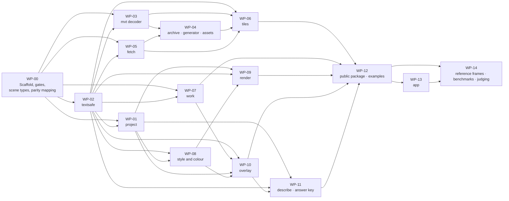

# go-tuiMaps v0.1.0 — Implementation plan

| Field | Value |
|---|---|
| Phase | PLAN |
| Date | 2026-09-19 |
| Status | Revised after the PLAN red-team's first round (74 findings; `../08-reports/red-team-plan.md`) and rulings D-81 to D-89; again after its second round (60 findings) and rulings D-90 to D-94; and after its third, narrow round (27 findings, no Critical). For HUM LEAD's approval with the Plan of Record. |
| Goal | Build the first release, v0.1.0, as ruled in D-44 and refined through D-94: a braille basemap with features, images and scalar grids on it, the view described as data, and a small app — ready to integrate into the first host. |
| Architecture | [`architecture.md`](../03-architecture-design/architecture.md) and its diagram set; **[the contract](../03-architecture-design/contract.md)** — what each public call promises; **[the constants](../03-architecture-design/constants.md)** — every number a test below asserts. This plan names the diagram each work package builds. |
| Tech stack | Go 1.25 (the floor toolchain), standard library, plus `mattn/go-runewidth` and `clipperhouse/uax29/v2` (D-75, D-81). No C toolchain (D-22). |
| Branch | `feature/go-tuimaps`, merged to `release/v0.1.0` at each phase exit (D-28). |

## How this plan is written (D-71)

**No code bodies.** Code is written in BUILD, test first. Each task gives: the file, the **test to write first** — its name and what it asserts — then what to implement, a signature only where it fixes a contract, and the command that verifies it. The framework's planning guide asks for complete code and two-to-five-minute tasks; HUM LEAD's directive overrides that, so a task here is **one red-green-refactor cycle**: one behaviour, one failing test, the least code that passes.

**Every task is test-first (FULL TDD).** A task is done when its test was seen to fail for the right reason, passes, and the whole suite is green under the race detector.

**Diagrams are kept current.** A task that changes a design decision updates the diagram named in its work package in the same commit.

## Conventions for every work package

| Rule | Check |
|---|---|
| Tests first, race detector on, floor toolchain, read-only modules | The gate script, in **every module** of the repository, not only the library (NFR-16). A second leg runs **without** the race detector: zero-allocation and allocation-count tests live in files built only there, because they are unreliable under it |
| No remote exists until SHIP (D-19) | So there is no hosted runner yet. **The gate is a script run locally before every merge**; at SHIP it becomes the hosted workflow. What cannot run locally — Linux, Windows, real amd64 hardware, a nightly soak — is listed as untested, not assumed ([tests and gates](../03-architecture-design/L2-gates.md)) |
| Separate modules resolve the library from this tree | The gate script writes a throw-away workspace file; tracked module files carry no `replace`. The allow-list test runs with the workspace switched off (D-81) |
| The library starts no goroutine and no timer | **A static check over non-test files**: no `go` statement, and no call to the time package's timer, ticker or after functions, in any library package. Test files and `internal/testkit` are exempt — they start goroutines legitimately — and a second check fails any non-test file that imports `testkit`. The one timer in play is the standard library's own client timeout inside `fetch`, which the check does not match: it lives and dies inside the host's `Work` call (D-73). A goroutine count cannot prove it — the network stack starts goroutines of its own, and a count cannot see timers. A stack-filtered leak check runs after `Close` |
| Anything that parses outside bytes has a fuzz target, 60 s on every change | `go test -fuzz` per target (NFR-10) |
| Builds for five targets with the C toolchain off | cross-compile job (NFR-1) |
| Reference frames byte-identical on amd64 **and** arm64 | arm64 natively, amd64 under local emulation until a hosted runner exists (NFR-6). **Emulated amd64 is not real amd64** — a math routine can branch on a processor feature — so the projection uses routines with no assembly on either architecture (constants, section 6), and the gate **fails, never skips,** when the second architecture cannot be run |
| Public contract compared with the last tag | contract-check job, from the first tag (NFR-22) |
| Tests connect to loopback only | The dial hook is installed **by default** in every test binary, not opted into (NFR-11) |
| Every exported name has a doc comment | lint (NFR-20) |
| **Parity is tested first, inside the work package that owns the row** | [`parity-mapping.md`](parity-mapping.md) names the owner and the test for each of the 62 rows; a work package is not done until its rows' tests pass (PL-BZ-2) |
| Sole-author commits; no tool-generated trailers or watermarks | NFR-14 |

## File map

```
go.mod                         module github.com/branden-thompson/go-tuimaps · go 1.25.0
go.work                        never tracked: written by the gate script so the separate modules resolve the library from this tree
scripts/gate                   the local gate: every module, both legs, fuzz, scans, static checks, cross-compile
tuimaps/ (module root)         the public package: map.go · options.go · intents.go · overlay.go · presets.go
                               palette.go · frame.go · legend.go · describe.go · errors.go · doc.go
assets/                        opt-in embedded tiles: assets.go · tiles/ (generated) · HASHES · NOTICE
internal/project/              projection, view-to-cell, distances, fit-to
internal/textsafe/             cleaning, grapheme clusters, width, id validation
internal/mvt/                  own vector-tile decoder, limits, compact geometry
internal/archive/              minimal single-file archive reader
internal/fetch/                transport rules
internal/tiles/                sources, caches, stand-ins, retry times, schema mapping
internal/work/                 pending queue, Work, Settle, deadlines
internal/style/                dark and bright styles, profiles, user styles (legacy filters)
internal/colour/               tokens, presets' ramps per depth, checker, ground, foreground choice
internal/render/               braille canvas, rasteriser, compositing, labels, markers, furniture, frame
internal/overlay/              validation, features, grids, images, freshness
internal/describe/             description as data
internal/fault/                the typed error and both closed lists of kinds; imports only textsafe; re-exported by the public package
internal/scene/                the prepared types every part shares — decoded tile, prepared overlay, the job type; imports nothing here
internal/testkit/              leak check, dial hook, blocking transport, shaped secure test server, fixture loaders
testdata/                      pinned fixture (memory-measurement.md) · reference frames · M1 scenario data · answer keys
cmd/tuimaps/   (own module)    the app
examples/      (own module)    one per shape · pump · pump in the first host's idiom · radar with its table
tools/gen-assets/ (own module) the tile generator
tools/answer-key/ (own module) the independent M1 answer-key script (D-43, D-67) — shares no code with internal/
tools/oracle/  (own module)    differential tests of internal/mvt against a proven decoder
```

## Work packages and their order



**Why these edges.** `render`, `overlay`, `describe`, `tiles` and `work` meet only through `internal/scene` (WP-00): render draws prepared types and never imports the packages that prepare them; `work` runs jobs it knows only by `scene`'s job type, so it depends on none of the packages that supply jobs. That is what lets WP-07 start early and keeps the import graph free of cycles (PL-CQ-7). **Added after red-team round 2 checked the edges against the tasks again:** every package that reports a problem does so through `internal/fault`, built in WP-02, so WP-01, -03, -05, -06, -07, -08 and -10 need WP-02 (round 3 found -01 and -07 missing); WP-10's borrow tests (10.5) need a real `Work`, so WP-10 needs WP-07. The assets package is handed to `New` as an option and imports nothing from `tiles`; the rule that embedded tiles never override a chosen source is `tiles`' rule and is tested there (06.20).

| Milestone | Reached when | Shows |
|---|---|---|
| M-A **A map from embedded tiles** | WP-00 to WP-07; from WP-08 the styles, tokens, ground and foreground rule (08.1 to 08.5, 08.16, 08.17, 08.21); WP-09's basemap tasks; from WP-12 tasks 12.1, 12.2 and 12.4 — 12.3's intents include `FitTo` over overlays and wait for M-B | The three-call world map (NFR-19); never blank; no goroutines; deterministic frames |
| M-B **Overlays** | The rest of WP-08; WP-10; WP-09's overlay tasks | Alerts, radar by the image path, temperature; presets; safe ramps; no-colour forms |
| M-C **The same facts as words** | WP-11 | M1b for every scenario in the slice, against the independent key |
| M-D **Release candidate** | WP-12 to WP-14 | The app; examples; 62 parity rows; M1 to M5; the benchmark against the pinned fixture |

**Quality checkpoint (HUM LEAD): after M-A.** The first working map is shown to HUM LEAD before M-B starts: does it hold up. *First written as a re-estimate checkpoint; HUM LEAD ruled that estimates are not what matters (D-80).*

## First effort estimate — a record, not a constraint

**HUM LEAD, D-80: "estimates mean nothing - I want it done right, so I'm willing to wait / use the time that's needed."** Nothing in BUILD is to be cut, hurried or re-ordered to meet the figures below. They are kept because the Discovery Report said no estimate existed and red-team round 2 asked for one; they say how big the work looked from PLAN, unverified.

- **Unit:** a *cycle* is one task below — one failing test, the code to pass it, a refactor. A *session* is one focused working sitting that lands about 8 to 12 cycles with their reviews and commits.
- **Basis:** the task counts below, plus an allowance of 30% for what tasks always hide — refactoring across packages, fixing what a later test exposes, specimen-to-code surprises. SEV-0 phase exits, red-team rounds and HUM LEAD's reviews are **not** in the figure.

| Work package | Tasks | Size | Sessions |
|---|---|---|---|
| WP-00 Scaffold and gates | 13 | S | 1 to 2 |
| WP-01 project | 13 | S | 1 |
| WP-02 textsafe | 11 | S | 1 |
| WP-03 mvt decoder | 19 | L | 2 to 3 |
| WP-04 archive · generator · assets | 16 | M | 2 |
| WP-05 fetch | 12 | M | 1 to 2 |
| WP-06 tiles | 21 | L | 2 to 3 |
| WP-07 work | 15 | M | 2 |
| WP-08 style and colour | 24 | L | 3 |
| WP-09 render | 32 | L | 4 to 5 |
| WP-10 overlay | 26 | L | 4 |
| WP-11 describe · answer key | 17 | M | 2 to 3 |
| WP-12 public package · examples | 29 | M | 3 to 4 |
| WP-13 app | 16 | M | 2 |
| WP-14 parity · reference frames · benchmarks | 20 | L | 3 to 4 |
| **Total** | **284** | | **33 to 41, or 43 to 53 with the 30% allowance** |

The count rose from 210 to 264 when the PLAN red-team found requirements with no task, to 272 after its second round found parity rows with an owner and nothing to build them and D-92 and D-94 added one each, and to 284 after its third round found 47 mapped parity tests that no task named — each owning package now closes with a task that lists them — the parity tests are counted inside the work packages that own them ([parity mapping](parity-mapping.md)). Tasks 14.15 to 14.19 are HUM LEAD's sessions or manual passes, not code. Cross-check against the Discovery Report's size estimate (about 6,700 to 7,300 lines): 284 cycles at 25 to 30 lines of production code a cycle is 7,100 to 8,520 lines — agreement that says only that the two share assumptions.

## The work packages

Each table lists tasks in order. "Test first" names the test and what it must assert. Signatures appear only where they fix the public contract or a boundary between packages.

### WP-00 — Scaffold and gates · builds: L1 "The parts"

| # | Test first | Then | Verify |
|---|---|---|---|
| 00.1 | — (BUILD-entry checklist, D-20) | Restore the language declaration in the project configuration; run the first code-quality check; confirm the floor toolchain | the framework's structure check and code-quality check pass |
| 00.2 | `TestModuleHasNoReplace` reads `go.mod` and fails on a `replace` line | Module layout per the file map; separate `go.mod` for `cmd/`, `examples/`, `tools/*`; untracked `go.work` | `go build ./...` in each module |
| 00.3 | `TestAllowList` fails if `go list -m all`, run with the workspace file switched off, names anything beyond the two allowed modules | Dependency allow-list check (NFR-9, D-75, D-81) | the test |
| 00.4 | `testkit.LeakCheck` self-test: after `Close`, no goroutine whose stack is inside the library remains; goroutines of the network stack are filtered | The leak check (the no-goroutine rule itself is proved statically — 00.11) | `go test ./internal/testkit` |
| 00.5 | `testkit.LoopbackOnly` self-test: a dial to a public address fails the test | The dial hook (NFR-11) | the test |
| 00.6 | `testkit.BlockingTransport` self-test: a request never returns until cancelled | The transport used to prove Render never waits (FR-23) | the test |
| 00.7 | — | **The local gate script** (D-19: no remote until SHIP): for every module — tests with the race detector, a second leg without it, fuzz 60 s a target, vulnerability scan of the module and the standard library, licence files; for the library also the five-target cross-compile with the C toolchain off, and reference frames on arm64 natively and amd64 emulated | a green run on an empty package |
| 00.8 | — | Lint: exported names documented; no writes to standard output or error from the library | lint job |
| 00.9 | `TestFixturePinned` hashes `testdata/fixture/` against its committed list | The fixture of `memory-measurement.md` is **already committed**, city tiles included; this task is the test and `testkit`'s loaders for it | the test |
| 00.10 | `TestSceneImportsNothingHere`: `internal/scene` imports no other internal package | The shared prepared types and the job type (PL-CQ-7) | `go test ./internal/scene` |
| 00.11 | The static checks fail on a planted `go` statement or timer call **in a non-test file**, a write to standard output, an import of `tiles` from `render`, an import of `testkit` from a non-test file, and a test package that does not link the loopback-only dial hook; they pass over test files and `testkit` | Static checks (D-73, FR-23, NFR-20) | the gate |
| 00.12 | The gate fails when any one module's test fails, and when the workspace file is tracked | Per-module gate (PL-CQ-5, PL-IS-3) | the gate |
| 00.13 | — | **`parity-mapping.md` written first**: each of the 62 rows, the work package that owns it, and the test that will prove it (PL-BZ-2) | 14.1 |

### WP-01 — project · builds: L2 Render "The braille canvas", L2 Describe

| # | Test first | Then | Verify |
|---|---|---|---|
| 01.1 | `TestMercatorRoundTrip`: lon/lat → world → lon/lat within 1e-9 for a table of points incl. ±85°, ±180° | Web-mercator forward and inverse | `go test ./internal/project` |
| 01.2 | `TestViewToDot`: centre of view maps to centre dot; one zoom level doubles the scale | `View{Centre, Zoom, Cols, Rows}`; dot space is 2×4 per cell | same |
| 01.3 | `TestFractionalZoom` | Fractional zoom scaling | same |
| 01.4 | `TestTilesForView`: the fixture view needs exactly its four zoom-6 tiles, in a fixed order | Tiles covering a view, deterministic order (NFR-6) | same |
| 01.5 | `TestGreatCircle` against published distances (three city pairs) within 0.5% | Haversine distance | same |
| 01.6 | `TestBearingAndCompass`: eight directions; 342° is "north" | Initial bearing; eight-point compass words | same |
| 01.7 | `TestCellSpan`: at the scenario-2 view a column is 0.8 km and a row 1.6 km (specimen 17) | Ground distance per column and per row (FR-33) | same |
| 01.8 | `TestLongitudeIsCircular`: distance across ±180° is the short way | Circular longitude (FR-29) | same |
| 01.9 | `TestFitToContainsAll`: for the scenario-6 points and a 69×12 rectangle, every named point lies inside with the margin | `FitTo(places, boxes, margin)` → centre and zoom (D-76) | same |
| 01.10 | `TestFitToLargestZoom`: the zoom is solved directly, and a zoom 1/256 of a level closer pushes a named point outside the margin | Largest-zoom solve | same |
| 01.11 | `TestNoNonFiniteReachesInt`: NaN or infinite input returns an error, never a conversion | Guard (NFR-6) | same |
| 01.12 | `TestFitToEdgeCases`: a single point keeps the zoom; a box across ±180° takes the short way; works before any `Work` has run, from boxes recorded at hand-in | Fit-to (L2-view) | same |
| 01.13 | **This package's parity rows that no task above names**, each by the test [the mapping](parity-mapping.md) gives it, written first: P-17 Tile zoom; P-18 Tile pixel size; P-20 Projection; P-21 Normalize | Whatever of each row's behaviour the tasks above have not already built is built here, as the parity matrix states it. The package is not done until all of its mapped tests pass (M3) | same |

### WP-02 — textsafe · builds: L0 "Way out"

| # | Test first | Then | Verify |
|---|---|---|---|
| 02.1 | `TestInvalidUTF8BecomesReplacement` | Cleaning pass, step 1 (FR-34) | `go test ./internal/textsafe` |
| 02.2 | `TestControlsDropped`: C0, DEL, C1, line and paragraph separators | Step 2 | same |
| 02.3 | `TestBidiDropped` | Step 3 | same |
| 02.4 | `TestZeroWidthOutsideClusterDropped` and `…InsideClusterKept` (a flag emoji, a letter with a combining accent) | Cluster-aware zero-width rule; the code-point list as a documented table | same |
| 02.5 | `TestWidthMatchesHostTable`: a table of strings measures the same as `go-runewidth` under the fixed narrow condition | Width by cluster (NFR-8) | same |
| 02.6 | `TestFitDropsWholeCluster`: a two-cell cluster that does not fit is dropped, never split | `Fit(s, cells)` | same |
| 02.7 | `TestQuoteCutTo64Clusters` | Quoting untrusted text in errors | same |
| 02.8 | `TestIDValidation`: an id that would need cleaning is refused; a clean id is returned byte-for-byte | Id rule (FR-34, NFR-20) | same |
| 02.9 | `FuzzClean`: output never contains an escape byte or a control | Fuzz target | `go test -fuzz FuzzClean -fuzztime 60s` |
| 02.10 | `TestClosedGlyphList`: every character the renderer may emit is in the list, and each measures one cell | The closed list of NFR-8 as data | same |
| 02.11 | `TestSafeOnlyBuiltHere`: the cleaned-text type is a struct with an unexported field, so no other package can make one from a plain string; the cleaning function is the only way to get one from outside text, and the constant form accepts only untyped string constants. `TestNoForeignErrorWrapped`: no library error unwraps to a standard-library or third-party error — the one exemption is the `cancelled` kind, which answers `errors.Is` for the two context errors and carries none of their text | One enforced way out (PL-IS-5); the typed error and the kinds, in `internal/fault` | same, plus a static check |

### WP-03 — mvt decoder · builds: L2 Tiles "Untrusted-input gate"

| # | Test first | Then | Verify |
|---|---|---|---|
| 03.1 | `TestVarint`: boundary values; an over-long varint is an error | Varint and tag scanning over a byte slice, no allocation | the leg without the race detector, for the allocation assertion |
| 03.2 | `TestBodyLimit`: a body over 2 MiB is refused before reading | Limits struct with the NFR-10 defaults | same |
| 03.3 | `TestGzipLimit`: a gzip bomb stops at 8 MiB decompressed | Limited decompression | same |
| 03.4 | `TestLayerLimit` (65 layers refused) | Layer scan | same |
| 03.5 | `TestDropUnusedLayer`: a layer absent from the schema mapping allocates nothing | Drop while decoding (D-75) | the leg without the race detector |
| 03.6 | `TestKeysAndValues`: only `class`, `name`, `house_num`, the configured language's name keys and the keys the mapping asks for are kept; no other `name:xx` is ever materialised (D-82) | Attribute filter | same |
| 03.7 | `TestFeatureLimit`, `TestGeometryIntegerLimit` | Counts checked before allocating | same |
| 03.8 | `TestGeometryCommands`: MoveTo, LineTo, ClosePath; zig-zag deltas; a malformed command stream is an error | Geometry decoding into 16-bit pairs with ring markers | same |
| 03.9 | `TestExtentRange`: 0 and 8,193 refused (constants, section 1); `TestCursorLeavesInt16IsError`: a delta stream that walks outside the 16-bit range is an error, never a wrap | Extent and coordinate range (PL-IS-2) | same |
| 03.10 | `TestRetainedLimit`: a tile whose kept form exceeds 4 MiB is refused | Retained-size accounting | same |
| 03.11 | `TestUnsupported`: a non-vector tile type and an unknown compression give a clear "unsupported" error | Error kinds | same |
| 03.12 | `TestCompactNeverLargerThanSource`: for every tile of the fixture and the urban set, the kept form is smaller than the tile's own bytes and under the retained cap — a one-sided bound from NFR-10, not a figure from the throwaway measurement | Size regression | same |
| 03.13 | `TestNeverPanics` over the corpus of real tiles, truncated at every byte | Robustness | same |
| 03.14 | `FuzzDecode`, seeded with real tiles | Fuzz target | 60 s |
| 03.15 | `tools/oracle`: every kept feature of the fixture tiles equals what the proven decoder gives, after the same filter | Differential test, separate module | `go test` in `tools/oracle` |
| 03.16 | `BenchmarkDecode`: records time and allocations for a fixture tile | Baseline for NFR-4 | `go test -bench` |
| 03.17 | `TestProtobufPitfalls`, table-driven: a group wire type; an unknown wire type; an unpacked repeated field; a nested length larger than its parent; a length beyond the platform's `int`; an odd number of tag integers; a key or value index out of range; a command count beyond the integers left; `LineTo` before `MoveTo`; a wrong `ClosePath` count — each a clear error | Decoder correctness, not only no-panic (PL-IS-2) | same |
| 03.18 | `tools/oracle` run over the fuzz corpus: wherever both decoders accept a tile, the kept features agree | Differential fuzzing | the tool's module |
| 03.19 | **This package's parity rows that no task above names**, each by the test [the mapping](parity-mapping.md) gives it, written first: P-26 Sort key; P-36 Label language; P-37 Gzip sniff; P-38 MVT decode; P-39 Ring grouping | Whatever of each row's behaviour the tasks above have not already built is built here, as the parity matrix states it. The package is not done until all of its mapped tests pass (M3) | same |

### WP-04 — archive · generator · assets · builds: L2 Tiles "The embedded tiles and their generator"

| # | Test first | Then | Verify |
|---|---|---|---|
| 04.1 | `TestHeader`: a good header parses; bad magic, bad version, offsets beyond the file are errors | Header (NFR-10) | `go test ./internal/archive` |
| 04.2 | `TestDirectoryLimits`: > 1 MiB decompressed, > 65,536 entries, or entries > bytes/4 refused before allocating | Directory decoding | same |
| 04.3 | `TestLeafDepthAndCycle`: depth 4 and a cycle are refused | Leaf traversal with a guard | same |
| 04.4 | `TestTileIDHilbert`: z/x/y ↔ tile id for a table of known values | Tile id | same |
| 04.5 | `TestFindTile` against a small archive built in the test | Lookup | same |
| 04.6 | `TestRangeReaderInsistsOn206`: a 200 reply is closed unread | Range reads through `internal/fetch` | same |
| 04.7 | `FuzzHeader`, `FuzzDirectory` | Fuzz targets | 60 s each |
| 04.8 | `TestEncodeRoundTrip`: a tile decoded, stripped and re-encoded decodes to the same kept features | A minimal vector-tile **encoder**, inside the generator's module only — the library never encodes (PL-PM-9) | the tool's module |
| 04.9 | `TestGeneratorWritesHashList`: every source and output tile listed with SHA-256 | HASHES file | same |
| 04.10 | `TestPinChangesTogether`: pin, hash list and asset disagreeing fails | Pin check (FR-28a) | same |
| 04.11 | `TestAssetsDecodeThroughGate`: all 85 embedded tiles pass `internal/mvt` with default limits; total size under 2.5 MB — the figure measured here replaces the 1.7 MB estimate made before English names were kept (D-82) | `assets` package with `embed` | `go test ./assets` |
| 04.12 | `TestAssetsRegisterExplicitly`: importing the package changes nothing; tiles are used only when passed as an option — so a test for "no source and no assets" can live in the same binary | No package-level side effect | `go test ./assets` |
| 04.13 | `TestGeneratorStripsTranslations`: output tiles carry `name` and English, and no other `name:xx` (D-82) | `tools/gen-assets`: read pinned archive, decode, strip, re-encode | `go test` in the tool's module |
| 04.14 | `TestGeneratorDeterministic`: two runs against a small local archive give byte-identical output | Reproducible assets (PL-IS-6) | same |
| 04.15 | `TestMetadataNeverParsed`: the archive reader skips the metadata block without reading it | Reader scope | `go test ./internal/archive` |
| 04.16 | **This package's parity rows that no task above names**, each by the test [the mapping](parity-mapping.md) gives it, written first: P-47 Embedded tiles | Whatever of each row's behaviour the tasks above have not already built is built here, as the parity matrix states it. The package is not done until all of its mapped tests pass (M3) | `go test ./assets` |

### WP-05 — fetch · builds: L2 Tiles "The network edge"

| # | Test first | Then | Verify |
|---|---|---|---|
| 05.1 | `TestPlainHTTPRefused` except loopback or explicit option | Transport rules (FR-22b) | `go test ./internal/fetch` |
| 05.2 | `TestRedirectLimit` (4th refused), `TestNoSecureToPlain`, `TestCrossHostRefusedUnlessAllowed` | Redirect policy | same |
| 05.3 | `TestPrivateAddressRefusedAtDial`: a public name resolving to a private address is refused, checked on the connected address | Dial control | same |
| 05.4 | `TestNoReferer`, `TestUserAgent`: names library, version and the host's token, nothing about the machine | Headers | same |
| 05.5 | `TestBodyReadThroughLimit` | Limit reader | same |
| 05.6 | `TestRangeMustBe206Exact` | Range replies | same |
| 05.7 | `TestErrorNeverCarriesAddress`: message text, `Unwrap` and `errors.As` expose scheme and host only | Own error type (FR-22b) | same |
| 05.8 | `TestProxyFromEnvironment` | Proxy | same |
| 05.9 | `TestReplacementFetcherContract`: range and maximum length are passed, and what returns is checked | The host's replacement fetcher | same |
| 05.10 | `TestTimeout`, `TestContextCancel` | Cancellation | same |
| 05.11 | `TestStatusChecked`: 404 and 500 are errors with a kind | Status (L-2) | same |
| 05.12 | `testkit.ShapedServer` self-test: secure transport with its own trust anchor, a stated latency and bandwidth, a virtual clock | The server NFR-5 is measured against (PL-PM-5) | `go test ./internal/testkit` |

### WP-06 — tiles · builds: L2 Tiles "Where a tile can come from", L3 States "A tile"

| # | Test first | Then | Verify |
|---|---|---|---|
| 06.1 | `TestNoSourceNoConnection`: a map with no named source never dials (D-65) | Source registry; nothing registered by default | `go test ./internal/tiles` |
| 06.2 | `TestSourceOrder`: disk, then named network, then embedded | Order | same |
| 06.3 | `TestMemoryCacheByteCap` at the default of 0.5 MB (D-85). Stated in what this package owns — **pin sets**, the tiles each registered view has published as its need: `TestPinnedNeverEvicted`: with two pin sets whose bytes together exceed the cap, no pinned tile is evicted and none is asked for twice; a stand-in ancestor is pinned while the tile it stands in for is missing; a withdrawn pin set frees its tiles; `TestCacheUnderNeedWarnedOnce`; `TestCacheUseReportsNeedHeldCap` (D-90). *Two whole maps on different views reaching "complete" is the public package's test, 12.27* | Byte-capped cache: need first, cap second | same |
| 06.4 | `TestCacheKeyIncludesLanguageNotStyle` (FR-31, D-82): a tile decoded for English is never served for another language | Key = source identity + label language + z/x/y | same |
| 06.5 | `TestAncestorStandIn`: with only a zoom-3 tile on hand, a zoom-6 request yields a stand-in region | Stand-ins (D-30) | same |
| 06.6 | `TestTileStates`: every transition of the state diagram (L3 States, machine 1), table-driven — among them: on hand → evicted **only** when no pin set holds the tile and the cache is over its cap (D-90); loading → unavailable when no source is named and the embedded tiles do not hold it, never retried on a timer; loading → waiting when a named source refused, failed or had no such tile | State machine | same |
| 06.7 | `TestNotBeforeDoubles`: 30 s doubling to 10 min; no timer is created | Retry times (FR-23) | same; "no timer" is the static check's to prove (00.11) |
| 06.8 | `TestDiskCacheOffByDefault` | Disk cache only with a root (FR-21b) | same |
| 06.9 | `TestCachePathConfined`: hostile source identities cannot escape the root; path is hash plus integers | Paths | same |
| 06.10 | `TestWriteOnlyAfterFullDecode`; `TestBadCachedFileDeleted` (FR-22a) | Write rule | same |
| 06.11 | `TestRootWritableByOthersRefused` (skipped with a stated reason on Windows) | Permissions | same |
| 06.12 | `TestEvictLeastRecentlyRead`: recency is modification time set on read, at most hourly; prune to 90% | LRU (FR-21a) | same |
| 06.13 | `TestPurgeAndVerify` | Maintenance calls | same |
| 06.14 | `TestSchemaMappingSeam`: a source declaring unknown layers gives "unsupported schema" (D-46, FR-35) | Mapping | same |
| 06.15 | `TestDedupInFlight`: two wants for one tile make one job | De-duplication | same |
| 06.16 | `TestTileJSONLimits` (1 MiB, nesting 64); `TestTileJSONAddressesObeyFetchRules`: secure scheme only, no user-info part, the tile host must be the TileJSON's own host unless the host application allowed another, and only the `{z}`, `{x}`, `{y}` tokens are filled — anything else in braces refuses the source; `FuzzTileJSON` | TileJSON (FR-21, NFR-10, FR-22b; parity P-49) | same |
| 06.17 | `TestCacheRootOpenedOnce`: the root is opened once as a confined handle and the permission check is made on that handle; `TestSymlinkInsideRootNotFollowed` — the confined handle stops escapes but follows links that stay inside, so each entry is checked without following before it is opened; `TestCachedFileSizeCheckedBeforeRead`; `TestReadOnlyRootTolerated`; `TestMemoryHitRefreshesDiskRecency` | Disk cache hardening (PL-IS-4) | same |
| 06.18 | `TestOverzoomAboveSourceMax`: above zoom 14 the zoom-14 tile is drawn scaled (parity P-18) | Overzoom | same |
| 06.19 | `TestAncestorsAreWanted`: a missing tile also wants its nearest ancestor a source can supply, and that job sorts first | Stand-ins have a source (PL-DQ-1) | same |
| 06.20 | `TestAssetsNeverOverrideChosenSource`: with a source named, embedded tiles serve only as stand-ins and at the zooms they hold | Source order (L-13) — moved here from WP-04, whose package cannot know it | same |
| 06.21 | **This package's parity rows that no task above names**, each by the test [the mapping](parity-mapping.md) gives it, written first: P-48 Disk cache; P-49 URL modes; P-50 HTTP; P-51 Fetch failure | Whatever of each row's behaviour the tasks above have not already built is built here, as the parity matrix states it. The package is not done until all of its mapped tests pass (M3) | same |

### WP-07 — work · builds: L3 Sequences, all four

| # | Test first | Then | Verify |
|---|---|---|---|
| 07.1 | `TestPendingCounts` | Queue with kinds: tile, overlay-prepare, describe | `go test ./internal/work` |
| 07.2 | `TestCapDropsOldest`, `TestNewestViewFirst` | Cap and ordering (FR-30) | same |
| 07.3 | `TestWorkDoesOneJob`: `Work(ctx)` runs exactly one job on the caller's goroutine | `Work(ctx) (did bool, err error)` | same; "on the caller's goroutine" is shown by a job that records its own stack |
| 07.4 | `TestWorkCancel`: a cancelled context abandons the job and leaves state consistent | Cancellation | same |
| 07.5 | `TestWorkNeverWaitsOnWork`: eight concurrent `Work` calls each proceed without waiting on another; and a documentation test that the per-`Work` memory note exists | No limiter (D-84): the pump's width and its memory are the host's | same, race detector |
| 07.6 | `TestLeftViewCancelsJob` | Jobs tied to the view | same |
| 07.7 | `TestChangeCounterMovesOnCompletion` | Counter (FR-25) | same |
| 07.8 | `TestNextCallIsEarliest`: of blink phase, retry time, staleness; on the wall clock | Deadline | same |
| 07.9 | `TestSettleEndsWhenIdle`: with a failed tile in back-off, `Settle` returns at once with the failure count. `TestSettleEndsOnContext`: with a transport that blocks for ever, `Settle` returns when its context ends. `TestSettleSaysNoSource`: with no source and no assets its result says why nothing was fetched | `Settle(ctx) (SettleResult, error)` | same |
| 07.10 | `TestPendingCountsWaitingOnly`: a job inside a `Work` call and a failed job waiting for its retry time are not pending; a retry becomes pending at the first owner call after its time. *(Render beside Work, first written here, cannot be tested in a package that may not import render; it is 12.22.)* | `Pending` (contract, section 2) | same |
| 07.11 | `TestNoPanicEscapes`: a panicking job is recovered into an error | Recovery | same |
| 07.12 | `TestNothingDueWhenOffline`: with every wanted tile unavailable, `NextCall` reports nothing due | Deadlines | same |
| 07.13 | `TestOnPendingFiresOnceInsideOwnerCall`: when pending goes from none to some, the hook is called once, before the owner call returns, with no lock held. `TestOwnerCallFromHookRefused`: an owner call made from inside the hook is refused with the `reentrant-call` kind — a pump call from inside it cannot be told from a legal one and is documented, not detected. `TestTwoWidePumpBothWake`: with a two-slot channel and two pump goroutines, one burst of four jobs is worked by both | The pump's wake rule (contract, section 2) | same |
| 07.14 | `TestSharedJobReturnsToQueue`: a shared fetch cancelled by one map while another still wants the tile goes back to the queue, **and the other map's hook fires from inside the cancelled call**, so its sleeping pump wakes | Shared caches with no goroutine to live on (contract, section 8) | same |
| 07.15 | `TestNoWorkCalledWarning`: after 20 renders that found work pending and no `Work`, one warning | The newcomer's silent failure (PL-NC-2) | same |

### WP-08 — style and colour · builds: L2 Colour, both diagrams

| # | Test first | Then | Verify |
|---|---|---|---|
| 08.1 | `TestTokensMatchTheDocumentedList`: the token names equal the list in the constants document, which was written first | Semantic tokens (D-63) | `go test ./internal/colour` |
| 08.2 | `TestPaletteOverridesToken`, `TestUnsetTokenFallsBack` | Palette resolution | same |
| 08.3 | `TestContrastFormula` against published WCAG pairs | Relative luminance and ratio | same |
| 08.4 | `TestForegroundRule`, for every default background: the line's own colour is kept where it meets 3:1 on the cell; otherwise black or white, whichever contrasts more, found by computing both | The foreground rule (FR-16, D-77) | same |
| 08.5 | `TestKeepColourWherePasses`: a style colour is kept on a cell when ≥ 3:1, else black or white (specimen 20) | Bright and dark style rule | same |
| 08.6 | `TestSimulation` against published reference values for the three deficiencies; `TestSimulationIsInLinearLight`: a known pair scores 11.1, not the 2.9 a gamma-space simulation gives (D-88) | Colour-vision simulation | same |
| 08.7 | `TestCheckerOrdered`, `…Distinct`, `…Readable`, `…VisionSafe`, each with a passing and a failing ramp (the broadcast-style ramp of specimen 21 must fail three ways) | `CheckRamp` (D-53) | same |
| 08.8 | `TestTemperaturePresetPasses` at truecolor and 256, **on a dark ground and on a light one**: every pair of classes, and every class against its ground, at least 10; relative luminance rises to freezing and falls from it (FR-16's order); in truecolor, lightness does the same under every simulated kind of colour vision; at 256 colours the three known inversions are recorded, not gated (constants, section 4); the light-ground colours differ from the dark in three bands only (D-91). `TestBreaksExactInFahrenheit` | Temperature preset: 17 classes, specimen 21's colours, two sets by ground (D-62, D-91) | same |
| 08.9 | `TestRadarPresetPasses` at truecolor and 256 **on a dark ground and on a light one**: lighter-is-heavier on dark, darker-is-heavier on light, chosen by the luminance of the ground **in effect — painted, or the host's declared colour** (`TestRadarRampFollowsDeclaredGround`); on both grounds **lightness** moves one way at every step — falling on a light ground, rising on a dark one — under every simulated kind of colour vision; every class at least 10 from its ground (D-88, PL-AX-1) | Radar preset: six classes, two ramps by ground | same |
| 08.10 | `TestAlertPreset`: five severities → outline and tint tokens, **two sets by ground**; outlines ≥ 3:1 on their ground and on their own tint; D-88 between every pair of outlines, every pair of tints, and each against its ground. The colours are designed here — PLAN checked only the two pairs its specimens drew, on a dark ground — and are shown to HUM LEAD before any reference frame is frozen (14.16) | Alert preset | same |
| 08.11 | `TestOverrideIsWarnedNotRefused` | Overrides (D-69, D-53) | same |
| 08.12 | `TestSafeRampsForcesPreset` | Safe ramps (D-63) | same |
| 08.13 | `Test256UsesOnlyFixedIndices` (16–255) | 256 depth | same |
| 08.14 | `TestSixteenPalette`: the hand-chosen basemap palette; ramps fall to the no-colour form (D-59, specimen 23) | 16 depth | same |
| 08.15 | `TestNoColourSelectedByEnv`: non-empty `NO_COLOR` with no hint | Depth selection (NFR-15) | same |
| 08.16 | `TestGroundPaintedByDefault`, `TestDeclaredGroundNotPainted`, `TestStyleByGroundLuminance` | Ground (D-64) | same |
| 08.17 | `TestUserStyleLegacyFilters`: every zoom stop honoured (L-9); an unknown expression is a clear error. `TestParityP44_ColourPick`: line colour, else fill, else text; upstream's red fallback; resolved at draw time. `TestParityP45_LineWidth`: a number or its stops; default 1 | `internal/style` | `go test ./internal/style` |
| 08.18 | `TestCheckerAllPairs`: the temperature scale as first filed fails (two non-neighbours 7.5 apart). `TestCheckerGroundRule`: the dark-ground radar ramp fails on a light ground (3.1) | Checker rules of D-88 (PL-AX-1, PL-AX-2) | same |
| 08.19 | `TestSixteenReferenceTable`: checks at 16 colours use the stated reference table and are reported as indicative; roads and borders differ by more than intensity | 16-colour depth (PL-AX-6) | same |
| 08.20 | `TestStyleLimits` (1 MiB, nesting 64, reference cycles), `FuzzStyle` | A user's style file is untrusted (PL-IS-1) | `go test ./internal/style` |
| 08.21 | `TestBuiltInStylesCoverEveryRole`: dark and bright each give every role a token; roads give way first, coast and water last (D-83) | Built-in styles (FR-20) | same |
| 08.22 | `TestPaletteSwapKeepsTiles`: a palette change moves the counter and re-decodes nothing | FR-15 | `go test ./internal/colour` |
| 08.23 | — | **HUM LEAD looks at the alert preset's colours** — five severities, both grounds, as rendered frames — once 08.10 has designed them and before M-B is called done (RS-26) | record |
| 08.24 | **This package's parity rows that no task above names**, each by the test [the mapping](parity-mapping.md) gives it, written first: P-05a Colour depth; P-41 Style match; P-42 Filter ops; P-43 Constants and ref | Whatever of each row's behaviour the tasks above have not already built is built here, as the parity matrix states it. The package is not done until all of its mapped tests pass (M3) | same |

### WP-09 — render · builds: L2 Render, both diagrams; L3 States "A marker"

| # | Test first | Then | Verify |
|---|---|---|---|
| 09.1 | `TestEmptyCellIsBlankBraille` — the mapping's `TestParityP03a_EmptyCell` | Canvas: dot mask per cell | `go test ./internal/render` |
| 09.2 | `TestLineRaster` golden: eight directions | Line rasteriser | same |
| 09.3 | `TestFillEvenOdd`: a polygon with a hole; overlapping parts are inside (FR-11) | Fill | same |
| 09.4 | `TestClipNothingOutside` | Clip to the rectangle | same |
| 09.5 | `TestCellColourVote` — the mapping's `TestParityP08_CellColourVote`: the majority colour among a cell's lit dots wins; a tie goes to the colour commoner among the eight neighbours; a deterministic last resort when that ties too (P-08, D-83) | One colour per cell, within the basemap | same |
| 09.6 | `TestCompositingOrder`: nine layers, table-driven, each pair (FR-12) | Compositor | same |
| 09.7 | `TestWaterMasksField` (D-32); `TestWaterNeverMasksImage`: rain over a lake is drawn and the shore is an outline (D-87); `TestHostCanFlipEither` | Water and overlays, by kind | same |
| 09.8 | `TestProfileThinsUnderOverlay`, `TestProfileBySize` | Basemap profiles (FR-19) | same |
| 09.9 | `TestLayerToggle` (FR-36) | Layer switches | same |
| 09.10 | `TestLabelCollision` per upstream's rule — the mapping's `TestParityP34_Collision` | Labels | same |
| 09.11 | `TestLabelByCluster`: a wide name occupies two cells a character; never split | Labels through `textsafe` | same |
| 09.12 | `TestMarkerOverHatch` (the defect of specimen 13a) | Marker order (FR-18a) | same |
| 09.13 | `TestBlinkPhaseFromTime`: same frames whatever the call count; both phases seen at 100, 300, 1,000 ms sampling | Blink (FR-25) | same |
| 09.14 | `TestFrozenClockDrawsOn`; `TestReduceMotionSteady` (NFR-21) | Motion safety | same |
| 09.15 | `TestHatchAndLabelNoColour`; `TestDashedLineNoColour` (specimen 19c) | No-colour feature strokes | same |
| 09.16 | `TestScaleMark`, `TestStaleMark`, `TestCreditLine`, `TestNoTilesNotice`, `TestFooterLineOffByDefault`: the footer furniture draws `Footer()`'s text when turned on (P-57) | Furniture | same |
| 09.17 | `TestEveryLineExactWidth` over a fuzzed set of labels, measured by calling the width library directly, not through the code under test | Frame emit (NFR-8) | same |
| 09.18 | `TestOnlyColourSequences`: output holds colour sequences and cleaned text only | Emit safety (FR-34) | same |
| 09.19 | `TestUnchangedFrameZeroAllocs`, in a file built only without the race detector | Frame reuse (NFR-4) | the gate's second leg |
| 09.20 | `TestRenderImportsNoSlowPackage`: `render`'s dependency list contains neither `tiles` nor `fetch` nor `overlay` | The layout rule (the behavioural test — Render beside a blocked `Work` — is 12.22) | same |
| 09.21 | `TestDeterministicAcrossMapOrder`: shuffled tile arrival gives identical bytes | Determinism (NFR-6) | same, both runners |
| 09.22 | `TestFrameStatus`: complete, still sharpening, no tiles | Status | same |
| 09.23 | `TestImageResampledAtDrawTime`: a pan redraws a prepared image with no `Work`, into a reused buffer; `TestHeaviestInCell`: eight samples a cell, the heaviest class wins, in both projections a host may state (D-78); `TestGridSampledAtDrawTime`: a grid's classes are sampled at cell centres, and its contour lines found, at draw time | Resampling belongs to render (PL-PF-4, D-78) | same |
| 09.24 | `TestReuseKey`: each item of the contract's list (section 5) forces a redraw when it changes — places and reduce-motion among them — and a call that changes none of them does not | Frame reuse key (PL-PF-5) | same |
| 09.25 | `TestOnlyChangedRowsRebuilt`; `TestFrameValidUntilNextRender` | The frame (contract, section 5) | same |
| 09.26 | `TestWaterwaysAndParksDrawn` | FR-2 | same |
| 09.27 | `TestImageBlockShadesNoColour` | FR-18 | same |
| 09.28 | `TestProjectionRounded`: results are rounded to 1/256 of a dot before rastering; a product feeding a sum carries the explicit conversion | NFR-6 (constants, section 6) | same, both architectures |
| 09.29 | `TestParityP58_MarkerShapes`: dot 3×3, cross ±3, diamond radius 3, ring and filled circle by the midpoint rule, a character; `TestParityP60_MarkerCullAndLabel`: culled beyond 20 dots of the view, label four dots right, collision-checked after the map's labels, in the marker's colour | Marker shapes, cull and label, as upstream | same |
| 09.30 | `TestParityP31_Simplify`: upstream's line simplification at upstream's tolerance (0.5), **off by default** as upstream has it | The basemap's optional simplification | same |
| 09.31 | `TestDrawFromRunIndex`: a prepared overlay that carries borrowed geometry and its run index is drawn by testing one box for each run and reading only the runs whose box meets the view; the counts of box tests and vertices read are inside the stated bound at the zoom-12 worst case (constants, section 3); split at ±180° as it is drawn | Drawing from the host's memory (FR-11, D-92) | same |
| 09.32 | **This package's parity rows that no task above names**, each by the test [the mapping](parity-mapping.md) gives it, written first: P-01 Pixel grid; P-02 Dot bitmask; P-06 SGR forms; P-07 Row self-containment; P-09 Forced pixels; P-10 Text cells; P-11 Wide chars; P-12 Text placement; P-13 Thin line; P-14 Thick line; P-15 Polygon fill; P-16 Degenerate rings; P-19 Visible tiles; P-22 Ocean outside world; P-23 Draw order, z≥2; P-24 Draw order, z<2; P-25 Label deferral; P-27 Zoom gate; P-28 Feature cull; P-29 Scaling; P-30 Line clip pad; P-32 Label anchor; P-33 Label bounds; P-35 POI glyph; P-59a Marker animation | Whatever of each row's behaviour the tasks above have not already built is built here, as the parity matrix states it. The package is not done until all of its mapped tests pass (M3) | same, both architectures where a frame is compared |

### WP-10 — overlay · builds: L2 Overlays, all three; L3 States "Borrowed geometry", "Freshness"

| # | Test first | Then | Verify |
|---|---|---|---|
| 10.1 | `TestSetReportsCreatedOrReplaced`; `TestRemoveReportsFound`; `TestSetAndRemoveNeverBlock` | `Set(o Overlay) (SetResult, error)`; `Remove(id) (RemoveResult, error)`; both carry `Released bool` (D-74, D-86) | `go test ./internal/overlay` |
| 10.2 | Table-driven `TestHandInMistakes`: each of NFR-20's listed mistakes gives its typed error kind and reviewed message | Closed list of error kinds | same |
| 10.3 | `TestWarningsCappedAndDeduplicated` (≤ 64) | Warnings | same |
| 10.4 | `TestBorrowNotCopied`: the library's bytes do not grow by the input's size | Borrow (FR-11) | the leg without the race detector |
| 10.5 | `TestReleasedAtOnceOnOneGoroutine`; `TestDrainingReportedByWorkReturn`: with a reader held mid-read on another goroutine, `Set` returns not-yet, `InUse` is true, and the `Work` call's return reports the release; `TestOldShapeDrawsFromOwnCopy`; `TestBorrowCheckWarnsOnMutation`; and, as a guarded sub-process run under the race detector, a program that reuses the memory too early exits non-zero with a data race reported, while one that waits is clean | End of a borrow: reported, never waited for (D-86) | same; the sub-process test needs the race detector's toolchain |
| 10.6 | `TestSimplifyIterative`: a 14,001-vertex ring, no recursion, result within tolerance | Simplification | same |
| 10.7 | `TestSubDotRingsDropped`: a ring that simplifies to fewer than three distinct points at the bucket's tolerance is dropped, and one that does not is kept — shown on three hand-made rings; the fixture's count is then recorded, not asserted | Drop rule (constants, section 3) | same |
| 10.8 | `TestZoomBuckets`: fractional zoom maps to one bucket; nearest bucket drawn on a miss | Buckets — definition fixed here | same |
| 10.9 | `TestSplitAtAntimeridian` | ±180° | same |
| 10.10 | `TestFallbackChosenByWholeCap`: a simplified form is cached when its vertices × 8.25 fit the shape cap and handed on as "draw from memory" when they do not (D-90); `TestShapePinsNeverEvicted`. *(Drawing it, and the bound on that work, are render's — 09.31.)* | Which path a shape takes | same |
| 10.11 | `TestVertexCaps`: 2,000,000 an overlay, 4,000,000 an instance | Caps | same |
| 10.12 | `TestGridClassify`: breaks, non-finite = no data | Scalar grid | same |
| 10.13 | `TestGridPresetSuppliesBreaks`; `TestOwnTypeNeedsBreaks`; `TestClassCap` | Types (D-69) | same |
| 10.14 | `TestContoursAtBreaks` golden; `TestFlatDayNoContour` (D-68) | Contours (D-35) | same |
| 10.15 | `TestImageHeaderFirst`: > 1,048,576 pixels or 16-bit refused without decoding | PNG gate (FR-9) | same |
| 10.16 | `TestTableRequired`, `TestTableRules` (≤ 256 entries, ascending, no duplicates) | Table (D-45) | same |
| 10.17 | `TestExactTableZeroUnmatched` with the fixture image and the provider's table (specimen 22) | Colour → class | same |
| 10.18 | `TestUnmatchedCountedAndSampled` (≤ 16 samples) | Report | same |
| 10.19 | `TestOneBytePerPixel`; `TestImageOverCapRefused`: over the map's image cap (default 0.25 MB, D-85) a typed error says what size would fit | Class bytes (D-36) | same |
| 10.20 | `TestImageProjectionStated`: the host states which of the two supported projections its image is in; anything else is refused with a kind from the list. *(Heaviest-in-cell, first written here, is render's — 09.23.)* | Image hand-in | same |
| 10.21 | `TestFreshnessStates`: current, stale, uncertain; currency 0 to 7 days | Freshness (FR-32) | same |
| 10.22 | `FuzzImage`, `FuzzTable`; `TestImageBytesCappedBeforeDecode` | Image inputs (PL-IS-1) | same |
| 10.23 | `TestToleranceRange`, `TestTransparentPixelsUncounted`, `TestLimitsSettableDownwardOnly` | FR-9 | same |
| 10.24 | `FuzzHandIn`: random structs never panic and always yield a kind from the closed list | Host structs (PL-IS-1) | same |
| 10.25 | `TestRefusedSetLeavesWarning`; `TestNearDuplicateIDWarned`; `TestImplausibleUnitWarned`; `TestRemoveUnknownReportsNotFound` | First-hour mistakes (PL-NC-4) | same |
| 10.26 | `TestRunIndexBuiltInsideSet`: for an overlay over the vertex count (30,303 at the default cap) the index exists when `Set` returns, one 16-byte box for each run of 64; at the count and below, none is built — the boundary tested on both sides; the index survives a change of zoom and is dropped with the overlay; on a replace the old copy and index are dropped and "released" is yes on one goroutine. `TestBorrowCheckByRun`: fingerprints are kept by run and a read re-checks only the runs it reads. `BenchmarkSetIndexAtVertexCap`: the pass at 2,000,000 vertices **with the borrow check off and on**, recorded against the few milliseconds PLAN estimated. *(That the next frame shows the shape is the public package's test, 12.28.)* | The run index, built inside `Set` (D-92) | same; the benchmark leg |

### WP-11 — describe · answer key · builds: L2 Describe, both diagrams

| # | Test first | Then | Verify |
|---|---|---|---|
| 11.1 | `tools/answer-key`: `TestKeyOnHandMadeShapes` — a square and a triangle whose answers are worked out by hand; `TestKeyModuleRequiresNothing` — its module file has no requirement at all, so it cannot share code with the library (D-67). Specimen 17's key is then reproduced as a regression, not as the oracle | The independent script | `go test` in the tool's module |
| 11.2 | `TestKeyNamesDimensionByBearing` (S17-2) | "Under one cell" uses the row for north–south, the column for east–west | same |
| 11.3 | `TestInsideOutsideUnsimplified`: uses the borrowed ring, not the simplified one | Areas | `go test ./internal/describe` |
| 11.4 | `TestNearestEdgeDistanceAndBearing`; `TestSeamIsNeverAnEdge` | Areas | same |
| 11.5 | `TestNearestPointAndLine` (scenarios 6 and 7) | Points and lines | same |
| 11.6 | `TestFieldValueBandAndRise`; exact on a flat day (D-68) | Fields | same |
| 11.7 | `TestImageClassAndNearestHeavier` | Images | same |
| 11.8 | `TestNoDataSaidPlainly`, `TestStaleReported`, `TestFormReported` | Every overlay | same |
| 11.9 | `TestUnitsFollowHost`: km or miles, °C or °F, always stated | Units | same |
| 11.10 | `TestSpeakable`: no braille, block or box characters; compass words in full | Output rules | same |
| 11.11 | `TestMemoised`: an unchanged repeat allocates nothing; recomputed on overlay, place, staleness or depth change | Cost rule (FR-29) | the leg without the race detector |
| 11.12 | `TestNeverInsideRender`; `TestCancellable` | Work integration | same |
| 11.13 | `TestM1bEveryScenarioInSlice`: description equals the independent key for scenarios 1, 2, 3, 4, 6, 7 | M1b | same |
| 11.14 | `TestCloserThanOneCellFlag`: the description says, per view, when a place is under one cell from an edge, so a host can tell the viewer the picture cannot settle it | PL-AX-4, D-67 | same |
| 11.15 | `BenchmarkDescribeSixtyPlaces`: recorded against the 50 ms target | FR-29's cost | the benchmark leg |
| 11.16 | `TestDescribeReadyOrPending`: a call returns at once, each part marked ready or pending | Contract, section 1 | same |
| 11.17 | `TestScenarioDataComplete`: scenarios 1, 3 and 4 have committed places, overlays and independent keys, as 2, 6 and 7 already do from PLAN | M1 scenario data and keys, written with `tools/answer-key` (D-43, D-67) | same |

### WP-12 — public package · examples · builds: L1 "The public contract at a glance"

| # | Test first | Then | Verify |
|---|---|---|---|
| 12.1 | `ExampleThreeCalls` compiles with exactly create, settle, render, assets imported, network disabled (NFR-18, NFR-19) | `New`, `Settle`, `Render` | `go test .` |
| 12.2 | `TestNewStartsNothing`: no goroutine, no connection, no file | Constructor (D-65, D-73) | same |
| 12.3 | `TestIntents`: each intent changes the view as documented; none reads input | Intents incl. `FitTo` (FR-24) | same |
| 12.4 | `TestSizeIsStateBeforeSettle`: with `WithSize` and the assets imported, `Settle` finds work to do before any `Render` (contract, section 3); `TestSettleWithoutSizeRefused` (`no-size`) | The three-call path | same |
| 12.5 | `TestOverlayStructsRoundTrip`: each struct of the contract sets and removes | Overlay structs | same |
| 12.6 | `TestPresetOneCall`: `TemperatureGrid(id, grid, unit, validAt)` needs nothing else | Helper constructors (D-69) | same |
| 12.7 | `TestLegendShowsDrawnColours` at each depth | `Legend()` | same |
| 12.8 | `TestCreditsCombined` | `Credits()` | same |
| 12.9 | `TestScaleExposed` | `Scale()` | same |
| 12.10 | `TestEveryReturnedStringIsClean` — a fuzz test over hostile tile and host text | Way out (FR-34) | 60 s |
| 12.11 | `TestTwoInstancesIndependent`; `TestSharedCacheOwnership` | Instances (FR-27) | same |
| 12.12 | `TestCloseReleasesEverything` | `Close` | same |
| 12.13 | Example tests: features, grid, image with the radar table, a pump — two goroutines on a two-slot channel, as the contract draws it — and a pump in the first host's idiom | `examples/` module | `go test` in `examples/` |
| 12.14 | `TestExampleTermsRecorded`: the radar example cites the provider's terms and credit | Compliance | same |
| 12.15 | README quick-start extracted and built by a test | README, with the deferred list, the compatibility promise, the braille need, the safe-ramps ask, what is sent and stored | the test; the README also gives the clone-and-run path for the examples, which are a separate module |
| 12.16 | Contract snapshot committed | Contract check baseline (NFR-22) | the job |
| 12.17 | Public-surface tests, look: `SetPalette`, `SafeRamps`, `Ground`, `ColourDepth`, `ReduceMotion`, `Layers`, `LabelLanguage` each change the next frame as documented | Contract group "Look" (PL-NC-6) | same |
| 12.18 | Public-surface tests, tiles: `Source`, `CacheRoot`, a replacement fetcher, shared caches, `CacheUse`, `Purge`, `Verify` | Contract group "Tiles" | same |
| 12.19 | Public-surface tests, work: `Pending`, `Work`, `Settle`, `OnPending` through the public package | Contract group "Running the work" | same |
| 12.20 | Public-surface tests: `Changed`, `NextCall` with a wall clock separate from animation time, `Describe`, `Warnings`, `CheckRamp`, frame status | Contract groups "When to call again", "What went wrong" | same |
| 12.21 | `TestErrorKindsClosed`, `TestWarningKindsClosed`: the lists equal the contract's | Contract, section 7 | same |
| 12.22 | `TestCallsSafeTogether`: a race test for every owner call — `Render` first among them — beside `Work` and `Settle`, and for the any-goroutine calls beside everything; `TestCloseWhileWorking`: the map closes at once, the `Work` inside returns `closed` and publishes nothing, `Close` reports one call inside, `InUse` says yes until it returns; `TestRenderBesideBlockedWork`: with `Work` stuck in a transport that blocks for ever, `Render` returns at once — no lock is held across I/O | Contract, section 6 (PL-CQ-3) | same, race detector |
| 12.23 | `TestPanicRecoveredAtEveryPublicCall`: a planted panic in each becomes an internal error, or a failed frame with a `render-failed` warning, and the map stays usable | Contract, section 6, rule 4 (PL-PM-7) | same |
| 12.24 | `TestLocalOverrideRecipe`: a throw-away host module builds against this tree by [the documented recipe](first-host-start.md) (no remote exists until SHIP — CD-4) | The first host can start integrating (PL-BZ-4) | same |
| 12.25 | `TestParityP52_ConfigDefaults`: the defaults table of the parity matrix, value by value; `TestParityP54_MinZoom`; `TestParityP55_ZoomByInitialZoom` | Options and their defaults; zoom limits | same |
| 12.26 | `TestSetPlaces`: places draw as markers, are what `Describe` answers for and what `FitTo` fits; `TestParityP61_MarkerId`: an empty id defaults to the position to six decimals, and `RemovePlace` removes every place with that id; `TestParityP57_Footer`: `Footer()` gives centre and zoom in upstream's wording, cut with floor | Places by id; the footer as data | same |
| 12.27 | `TestTwoMapsDifferentViewsSettle`: two maps sharing caches, on views whose need together is over the tile cap, both reach "complete" and stay there with no further fetch; `CacheUse` reports need over cap; closing one map frees its need (D-90) | Need first, cap second, end to end | same |
| 12.28 | `TestLargeShapeNeverVanishes`: an overlay over the vertex count shows on the frame after `Set` with no `Work`; replaced, every frame shows the old shape or the new; viewed later at zoom 12 it is still drawn (D-92) | The run index, end to end | same |
| 12.29 | **This package's parity rows that no task above names**, each by the test [the mapping](parity-mapping.md) gives it, written first: P-53 Size from terminal; P-56 fit_world | Whatever of each row's behaviour the tasks above have not already built is built here, as the parity matrix states it. The package is not done until all of its mapped tests pass (M3) | same |

### WP-13 — app · builds: parity rows P-68a, P-72a and the app half of FR-5

| # | Test first | Then | Verify |
|---|---|---|---|
| 13.1 | `TestKeyMap`: upstream's keys for pan, zoom and toggles — the mapping's `TestParityP68a_Keys` | Key handling | `go test` in `cmd/tuimaps` |
| 13.2 | `TestParityP72a_Chrome`: the app's own chrome — its footer line and help — as upstream's | Footer and help | same |
| 13.3 | `TestPump`: the app's own pump sharpens the map; stops on quit | Pump | same, race detector |
| 13.4 | `TestHeadlessFlag` writes one complete frame and exits | Headless | same |
| 13.5 | `TestDescribeMode`: `--describe --place` prints text only | Describe mode (FR-5) | same |
| 13.6 | `TestOfflineFlag`, `TestNetworkOnByDefaultAndSaidInHelp` | Network (D-65) | same |
| 13.7 | `TestNoCacheAndPurgeFlags` | Cache flags (FR-21b) | same |
| 13.8 | `TestSafeRampsKeyAndFlag`, `TestReduceMotionFlag` | Accessibility switches | same |
| 13.9 | `TestTerminalRestoredOnPanic` | Restore (L-16) | same |
| 13.10 | `TestHelpStatesBrailleNeed` | Help text (D-57) | same |
| 13.11 | `TestPrintsOnlyCleanText` | Output safety | same |
| 13.12 | `TestScenarioFlag`: `--scenario N` loads an M1 scenario's places and overlays, so HUM LEAD can judge M1a live and `--describe` has something to describe | M1 in the app (PL-BZ-3) | same |
| 13.13 | `TestHelpListsAccessibilitySwitches`: safe ramps, reduce motion, no colour, describe mode, `NO_COLOR`; each also has a key and a flag | PL-AX-5 | same |
| 13.14 | `TestSizeFlag`: `--size 149x38` and `--size 69x12` set the map's size in headless, describe and scenario modes, so M1's two sizes can be produced exactly; `TestZoomAroundFocusKey`: the keyboard equivalent of zoom-toward-the-pointer — `+` and `-` zoom about the focused place when one is focused, about the centre otherwise | Size flag; PQ-7's keyboard equivalent (FR-5) | same |
| 13.15 | `TestStyleFlag`: `--style PATH` reads a style file and hands its bytes to the library; a missing or malformed file is a clear error and the terminal is left as it was found | A user's style from the app (FR-20, D-94) | same |
| 13.16 | **This package's parity rows that no task above names**, each by the test [the mapping](parity-mapping.md) gives it, written first: P-69 Pan step; P-71 Loop | Whatever of each row's behaviour the tasks above have not already built is built here, as the parity matrix states it. The package is not done until all of its mapped tests pass (M3) | same |

### WP-14 — parity · reference frames · benchmarks · builds: the evidence for M1 to M5

| # | Test first | Then | Verify |
|---|---|---|---|
| 14.1 | `TestParityMappingComplete`: every one of the 62 rows is in [`parity-mapping.md`](parity-mapping.md), and **every test it names exists** | Parity index (M3) — the mapping itself is written first, in WP-00 (00.13) | `go test ./...` |
| 14.2 | `TestParitySuite`: the 62 tests named in the mapping run as one suite and the result is M3's figure for the release | M3 reported from tests, not counted by hand | same |
| 14.3 | Reference frames for the M1 scenarios in the slice, both sizes, truecolor and no colour | Golden frames | same, both runners |
| 14.4 | `TestM1aFrameDoesNotContradictKey` | M1a | same |
| 14.5 | `TestM1GuardSharedFrame`: `FitTo` puts place and hazard in one frame at 80×24 | M1's guard | same |
| 14.6 | `BenchmarkFixtureLive`, `…Peak`: after a scripted tour filling every cache; **three maps sharing caches (two at 149×38, one at 69×12), two `Work` calls at a time — the ruled condition (D-84, D-85)** — **over the fixture region, which is what gates**; one map; and, recorded without gating, three maps on three different views (D-90). One processor and a fixed collector setting; the heap metric sampled every 10 ms by a test-side sampler **while** `Work` runs, as NFR-3 defines peak, and read again after every `Work` call | NFR-3 | the gate's benchmark leg |
| 14.7 | `BenchmarkChangedFrame`: marker phase, one-cell pan, at 100 and 1,000 features | NFR-4 | same |
| 14.8 | `TestSoakOneHour` (nightly): heap slope, and the stack-filtered leak check after `Close` | NFR-4 | nightly job |
| 14.9 | `TestColdAndWarm` on a **virtual-clock** link, two `Work` calls wide, so the result is deterministic; a real-time run against the shaped secure local server is recorded, not gating | NFR-5, M2 | same |
| 14.10 | `TestWorstCaseSynthetic`: 812,058 vertices accepted, not copied, and drawn within the **stated work bound** — box tests and vertices visited are counted (constants, section 3); the time is recorded | NFR-3 | same |
| 14.11 | `TestCoastalZone14001`: the real 14,001-vertex county at zoom 12 — inside-or-outside never flips against the key (RS-19) | The hard case, from real data | same |
| 14.12 | `TestHostIndependence`: no terminal, no TUI framework in the module graph | M5 | same |
| 14.13 | Keys-only scripted session reaches every state | NFR-15 | in `cmd/tuimaps` |
| 14.14 | Release checklist: checksums, binary scan, licence files; tags in order — the library, then `cmd/tuimaps/v0.1.0` and the other nested modules | SHIP inputs | checklist |
| 14.15 | — | **HUM LEAD judges M1a** in the app. The sitting, for each scenario of the slice, at both sizes (`--size`), at truecolor and with no colour: HUM LEAD states the answer read from the frame alone; it is written down **before** the key is shown; then the key and the description are shown. A scenario fails if the frame contradicts the key beyond the frame's own resolution (D-67); "cannot tell" is recorded as such and is a finding, not a pass | M1 (D-43, D-67) |
| 14.16 | — | **Golden frames are approved by HUM LEAD before they become goldens** (RS-15) | record |
| 14.17 | — | Describe-mode output for every M1 scenario is played through a speech engine and a screen reader; what is misread is fixed or recorded (PL-AX-3) | record |
| 14.18 | — | NFR-15's reviewer session: the M1 questions answered from the no-colour frames alone | record |
| 14.19 | — | **Before the tag:** a spike in the first host using the local-override recipe — one map, one overlay, its pump in the host's idiom (RS-2, RS-4). **After the integration:** the written review D-60 requires, from [the template](../07-readiness/integration-review-template.md): what the host needed that the contract lacked; memory and timing in the real host; contract changes proposed; whether the plan for the rest holds | the review, to HUM LEAD |
| 14.20 | `TestFixtureAtZoomNine`: the fixture's alert overlay at zoom 9 (87 KB simplified) is cached and drawn from the library's own copy, not from the host's memory — the case the withdrawn quarter rule would have sent down the fallback (P2-ENG-2). *(The city tiles this task was to add were committed in PLAN.)* | The ordinary path stays ordinary | same |

## Risks this plan carries, and where each is met

| Risk | Met in |
|---|---|
| RS-2 The overlay contract is designed before real use | WP-10 and WP-12 build to D-74; the integration review (D-60) follows this release |
| RS-4 Background work | WP-07, and the pump in WP-12 and WP-13 |
| RS-7 Memory | WP-03.12, WP-14.6 against the pinned fixture |
| RS-12 Own parser of hostile bytes | WP-03 (limits, fuzz, oracle), WP-04.7 |
| RS-19 A simplified edge flips "inside" | WP-11.3, WP-14.11 |
| RS-25 A font without braille | WP-13.10, WP-12.15 |
| RS-26 The alert preset's colours are not designed | WP-08.10 designs them, test first; WP-08.23 is HUM LEAD's look, inside M-B |
