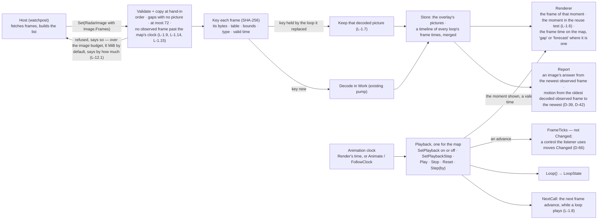
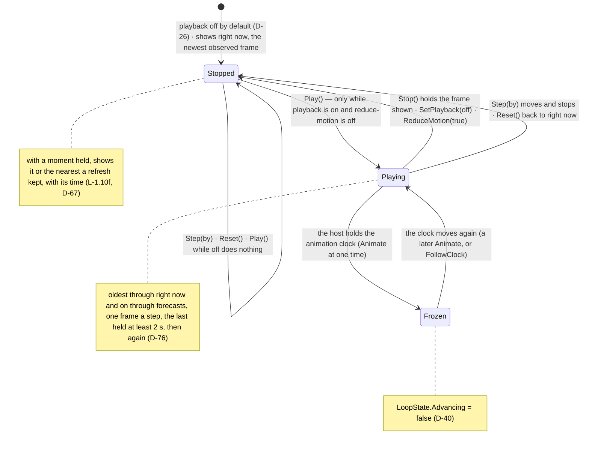

# Approach 1 — the loop's data model and playback API

**The question.** How does a host give the library a loop, and how does it refresh one? Everything
else in L-1 hangs off the answer: validation, the frame copy, the budget, the renderer's frame
advance, the playback API and the description of motion.

**What any answer must satisfy.** It must be additive to the v0.1.0 contract (NFR-1); one overlay per
radar source, never blended (watchpost FR-5.2); gaps stated, never filled from a neighbour (L-1.2);
the frames copied at hand-in and validated (L-1.14); the whole held inside the host-settable budget
(L-12); a refresh that does not re-decode frames already held (L-1.7, and watchpost FR-5.5's "one
request, not twelve" on the library side); a frame advance the renderer sees (L-1.6); and one
standard playback API (L-1.13).

## The shape both approaches share

```go
// LoopFrame is one frame of a loop: a picture for one valid time, or a
// stated gap where the source had none (L-1.2).
type LoopFrame struct {
	Valid time.Time
	PNG   []byte // empty when Gap is true
	Gap   bool
}

// Playback is what a loop does over time (L-1.5): off shows the newest
// non-gap frame (L-1.10f).
type Playback uint8

const (
	PlaybackOff Playback = iota // the default (D-26)
	PlaybackSlow
	PlaybackNormal
)

// OffBecause says why playback is off when it is (L-1.10d).
type OffBecause uint8 // NotOff, OffReduceMotion, OffByHost, OffByDefault

// LoopState is the state read (L-1.10d).
type LoopState struct {
	Playback  Playback   // the setting in effect
	Because   OffBecause // why, when it is off
	Advancing bool       // true only while the shown frame is actually moving (D-40)
	Index     int        // the frame shown, 0 = oldest
	Count     int
	Valid     time.Time  // the shown frame's time
	Gap       bool       // the shown frame is a gap
	Oldest    time.Time  // the span the loop covers
	Newest    time.Time
}

// The playback API (L-1.10b, L-1.13): one shape for every looped overlay.
func (m *Map) SetPlayback(id string, p Playback) error
func (m *Map) Step(id string, by int) error    // -1 previous, +1 next
func (m *Map) Seek(id string, index int) error
func (m *Map) ShowNewest(id string) error
func (m *Map) Loop(id string) (LoopState, bool)

// FrameTicks counts frame advances, apart from Changed(), which counts data
// and look changes (L-1.10e): a screen-reader host re-reads the description
// on Changed() and ignores ticks.
func (m *Map) FrameTicks() uint64
```

**Time.** The loop is driven by the library's existing animation clock (`Animate`, `FollowClock`),
the same way the marker blink is. `NextCall` gains the next frame change as a fourth source (L-1.8).
The interval is the library's own, with one ceiling per map (L-1.10g). A host that freezes the clock
with `Animate` freezes the loop, and `LoopState.Advancing` goes false.

**The renderer.** A frame advance changes which raster is drawn, so the renderer's frame-reuse test
(`internal/render/frame.go:285-302`) gains the shown frame's identity per raster (L-1.6). A tick
raises `FrameTicks`, not `Changed()` or the description's key (L-1.10e, D-39).

**The description.** It follows the newest non-gap frame (D-39). Motion compares the oldest usable
frame with the newest, under one threshold (L-1.12, D-42).

## The choice: how a host hands in and refreshes a loop

### A — Declarative: the whole loop in one `Set`, frames reused by key

```go
type Image struct {
	// … v0.1.0's fields, unchanged; a single picture is PNG with no Frames …
	Frames []LoopFrame // new: a loop; when set, PNG is empty
}
```

A host builds the loop it wants and `Set`s it, as it does every other overlay. **A refresh is another
`Set` with the new list**, for example the same eleven frames plus one new one, and one dropped. The
library keys each frame by its valid time and a hash of its bytes. A frame whose key it already holds
keeps its decoded picture, so a refresh decodes only the new frame (L-1.7). Validation, the copy and
the budget apply to the whole list at hand-in, and the whole `Set` is refused if it does not fit.

- **For:** one mutation model for every overlay, as since v0.1.0 (`Set` replaces, D-74, D-86). The host
  holds no loop state of its own. The loop on screen is exactly the last list handed in, which is easy
  to test and to reason about. Watchpost already builds the whole frame list from its fetch (FR-5.2,
  FR-5.5).
- **Against:** each refresh hands in, copies and hashes every frame's bytes again, about 70–250 KB for
  12 frames, measured in W2 M-B. The decode is skipped, not the copy. The key has to be exact, or a
  changed frame with an unchanged time is missed; hashing the bytes closes that.

### B — Incremental: frames added and dropped one at a time

```go
func (m *Map) SetLoop(id string, bounds Image) error         // the loop's georeference and table, no frames
func (m *Map) AddFrame(id string, f LoopFrame) error          // validated, copied, budgeted per frame
func (m *Map) DropFramesBefore(id string, t time.Time) (int, error)
```

A host opens a loop once, then adds the newest frame and drops the oldest as they arrive. A refresh
costs exactly one frame's copy and decode.

- **For:** the least work per refresh. It is a natural fit for a stream, and budget errors are specific
  to the frame that caused them.
- **Against:** a second mutation model beside `Set`, and the library now holds state the host must mirror
  (which frames are in, and in what order). It needs rules for frames arriving out of order, duplicate
  times, and a partially built loop that is being drawn, each one a new way to be wrong. It is more
  public API surface to keep for good (NFR-1).

### Why not a separate `Loop` overlay kind

A new `Overlay.Loop` beside `Image` would duplicate `Image`'s bounds, projection and table, and give a
still radar and a looped radar two different shapes in the host's code. Frames on `Image` (A) or an
incremental API over the same `Image` (B) both avoid that. Considered, and rejected on that ground.

## Recommendation

**A, declarative.** It keeps the library's one mutation model, and it keeps the host free of loop
bookkeeping. The cost it adds, re-copying about 70–250 KB per refresh, is small against a
refresh that happens every two to five minutes. The re-decode that actually matters is avoided by
keying frames. B saves that copy at the price of new public API and ordering rules that would have
to be kept for good.

**The strongest argument against A.** If a future host loops at a much higher rate or size than
radar, for example satellite at full resolution, the per-refresh copy grows with it. B scales
better there, and A would need B's API added later anyway.

## AS BUILT v0.2.0 — how the parts fit (ruled D-54; built in rc.2 and rc.3)

The sketch above was PLAN's. As built, playback is **one for the map** (D-67): `SetPlayback` on or off, `SetPlaybackStep` (200–1000 ms, D-76), and `Play`, `Stop`, `Reset`, `Step(by)` along every loop's frame times merged. No `Seek`, `ShowNewest` or slow/normal speeds. `Loop()` returns the moment shown, "right now", the span, and why playback is off. Frames may be forecasts; at most 72.



The playback states, as built. *ReduceMotion(false) does not restart a loop: playback keeps its setting, and the host presses `Play` again (L-1.10c as built). `LoopState.Off` names why playback is off: reduce motion, the host, or the default.*



## Cross-reference with watchpost 0.18.0

| Watchpost | Here |
|---|---|
| FR-5.2: one overlay per source, never blended | One `Set` per source's loop; frames never merged across overlays |
| FR-5.5: a refresh fetches only new frames | Watchpost's fetch; under A the library decodes only new frames |
| FR-5.8: motion is a Settings row, off / slow / normal | *As built:* playback is one per map - `Playback` on or off, plus `SetPlaybackStep` (D-76) - not one call per loop; the Setting drives both |
| FR-5.9: a maximum frame rate, as a number | Set here in PLAN, within L-1.10g's ceiling per map |
| FR-5.4: the newest frame's age is visible | `LoopState.Newest`, and the frame time on the map (L-1.10a) |
