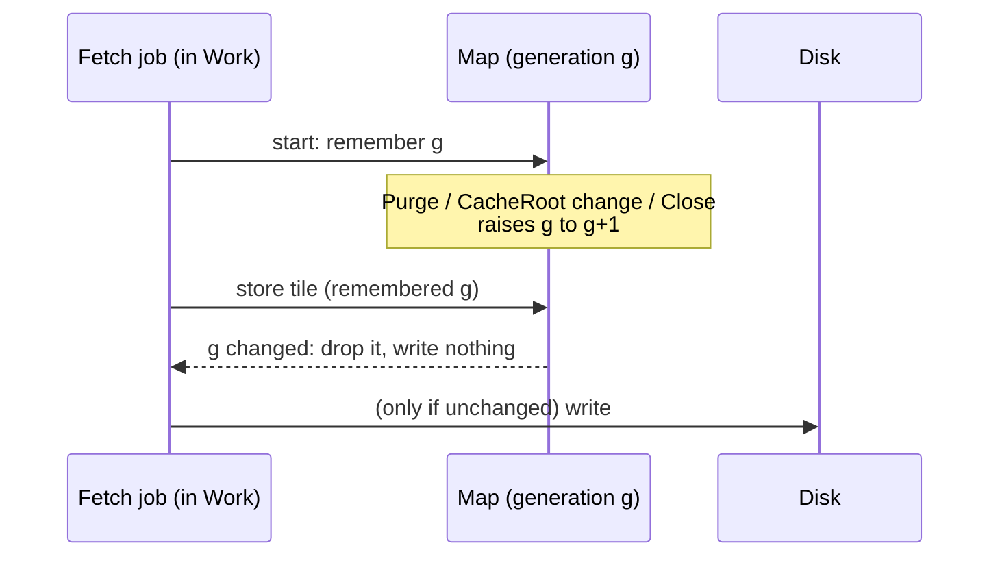

# Approach 3 — the cache's age, and purge

**The question.** How does the disk cache know how old a tile is (L-9.4), so that a host can promise
its listener a retention and keep it? And how does a purge reach everything, with nothing written
after it (L-9.3)?

**Today.** A tile file's modification time is its only clock, and it records **when the tile was last
read**, rewritten at most hourly (`internal/tiles/disk.go:217-218, 313-322`). The cap prunes the
least recently read files (`pruneLocked`, `:267`). So:
- a maximum age measured on that clock never expires a tile the listener keeps looking at (round 2,
  S-3);
- the disk holds a dated record of **when** each place was last looked at, not just which places;
- `Purge` empties one source's directory (`Empty`, `:329`), but a fetch already in flight can write
  after it, as can one in flight when `CacheRoot` changes or the map closes (S-4).

## PLAN v0.2.0 — shared by every option: purge and in-flight writes (ruled D-56, not yet built)

```go
// Purge empties everything the map holds from tiles: every source on disk,
// the memory caches, decoded pictures (L-9.3). With a source named or not.
func (m *Map) Purge() error

// PurgeReport says what could not be removed (L-9.5).
type PurgeReport struct{ Removed, Failed int }
func (m *Map) PurgeWithReport() (PurgeReport, error)
```

**A cache generation** makes in-flight writes safe. The map holds a counter; a job records it when it
starts; a store lands only if the counter is unchanged. `Purge`, a `CacheRoot` change or turning the
cache off, and `Close` all raise it, so no write lands after any of them (L-9.3). A replaced root is
`Release`d, and its file descriptor closed. Removals are counted only when they succeed, and a failed
write raises `cache-write-failed` (L-9.5).



## The choice: what records a tile's age

### A — The file's time becomes its fetch time; reads never touch it

The modification time is set once, when the tile is written, and never again. Maximum age
(`CacheRoot`'s new option) and the cap both run on it: over the cap, the **oldest-fetched** files go
first, not the least recently read. Tiles the current view needs are never evicted, as today.

```go
func (m *Map) CacheRoot(dir string, capBytes int64, opts ...CacheOption) error
func MaxAge(d time.Duration) CacheOption   // enforced at CacheRoot and in every job (L-9.4)
```

- **For:** the simplest possible change: one clock, one meaning. **The disk stops recording when a place
  was looked at.** A read writes nothing at all, which is a privacy gain beyond what L-9.4 asked for.
  A future-dated time counts as expired.
- **Against:** eviction becomes first-in-first-out instead of least-recently-used. A tile read often but
  fetched long ago goes before one fetched recently and never read. In practice a tile past its
  maximum age is fetched again anyway, and tiles in view are protected, but the cap does keep a little
  less of what the listener actually uses.

### B — Fetch time in the file name; the file's time keeps recency

`<z>/<x>-<y>.<fetched>.pbf`. Age comes from the name; the file's time stays as least-recently-read for
eviction.

- **For:** eviction stays least-recently-used, keeping the most-used tiles longest.
- **Against:** reads still write, so the dated record of when each place was looked at stays on disk. A
  refresh is a rename plus a write. It is also a new file-name format, which today's `Verify`/`ReadBack`
  and old cache directories must cope with.

### C — A small journal of fetch times beside the tiles

One index file per source records each tile's fetch time.

- **For:** keeps both clocks without changing file names.
- **Against:** a second structure to keep consistent with the files through crashes, purges and
  concurrent maps sharing a cache. That is a new class of bug for a small gain.

## Recommendation

**A.** It meets L-9.4 with the least mechanism, and it removes the "when" from the viewing record: a
read never touches the disk. The eviction order changes from least-recently-read to oldest-fetched,
which barely matters when every tile has a maximum age and the tiles in view are protected.

**The strongest argument against A.** Least-recently-used is the better cache for a listener who keeps
coming back to the same few places. Under a tight cap, first-in-first-out can evict their home area
before a place they looked at once, yesterday, and never again.

## Cross-reference with watchpost 0.18.0

| Watchpost | Here |
|---|---|
| HR-8 (L-9): cache retention and purge | `MaxAge` and `Purge` |
| Its privacy promise to the listener (R-9; the Settings row for cache retention) | A: no read ever touches the disk; `Purge` reaches everything, and nothing lands after it |
| Its own radar cache (`platform/httpx`) | Watchpost's to purge. The library's `Purge` covers tiles only (L-1.4: the library never fetches radar) |
