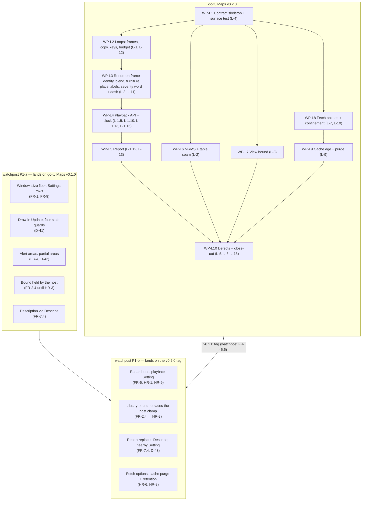

# Integration map

**Why this exists.** The two PLANs run in parallel (go-tuiMaps D-52, watchpost D-39). This page fixes
the order in which their work can land, and traces each host requirement to the library requirement
and ruling that meet it. Each plan cites the work packages here by name; neither plan restates the
other's.

## PLAN — the order, in one picture (v0.2.0 ⇄ watchpost 0.18.0, not yet built)

**Two tracks in parallel, one join.** Watchpost's P1-a needs nothing from v0.2.0 and can start at
once. Its P1-b waits for the v0.2.0 tag (watchpost FR-5.6: radar lands only against a tagged
version). Watchpost's ship-without-radar rule (its RK-4) is P1-a on its own.

## Host requirement ⇄ library requirement ⇄ work package

| Watchpost | Needs from go-tuiMaps | Library requirement | Ruling | Work package |
|---|---|---|---|---|
| HR-1 loops | frames, one overlay per source | L-1.1–L-1.9, L-1.14, L-1.15 | D-54 | WP-L2 |
| HR-9 playback, FR-5.8/5.9 | one playback API; rates | L-1.5, L-1.10, L-1.11, L-1.13 | D-25, D-26, D-54, watchpost D-43 | WP-L4 |
| D-41 stale-frame guards | `Frame` carries its counters; `FrameTicks`; `NextCall` | L-1.16, L-1.10e, L-1.8 | D-59, D-54 | WP-L3, WP-L4 |
| HR-2 MRMS | the observed-palette table | L-2.1–L-2.5 | D-19, D-35, D-44 | WP-L6 |
| HR-3 bound | min zoom and a box, held | L-3.1, L-3.2 | — | WP-L7 |
| HR-4 contract | contract matches the code | L-4.1–L-4.4 | D-34 | WP-L1 |
| HR-5 triage | superseded | L-5 | D-18 | WP-L10 |
| HR-6 fetcher | `SetFetchOptions`, user-agent | L-7.1–L-7.4 | D-55 | WP-L8 |
| HR-7 pattern | severity word + dash, every depth | L-8.1, L-8.5–L-8.7 | D-17, D-28 | WP-L3 |
| HR-8 cache | `MaxAge`, `Purge` of everything | L-9.1–L-9.6 | D-56 | WP-L9 |
| HR-10 confinement | one allow-list, per-connection proxy check | L-10.1–L-10.3 | D-55 | WP-L8 |
| FR-4.4 / D-42 partial areas | per-alert answers; place labels kept | L-13.6, L-8.9 | D-43, D-60 | WP-L5, WP-L3 |
| FR-7.4 description | `Report`: alerts shown, per place, motion | L-1.12, L-13.5–L-13.10 | D-42, D-43, D-57 | WP-L5 |
| Radar over alerts | the blend; furniture never erased | L-11, L-8.3 | D-14, D-27, D-45 | WP-L3 |
| M5 time to picture | render ≤ 15 ms an advance | L-12.5 | D-61 | WP-L3 |

## Rules for both plans

- A task that depends on a library change names the work package here, e.g. "needs WP-L4".
- A task that changes what the library must provide changes this page in the same commit.
- **No code in PLAN** (watchpost D-13): signatures, shapes, test descriptions and file paths only.
