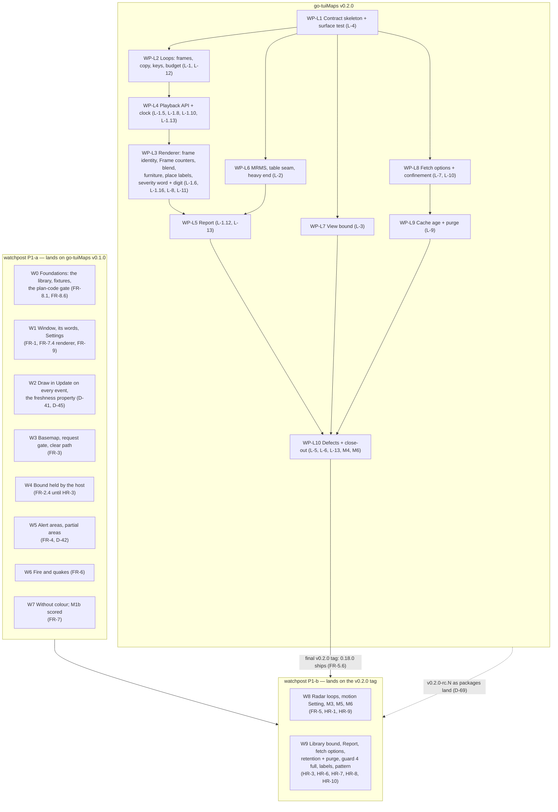

# Integration map

**Why this exists.** The two PLANs run in parallel (go-tuiMaps D-52, watchpost D-39). This page fixes
the order in which their work can land, and traces each host requirement to the library requirement
and ruling that meet it. Each plan cites the work packages here by name; neither plan restates the
other's.

## PLAN — the order, in one picture (v0.2.0 ⇄ watchpost 0.18.0, not yet built)

**Watchpost's W-numbers are its plan's** (`observer-maps/04-development/implementation-plan.md`). **Inside the library, WP-L4 lands before WP-L3**: the renderer's frame-identity tasks need a way to advance the shown frame.

**Two tracks in parallel, one join.** Watchpost's P1-a needs nothing from v0.2.0 and can start at
once. Its P1-b builds against release candidates, `v0.2.0-rc.N`, as the packages it needs land
(D-69, watchpost D-51), and 0.18.0 ships only on the final `v0.2.0` (watchpost FR-5.6). Watchpost's ship-without-radar rule (its RK-4) is P1-a on its own.

## Host requirement ⇄ library requirement ⇄ work package

| Watchpost | Needs from go-tuiMaps | Library requirement | Ruling | Work package |
|---|---|---|---|---|
| HR-1 loops | frames, one overlay per source | L-1.1–L-1.4, L-1.7, L-1.9, L-1.14, L-1.15 (WP-L2); L-1.6 (WP-L3); L-1.5, L-1.8 (WP-L4) | D-54 | WP-L2, WP-L3, WP-L4 |
| HR-9 playback, FR-5.8/5.9 | one playback per map: play, stop, reset, step; position by valid time; forecast frames | L-1.5, L-1.10, L-1.11, L-1.13 | D-25, D-26, D-54, D-67, watchpost D-43, D-48 | WP-L4 |
| D-41/D-45 never an old frame | `Changed()` counts inputs, raised by `Work`; `FrameTicks`; `NextCall`; `Frame` carries its counters | L-1.16 (WP-L3, L3.2), L-1.10e, L-1.8 (WP-L4) | D-59, D-54, D-66 | WP-L3, WP-L4 |
| HR-2 MRMS | the observed-palette table | L-2.1–L-2.5 | D-19, D-35, D-44 | WP-L6 |
| HR-3 bound | min zoom and a box, held | L-3.1, L-3.2 | — | WP-L7 |
| HR-4 contract | contract matches the code | L-4.1–L-4.4 | D-34 | WP-L1 |
| HR-5 triage | superseded | L-5 | D-18 | WP-L10 |
| HR-6 fetcher | `SetFetchOptions`, user-agent | L-7.1–L-7.4 | D-55 | WP-L8 |
| HR-7 pattern | severity word + a digit on the outline, every depth; the key in watchpost's legend (watchpost D-44) | L-8.1, L-8.5, L-8.7 | D-17, D-28, D-65 | WP-L3 |
| HR-8 cache | `MaxAge`, `Purge` of everything | L-9.1–L-9.6 | D-56 | WP-L9 |
| HR-10 confinement | one allow-list, per-connection proxy check | L-10.1–L-10.3 | D-55 | WP-L8 |
| FR-4.4 / D-42 partial areas | per-alert answers; place labels kept | L-13.6, L-8.9 | D-43, D-60 | WP-L5, WP-L3 |
| FR-7.4 description | `Report`: alerts shown, per place, motion | L-1.12, L-13.5–L-13.10 | D-42, D-43, D-57 | WP-L5 |
| Radar over alerts | the blend; furniture never erased | L-11, L-8.3 | D-14, D-27, D-45 | WP-L3 |
| M5 time to picture | render ≤ 15 ms an advance | L-12.5 | D-61 | WP-L3 |
| The loop's shape (host-owned) | per state-regional region, two hours, a step the listener sets (5 minutes by default), images up to about 200,000 pixels; the library accepts up to `MaxFrames` 72 within a host-set budget (6 MiB default) | L-1.15, L-12.1, L-12.2 | D-68, watchpost D-47, D-50 | WP-L2 |

## Rules for both plans

- A task that depends on a library change names the work package here, e.g. "needs WP-L4".
- A task that changes what the library must provide changes this page in the same commit.
- **No code in PLAN** (watchpost D-13): signatures, shapes, test descriptions and file paths only.
